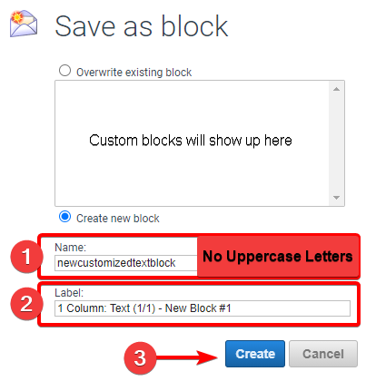
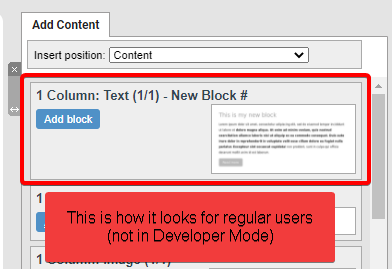

# Så här skapar du ett anpassat innehållsblock (Developer)

Spara ett redigerat innehållsblock så att det blir återanvändbart i komponenter och mallar.

Den här artikeln täcker avancerad användning av eMarketeer och ligger utanför ramen för vanlig support. Om du behöver hjälp med utvecklarfunktioner, kontakta din återförsäljare för att bli kopplad till en utvecklingskonsult eller tekniker.

Användare med Developer-behörighet kan ändra HTML-koden för ett innehållsblock för att förändra hur det ser ut och fungerar. När du har gjort en betydande ändring kan du spara blocket för återanvändning. Ett sparat block blir då tillgängligt för alla användare som redigerar den komponenten, och om komponenten blir en mall följer det sparade blocket med till alla nya komponenter som skapas från den mallen.

Kontakta ditt kontos Account Administrator om du behöver Developer-behörighet på ditt användarkonto.

---

## Så här sparar du ett anpassat innehållsblock

Spara ett block

### 1. Aktivera Developer Mode

Med Developer-behörighet ser du knappen [Enable Developer Mode] i menyn Tools.

### 2. Öppna blocket du vill spara

Dubbelklicka på det anpassade blocket för att öppna dess konfigurationsmeny.

### 3. Gå till Block Settings

Öppna fliken Settings i blockets konfigurationsmeny.

### 4. Ge blocket en etikett

Label är namnet som visas i sektionen Component Content när blocket används. Exempel: *1 Column: Text (1/1)*.

### 5. Klicka på Save as Block

[Save as Block] öppnar dialogen där du kan spara det anpassade blocket till komponenten.

Fönstret Save as block

### 1. Sätt ett containernamn

Containernamnet identifierar det anpassade blocket i systemet och syns i Developer Mode.

### 2. Sätt en unik etikett för blocket

Den här etiketten är namnet som varje användare ser när de arbetar med det anpassade blocket.

### 3. Skapa det anpassade blocket

Klick på [Create] sparar det anpassade blocket och lägger till det i menyn "Add Content Block" så att alla användare kan släppa in det.

Blocket som det visas i listan Add Content

---

## Anpassade block i mallar

För att göra blocket tillgängligt i nya komponenter byggda från en mall kan du antingen redigera en befintlig mall för att lägga till blocket, eller skapa en ny mall från en komponent som redan innehåller det, som visas nedan.

Skapa en mall från en komponent med ett anpassat block

En ny komponent som skapas från den mallen ärver det anpassade blocket. Om du senare uppdaterar blocket i mallen sprids ändringen även till komponenter som redan byggts från den.
