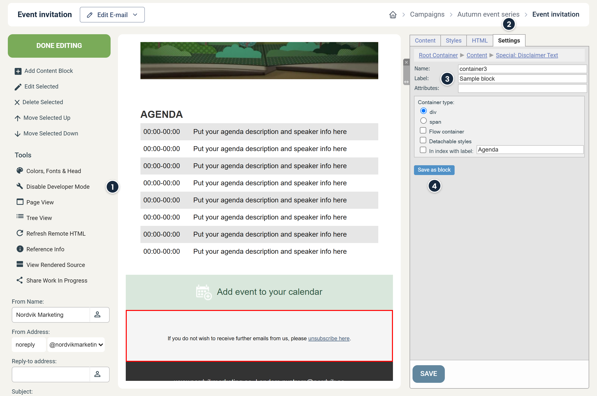

# Så här skapar du ett anpassat innehållsblock


Den här funktionen kräver Developer-behörighet. Kontakta din Account Administrator om du behöver den aktiverad på ditt användarkonto.


Spara ett redigerat innehållsblock så att det blir återanvändbart i komponenter och mallar.

Den här artikeln täcker avancerad användning av eMarketeer och ligger utanför ramen för vanlig support. Om du behöver hjälp med utvecklarfunktioner, kontakta din återförsäljare för att bli kopplad till en utvecklingskonsult eller tekniker.

Användare med Developer-behörighet kan ändra HTML-koden för ett innehållsblock för att förändra hur det ser ut och fungerar. När du har gjort en betydande ändring kan du spara blocket för återanvändning. Ett sparat block blir då tillgängligt för alla användare som redigerar den komponenten, och om komponenten blir en mall följer det sparade blocket med till alla nya komponenter som skapas från den mallen.

***

## Så här sparar du ett anpassat innehållsblock

Spara ett block



### Aktivera Developer Mode

Med Developer-behörighet ser du länken \[Enable Developer Mode] i menyn Tools.



### Öppna blockets flik Settings

Håll muspekaren över det anpassade blocket och klicka på redigeringsikonen för att öppna blockets konfigurationspanel. Öppna sedan fliken **Settings**.



### Ge blocket en etikett

Name identifierar det anpassade blocket i systemet och syns i Developer Mode. Label är namnet som varje användare ser när de arbetar med blocket, och det visas i sektionen Component Content när blocket används. Exempel: _1 Column: Text (1/1)_.



### Klicka på Save as block

Klicka på \[Save as block] längst ned i samma panel. Det sparar det anpassade blocket och lägger till det i menyn "Add Content Block" så att alla användare kan släppa in det. Det finns ingen separat dialog att fylla i.

Blocket som det visas i listan Add Content



***

## Anpassade block i mallar

För att göra blocket tillgängligt i nya komponenter byggda från en mall kan du antingen redigera en befintlig mall för att lägga till blocket, eller skapa en ny mall från en komponent som redan innehåller det, som visas nedan. För att skapa mallen öppnar du menyn med tre punkter på komponentkortet och klickar på **Create Template**.

Skapa en mall från en komponent med ett anpassat block

En ny komponent som skapas från den mallen ärver det anpassade blocket. Om du senare uppdaterar blocket i mallen sprids ändringen även till komponenter som redan byggts från den.
