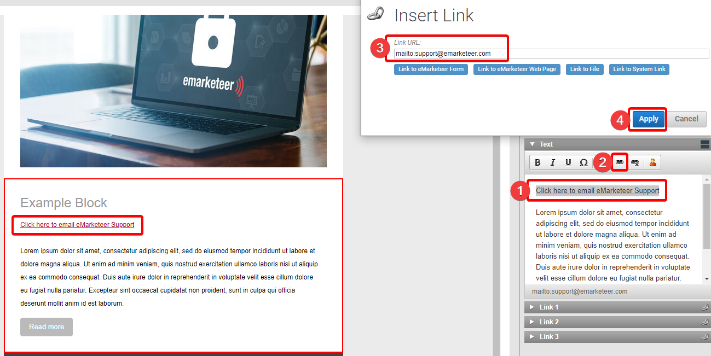

# Skapa klickbara länkar och knappar med e-postadresser

En klickbar e-postadress öppnar ett nytt meddelande i mottagarens e-postklient med adressen redan ifylld.

Många e-postklienter lägger till det här beteendet automatiskt när de hittar en adress i inkommande post, men du kan göra det uttryckligt på en länk eller en knapp. Tekniken är densamma som för en webblänk — du använder en URL med prefixet `mailto:`, så här:

> mailto:support@emarketeer.com

## Klickbar adress i text

För att göra en text inuti en komponent till en e-postlänk, följ samma steg som för en vanlig webblänk.

1. Markera texten du vill ska vara klickbar.
2. Klicka på knappen Hyperlink/Link i textredigeraren.
3. I fältet Link URL, skriv e-postadressen med prefixet `mailto:`.
4. Tillämpa länken.

Bästa praxis är att undvika den här typen av länk i brödtexten i en e-postkomponent. De flesta e-postklienter gör redan om vanliga e-postadresser till klickbara länkar, så avsändaren behöver inte lägga till länken manuellt.

Exempel på en e-postlänk tillämpad på text.

## Knapp länkad till en e-postadress

Tillvägagångssättet är detsamma — `mailto:`-URL:en läggs i fältet Link URL, men den här gången på en knapp.

1. Välj blocket med knappen och öppna länkrutan som matchar knappen.
2. I fältet Link URL, skriv e-postadressen med prefixet `mailto:`.
3. Tillämpa länken.

Exempel på en e-postlänk på en knapp.
