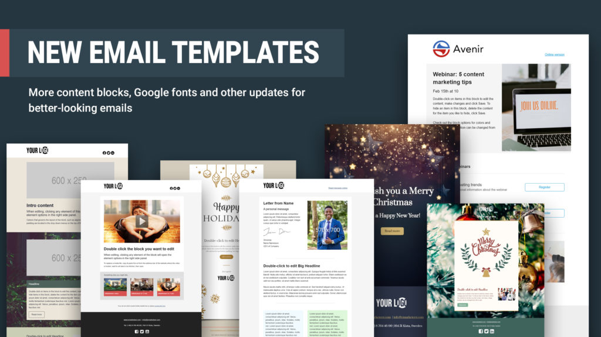
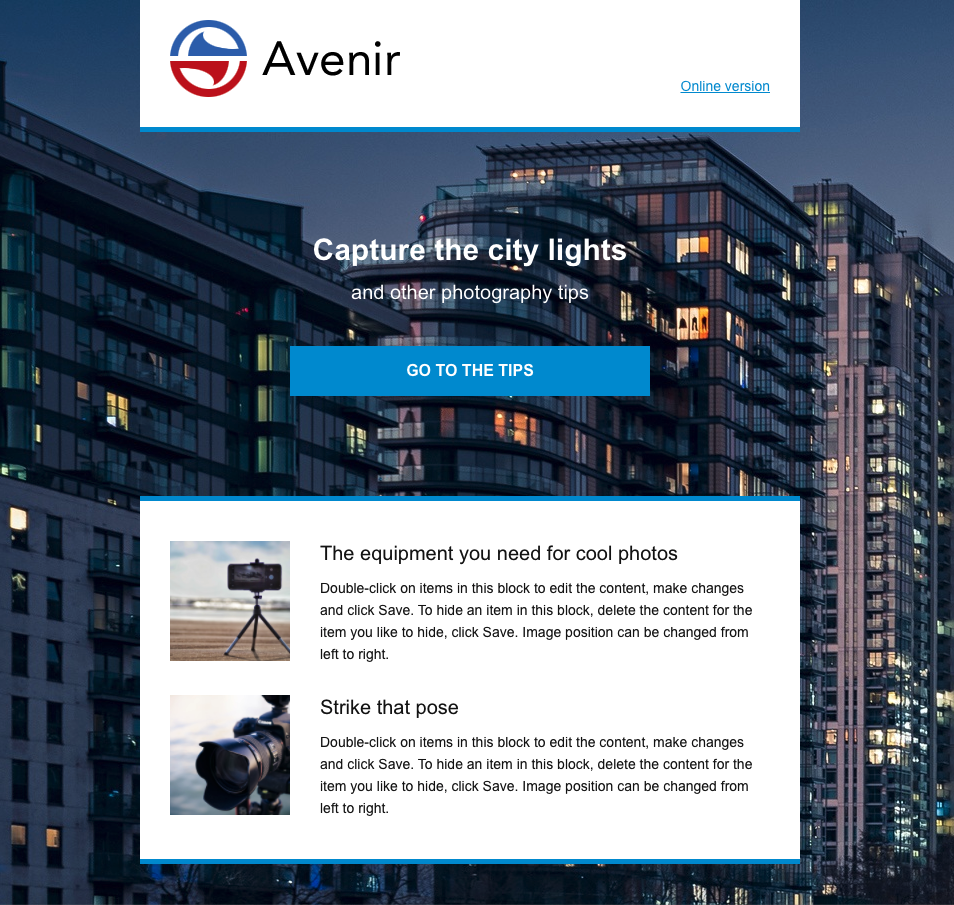
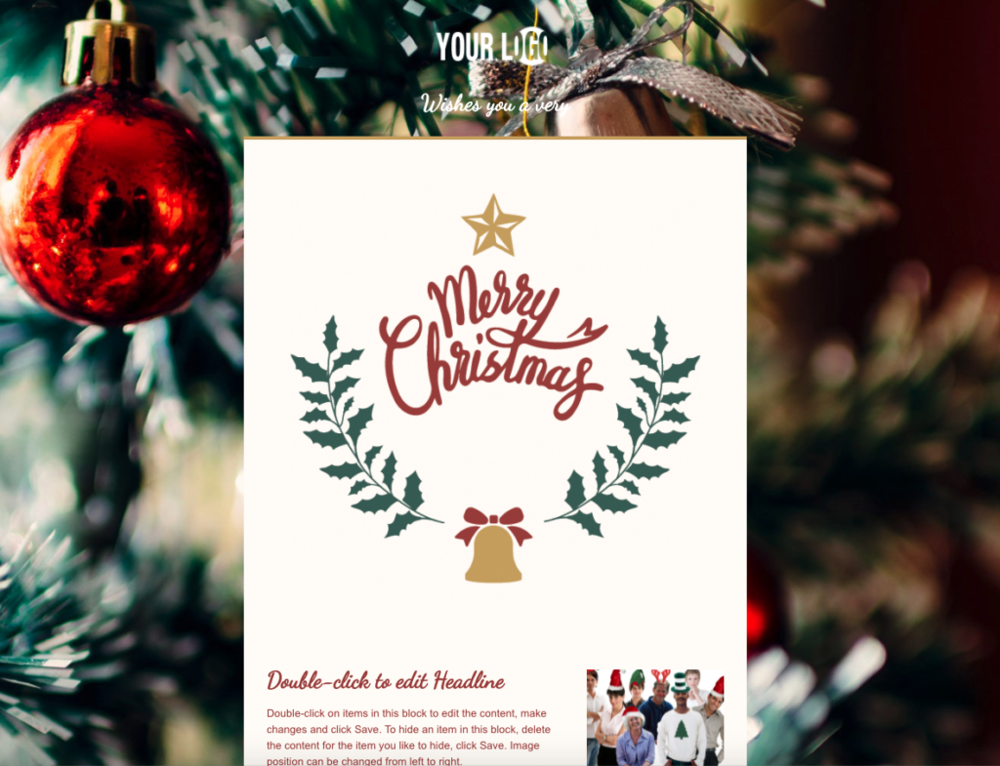
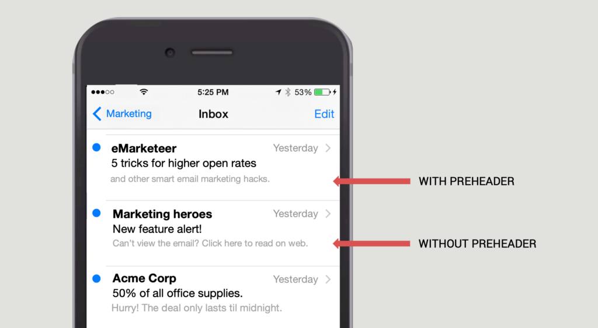

# Nya e-postmallar — det här behöver du veta

De kostnadsfria e-postmallarna i eMarketeer ger dig ett försprång när du bygger e-postmeddelanden, med dussintals mobilanpassade designer som du kan anpassa till ditt varumärke.

## Vad är nytt i mallarna

De nya mallarna ser mer moderna ut och är byggda på en ny grundkod, vilket innebär att de renderar bättre i fler e-postklienter än tidigare. Andra fördelar är:

* Fler designalternativ. Över 60 innehållsblock finns tillgängliga, designade att passa ihop för enklare redigering.
* Högre bildupplösning.
* Inställningar för länkdelning som låter dig sätta titel, beskrivning och bild som används automatiskt när e-postlänken delas på sociala medier.
* Stöd för Google-typsnitt, utan kod.

De nya mallarna ersätter de tidigare. Sparade mallar visas fortfarande på ditt konto, men de bygger på den gamla grundkoden. För att få de nya fördelarna, bygg om dina sparade mallar med hjälp av en av de nya.

Om du behöver hjälp att flytta en sparad mall till den nya grunden, mejla sales@emarketeer.com.

## Tre tips om e-postmallarna

Börja med att välja den mall som passar ditt budskap — evenemangsinbjudan, produktkampanj, nyhetsbrev och mer. I redigeraren anpassar du mallen med dra-och-släpp-verktygen och de över 60 innehållsblocken. Tre ytterligare knep, alla inställda i e-postinställningsrutan i redigeraren, hittar du nedan.

### 1. Inställningar för länkdelning

När du delar länken till ditt e-postmeddelande på sociala medier kan inlägget använda en anpassad titel, beskrivning och bild. Längst upp i mallen i redigeraren, öppna rutan med e-postinställningar. Sätt en titel (till exempel din ämnesrad), en beskrivning och en bild. De här värdena används automatiskt i förhandsvisningen på sociala medier.

Det här är inte där du sätter ämnesraden för själva e-postmeddelandet — ämnesraden och avsändarinformationen finns i menyn till vänster.

Var du uppdaterar information om länkdelning i redigeraren.

Hur e-postlänken ser ut när den postas på sociala medier.

### 2. Sätt din preheader

Preheadern är din andra chans — efter ämnesraden — att övertyga en kontakt att öppna e-postmeddelandet. Den visas bredvid ämnesraden i inkorgens förhandsvisning.

I e-postinställningsrutan, klicka på preheader-fältet. Använd det för att förlänga din ämnesrad eller förhandsvisa innehållet i e-postmeddelandet. Preheader-texten visas inte inuti själva e-postmeddelandet, bara i inkorgens förhandsvisning. Om du lämnar den tom visas den första texten i e-postmeddelandet i stället, vilket ofta är något i stil med "läs på webben".

Den exakta längd som visas beror på mottagarens e-postklient. Sikta på 40–100 tecken.

Exempel på e-postmeddelanden med och utan preheader.

### 3. Använd ett Google-typsnitt i ditt e-postmeddelande

Dubbelklicka på e-postinställningsrutan och öppna fliken Google Fonts i panelen till höger. I textrutan, skriv typsnittsnamnet exakt som Google har det — fältet är skiftlägeskänsligt. Du kan också välja om typsnittet ska gälla bara rubriker eller all text i e-postmeddelandet. Spara dina ändringar.

Om mottagarens e-postklient inte stöder webbtypsnitt, används typsnittet som är satt under Styles som fallback.

## Bonus-tips

Skapa bilder till ditt e-postmeddelande med bildredigeraren i eMarketeer. Du kan lägga till filter, text och grafiska element, och det inbyggda stockbildsbiblioteket innehåller två miljoner foton, 900 typsnitt och 700 ikoner som är gratis att använda.

För en genomgång, se [Så här använder du bildredigeraren i eMarketeer](how-to-use-the-image-editor-in-emarketeer.md).
