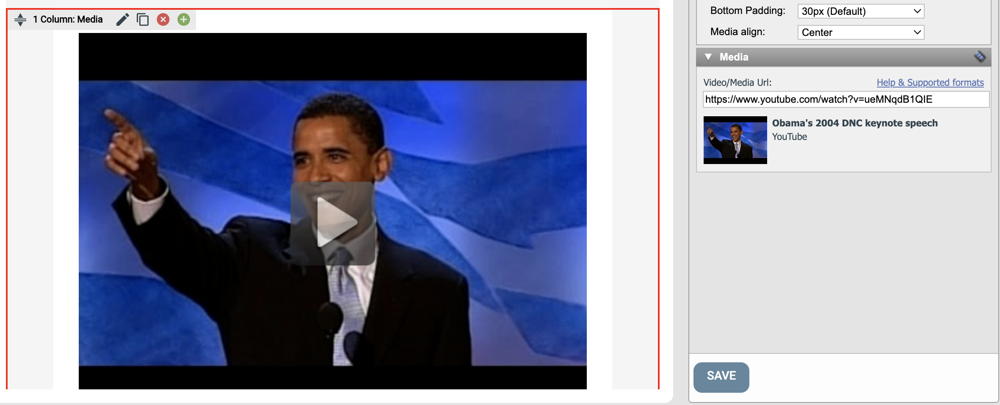

# Bädda in video/media

Använd blocket Video/Media i Page Builder för att bädda in video, bildspel och annat rikt innehåll från externa tjänster.

Blocket är tillgängligt i Page Builder för e-postmeddelanden och webbsidor. eMarketeer hämtar media från tjänster som YouTube och renderar det inuti ditt innehåll.

### Så här lägger du till video och media

Lägg till ett block med Video/Media i och dubbelklicka för att redigera. Dialogen ovan visas. Klistra in URL:en för din media i textrutan (till exempel [https://www.youtube.com/watch?v=ueMNqdB1QIE](https://www.youtube.com/watch?v=ueMNqdB1QIE)).

En förhandsvisning visas under textrutan när URL:en har laddats. Klicka på Save för att lägga till media.

Om blocket inte uppdateras klickade du på Save innan förhandsvisningen hann ladda klart. Försök igen.

### Fungerar det här i e-postmeddelanden?

De flesta e-postklienter stöder inte videoobjekt, men de stöder bilder. När du lägger till Video/Media i ett e-postmeddelande infogar eMarketeer en skärmdump av videon med en uppspelningsknapp och länkar den till den ursprungliga URL:en. Mottagaren ser illusionen av en inbäddad video och öppnar den riktiga i en webbläsare vid klick.

### Video/Media och sidredigeraren

Medan du redigerar en sida eller ett e-postmeddelande visar blocket bara en förhandsvisning av media. Den faktiska inbäddade spelaren visas när du publicerar, skickar eller förhandsvisar sidan.

### Mediaformat som stöds

Inbäddningsfunktionen stöder de flesta leverantörer av rikt onlineinnehåll, och listan växer hela tiden. Den omfattar videor, bildgallerier, presentationer, ljud med mera.

Tjänster som stöds inkluderar YouTube, Vimeo, SlideRocket, Slideshare, Flickr och Google Maps. [Se den fullständiga listan över format som stöds](https://embed.ly/providers).
