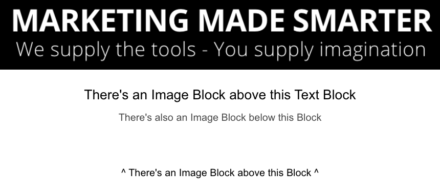
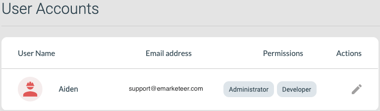
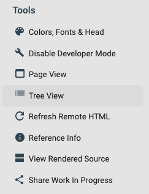
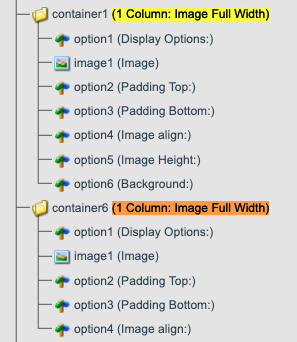
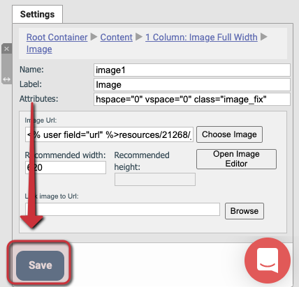
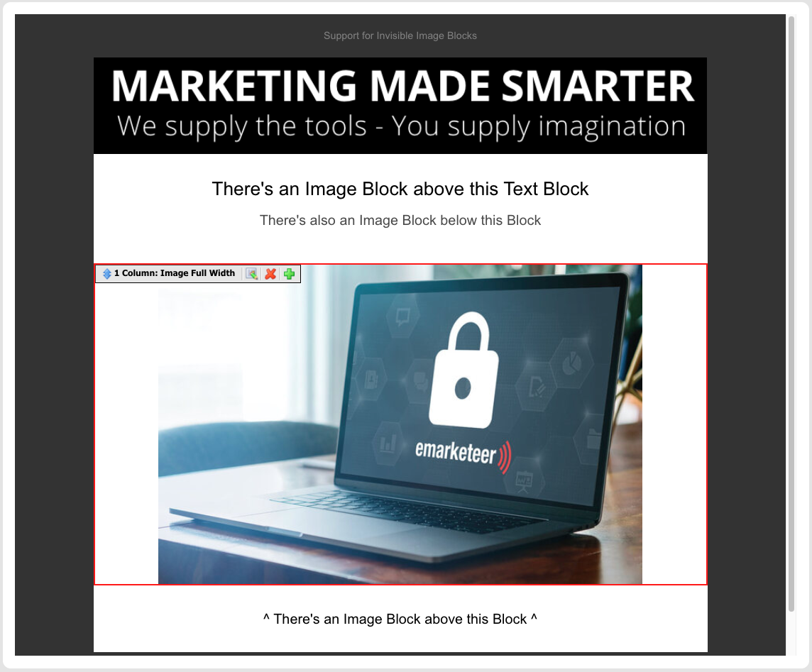

# Saknat bildblock i e-postkomponent


Den här åtgärden kräver Developer-behörighet på ditt användarkonto.


Om en röd-x-ruta eller en blå frågetecken-ruta visas i dina skickade e-postmeddelanden när de visas i Outlook, gömmer sig sannolikt ett saknat bildblock i e-postkomponenten eller mallen.

Outlook (Windows)

Outlook (Mac)

Det här händer när den underliggande bilden togs bort från ditt konto eller flyttades till en annan mapp, vilket skapar en ny filsökväg. Antingen åtgärden ogiltigförklarar bildlänken i alla e-postkomponenter som använder den, och de flesta e-postklienter svarar med att dölja blocket.

Innan bildens sökväg är bruten.

Efter att bildblocket är brutet och dolt.

## Så här fixar du det

En eMarketeer-användare med developer-behörighet kan ta bort eller fixa blocket från komponenten genom att gå in i developer mode.

Kontoanvändare med developer-behörighet.

1. Öppna redigeraren för mallen eller komponenten.
2. Gå in i developer mode.

   

   Knappen Enable Developer Mode.

3. Kontrollera namnen på alla synliga bildblock genom att välja varje och öppna fliken settings.

   

   Kontrollera namnet på ett synligt bildblock.

4. Gå in i Tree View.

   

   Knappen Tree View.

5. Hitta alla Image Full Width-block i listan och matcha deras containernamn med de synliga tills du hittar ett som inte matchar. I det här exemplet matchar inte _container1 (1 Column: Image Full Width)_ ett synligt bildblock.

   

   Image Full Width-block i Tree View.

6. Välj bilddelen av blocket och ändra bildens URL genom att klicka på knappen Choose Image, välj sedan en ny bildfil i filvalsfönstret.

   

   Hitta bildens URL.

   

   Välj en ny bildfil.

7. Spara ändringen, återgå sedan till Page View för att fortsätta redigera komponenten.

   

   Knappen Save.

   

   Resultatet efter att du följt den här guiden.

## Så här redigerar du en mall

1. Klicka på Add E-Mail från en kampanjsida för att visa dina mallar.
2. Klicka på More Actions på mallen du vill redigera.
3. Klicka på Edit Template i rullgardinsmenyn.
4. Mallen öppnas i komponentredigeraren. Varje ändring som sparas här uppdaterar mallen.

Visuell guide till att redigera en mall.
