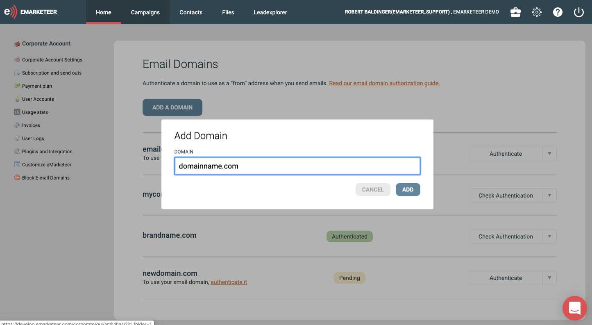
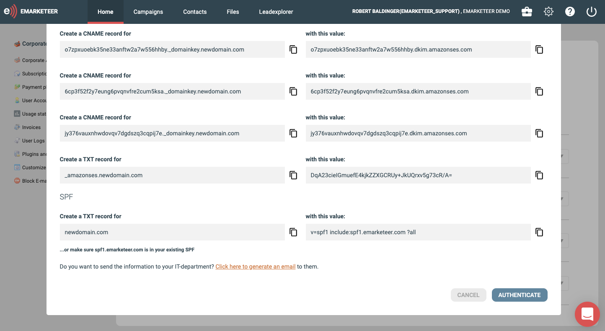
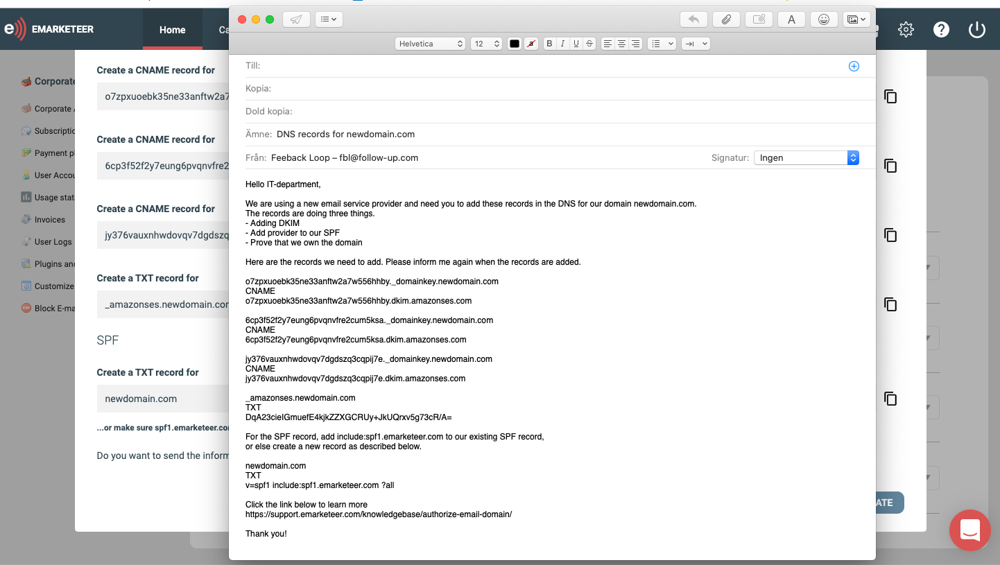
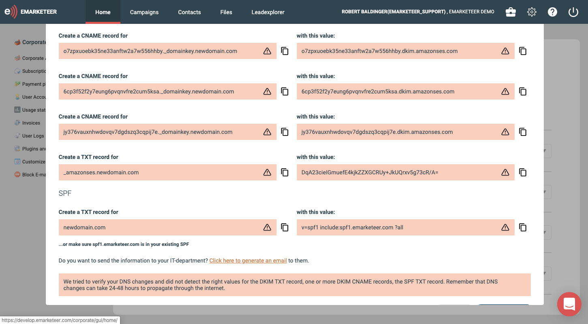
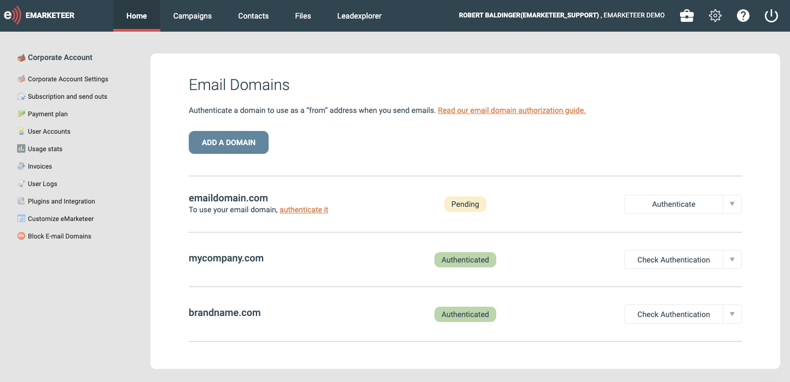

# Så autentiserar du din domän (administratör)

Den här guiden tar dig igenom autentiseringen av din domän så att du kan skicka e-post från din egen adress med bästa möjliga leveransbarhet.

När du är klar, hör av dig till oss så aktiverar vi den nya e-posttjänsten för ditt konto. Bakgrund till varför domänautentisering är viktigt finns i [den här artikeln](why-authorize-email-domain.md).

## Autentisera din domän

1. I eMarketeer går du till **Account** → **Email domains** och klickar på **Add a domain**.
2. Ange den domän du vill autentisera (till exempel `yourdomain.com`) och klicka för att lägga till.
   

3. eMarketeer visar en lista med DNS-poster. Lägg till dem i din DNS. Om du inte har åtkomst till företagets DNS — ofta är det IT-avdelningen som äger den — klickar du på länken i autentiseringsdialogen för att skicka posterna till ansvarig person.
   [

   

4. När posterna är på plats återvänder du till autentiseringsdialogen och klickar på **Authorize**.
5. Om posterna är korrekta validerar dialogen och godkänner autentiseringen. Om något är fel markeras posten som misslyckas i rött.
   [

   

DNS-ändringar sprids oftast snabbt, men räkna med upp till 48 timmar.

När domänen är autentiserad kan du skicka från eMarketeer med din domän som From-adress med bästa möjliga leveransbarhet. Du kan upprepa processen för så många domäner du behöver. Om du har frågor mejlar du [support@emarketeer.com](mailto:support@emarketeer.com).
