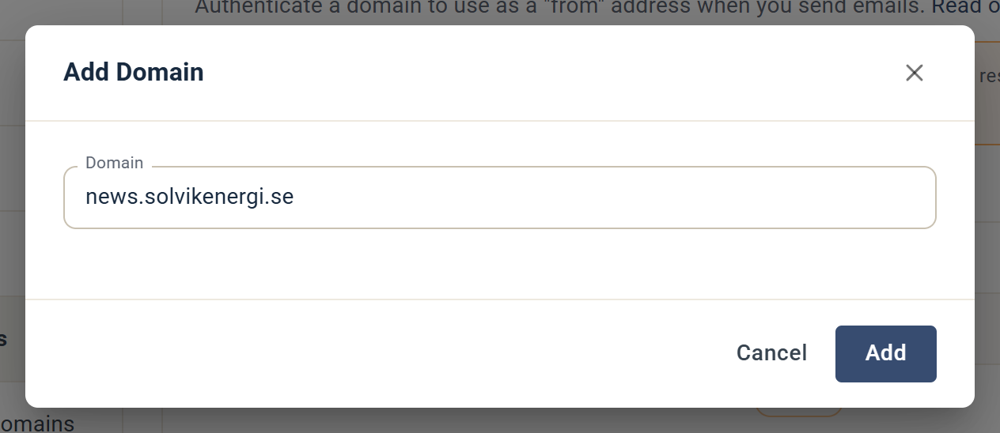
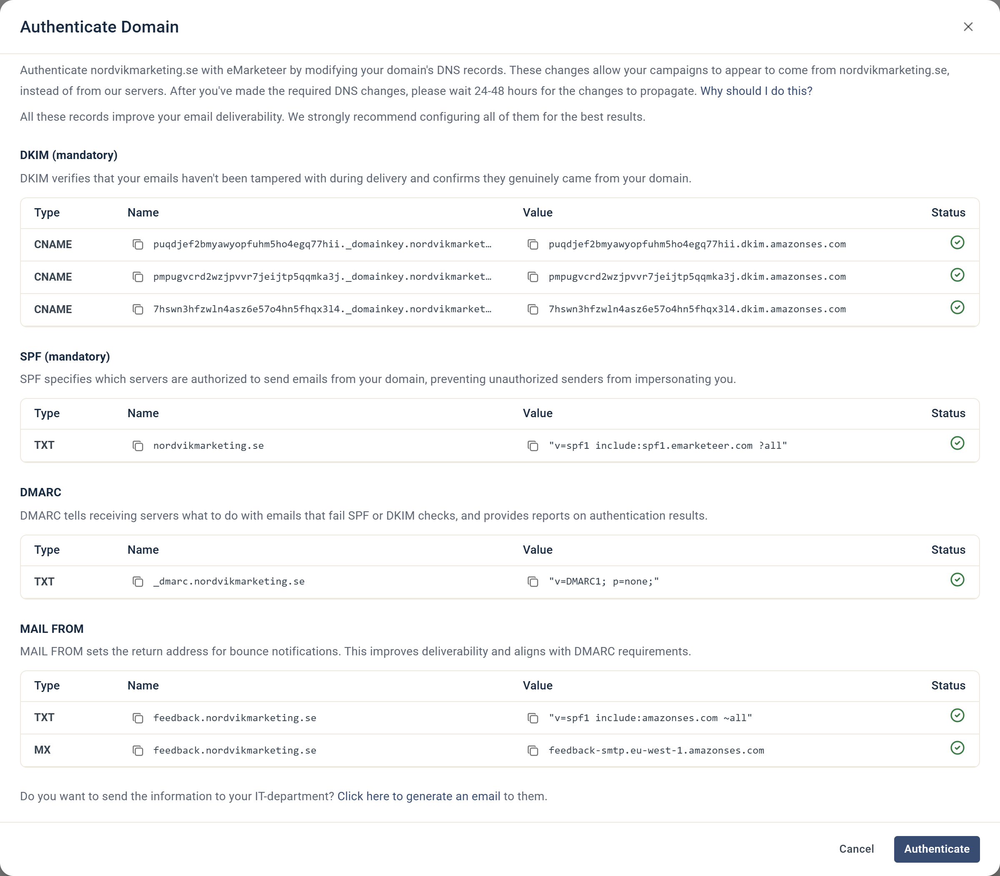
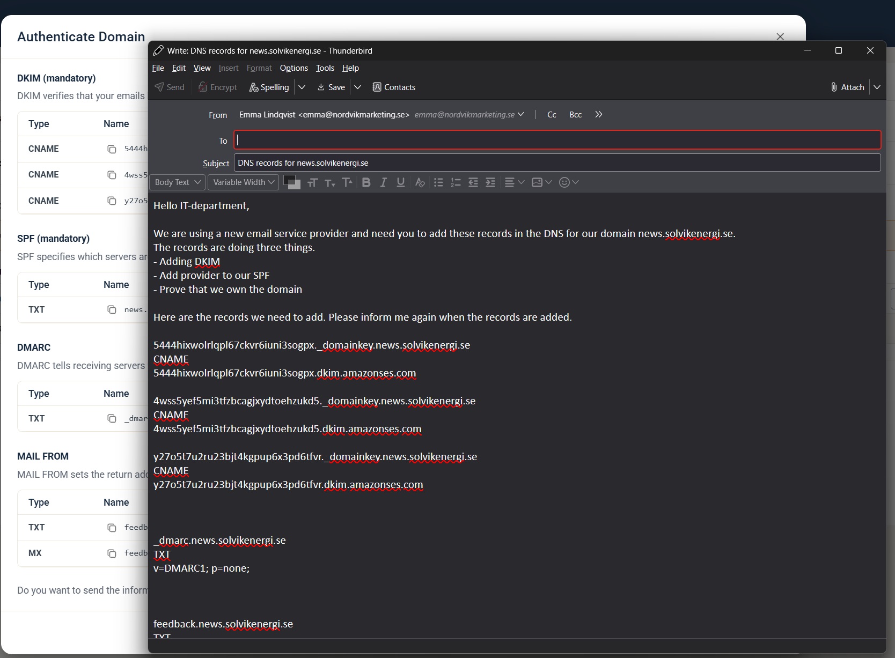
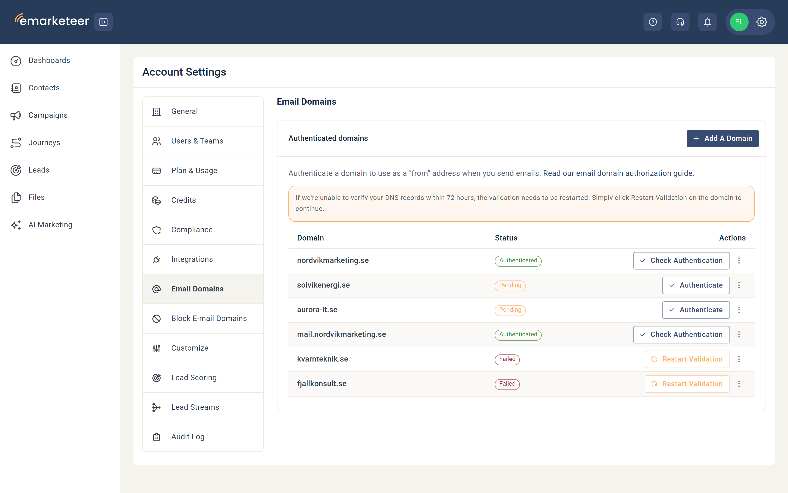

# Lägg till e-postdomän


En autentiserad e-postdomän krävs för att skicka e-post från eMarketeer. Utan den är utskick av e-post inte tillgängligt på ditt konto.


Den här guiden tar dig igenom autentiseringen av din domän så att du kan skicka e-post från din egen adress med bästa möjliga leveransbarhet.



### Gå till Email Domains

I eMarketeer klickar du på kugghjulsikonen uppe till höger och väljer **Account Settings**. Öppna **Email Domains** och klicka på **Add A Domain**.



### Ange din domän

Ange den domän du vill autentisera (till exempel `yourdomain.com`) i fältet **Domain** i dialogen Add Domain och klicka på **Add**.




### Lägg till DNS-poster

Den nya domänen visas i listan med statusen Pending, och dialogen Authenticate Domain öppnas automatiskt. Den listar de DNS-poster som ska läggas till: DKIM och SPF (obligatoriska), DMARC och MAIL FROM. Lägg till dem i din DNS. Om du inte har åtkomst till företagets DNS — ofta är det IT-avdelningen som äger den — klickar du på **Click here to generate an email** längst ned i dialogen för att skicka posterna till ansvarig person. Det öppnar ett nytt mejl i ditt e-postprogram med posterna redan ifyllda.




### Klicka på Authenticate

När posterna är på plats öppnar du domänens dialog Authenticate Domain igen och klickar på **Authenticate**.



### Bekräfta autentiseringen

Om posterna är korrekta ändras domänens status till Authenticated. Om något är fel markeras posten som misslyckas med ett rött kryss i kolumnen Status. Om eMarketeer inte kan verifiera posterna inom 72 timmar visas domänen som Failed: klicka på **Restart Validation** för att försöka igen.




DNS-ändringar sprids oftast snabbt, men räkna med upp till 48 timmar.

När domänen är autentiserad kan du skicka från eMarketeer med din domän som From-adress med bästa möjliga leveransbarhet. Du kan upprepa processen för så många domäner du behöver. Om du har frågor mejlar du [support@emarketeer.com](mailto:support@emarketeer.com).
