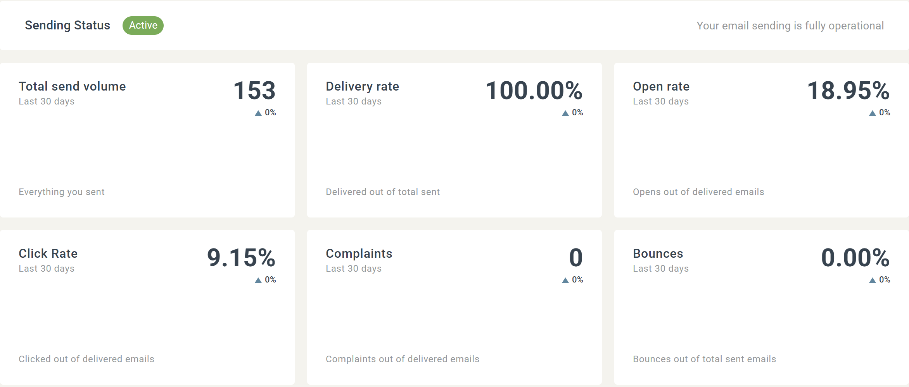
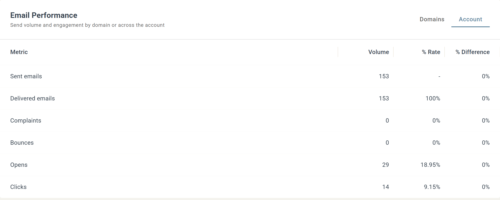

# E-posthälsa

KPI:er på hög nivå, trenddiagram och detaljerade tabeller hjälper dig att se var problemen uppstår och borra ner till exakt vilka domäner eller konton som behöver uppmärksamhet.

## Vad du kan göra med E-posthälsa

* Skydda ditt avsändarrykte genom att övervaka studsar, klagomål och leveransfrekvenser.
* Upptäck risker för leveransbarhet tidigt genom att se negativa trender innan de blir blockeringar eller fördröjningar.
* Följ prestanda över tid, inte bara per utskick.
* Borra ner per mottagande domän eller avsändarkonto för att hitta grundorsaken till problem.

## Datumintervall

All data i översikten beräknas utifrån det valda datumintervallet.

Klicka på knappen för datumintervall högst upp till höger i fliken Email Health och välj något av följande:

* En fördefinierad period — Last 7 days, Last 30 days, Last 90 days, Since yesterday, This week, This month eller Last month.
* Custom — välj start- och slutdatum manuellt. För att visa en enskild dag, sätt samma start- och slutdatum.

Det valda intervallet gäller för översiktskorten, tidsseriediagrammen och tabellerna för Domain och Account.

## Översiktskort

Översiktskorten ger dig en snabb ögonblicksbild av dina viktigaste mätvärden för e-posthälsa:

* Total send volume — totalt antal skickade e-postmeddelanden.
* Delivery rate — levererade e-postmeddelanden som procent av totalt skickade.
* Open rate — öppningar som procent av levererade e-postmeddelanden.
* Click Rate — klick som procent av levererade e-postmeddelanden.
* Complaints — spamklagomål som procent av levererade e-postmeddelanden.
* Bounces — studsar som procent av totalt skickade.

Varje kort visar också förändringen jämfört med föregående datumintervall, så att du snabbt kan upptäcka förbättringar eller negativa trender.

## Mätvärdesdiagram

Avsnittet Metrics visualiserar hur din e-posthälsa utvecklas över tid. Två tidsseriediagram visas:

* Volume — skickade, levererade, öppningar, klick, klagomål och studsar.
* Rate — procentbaserade mätvärden som leverans-, öppnings-, klick-, studs- och klagomålsfrekvenser.

### Interagera med diagrammen

* Hovra över valfritt datum för att se exakta värden för den dagen.
* Klicka på Select Metrics och bocka i de mätvärden du vill visa.
* Jämför flera mätvärden för att upptäcka samband — till exempel ökad volym följd av högre studsfrekvenser.

Dessa diagram är användbara för att fånga gradvisa förändringar som kan signalera framtida leveransproblem.

## Tabellen Domains

Tabellen Domains visar hur dina e-postmeddelanden presterar för varje mottagande domän under det valda datumintervallet. För varje domän ser du:

* Send volume
* Delivered emails (%)
* Bounces (%)
* Complaints (%)
* Opens (%)
* Clicks (%)

### Så använder du Domains-tabellen

* Sortera kolumner för att identifiera domäner med höga studs- eller klagomålsfrekvenser.
* Jämför engagemangsmått mellan domäner.
* Upptäck specifika mottagande domäner där ryktesproblem kan vara på väg att uppstå.

Endast domäner med minst 10 skickade e-postmeddelanden under det valda datumintervallet visas i tabellen.

## Tabellen Account

I kortet Email Performance växlar du från Domains till fliken Account för att se e-posthälsostatistik för hela kontot. Tabellen visar volym och frekvens för:

* Sent
* Delivered
* Complaints
* Bounces
* Opens
* Clicks

Den visar också skillnaden (%) jämfört med föregående datumintervall.

## Förstå studsar och klagomål

### Studsar

En studs inträffar när ett e-postmeddelande inte kan levereras.

* Permanenta studsar uppstår när det finns ett permanent problem, till exempel en obefintlig adress eller en mottagande server som blockerar din domän eller IP.
* Tillfälliga studsar uppstår på grund av tillfälliga problem, till exempel en full inkorg eller ett tillfälligt serverproblem.

Höga studsfrekvenser signalerar dålig listkvalitet och kan skada ditt avsändarrykte.

### Klagomål

Ett klagomål inträffar när en mottagare markerar ditt e-postmeddelande som skräppost i sin e-postklient.

Klagomål är en stark negativ signal till brevlådeleverantörer och kan snabbt skada ditt avsändarrykte om de ökar.

## Best practices

För att upprätthålla god e-posthälsa:

* Granska trender för studsar och klagomål regelbundet.
* Ta bort inaktiva eller ogiltiga mottagare från dina listor.
* Håll koll på domäner med sjunkande leverans eller engagemang.
* Agera tidigt när du ser negativa förändringar — små problem kan eskalera snabbt.

E-posthälsa hjälper dig att agera innan leveransproblem påverkar dina resultat.
