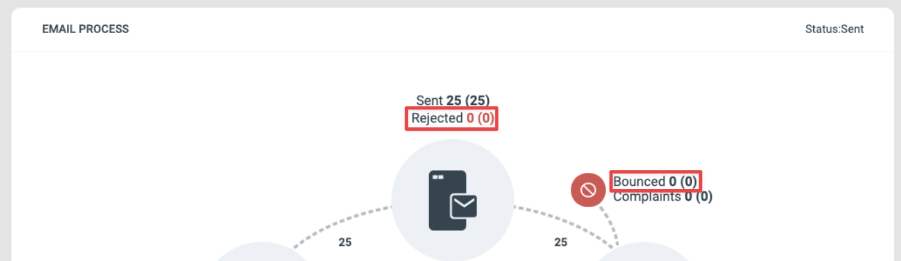
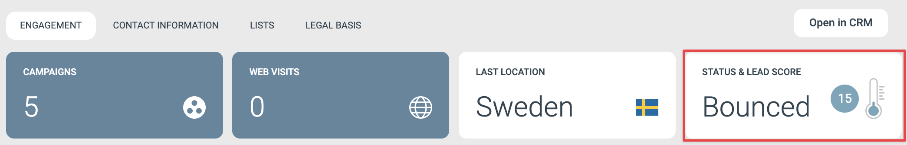

# Identifiera varför ett e-postmeddelande inte togs emot

Den här artikeln förklarar hur du identifierar de vanligaste anledningarna till att en kontakt inte tog emot ett e-postmeddelande och vad du kan göra åt varje orsak.

Tänk på att vissa orsaker ligger utanför din kontroll som avsändare, särskilt de som är kopplade till mottagarens e-posttjänst.

## Vanliga orsaker

1. E-postmeddelandet avvisades innan det skickades.
2. E-postmeddelandet studsade efter att det skickats.
3. Den slutliga leveransen stoppades av kontaktens e-posttjänst.
4. E-postmeddelandet adresserades eller skickades aldrig.

## Identifiera orsaken

### Avvisades e-postmeddelandet eller studsade det?

Du hittar det på e-postkomponentens Report-sida. Öppna motsvarande Selections i e-postrapporten och kontrollera om kontakten finns i någon av listorna.

Event Selections i rapporten

Ett avvisat e-postmeddelande betyder att e-posttjänsten hittade ett problem med avsändaradressen eller mottagaradressen vid den sista kontrollen innan utskick. En mottagare avvisas oftast på grund av ett känt problem med just den mottagaradressen eller domänen, till exempel en domän som inte existerar. Om alla mottagare räknas som avvisade är problemet sannolikt att avsändaradressen eller svarsadressen för e-postkomponenten är ogiltig.

Om en kontakt har studsat, öppna deras kontaktkort från Selection-listan. Under e-postinformationen i Engagement History kan du läsa det studsmeddelande som returnerats av mottagarens e-posttjänst. Exemplet nedan visar ett e-postmeddelande som studsats av en organisations strikta policy som inte tillåter den här typen av meddelande.

Felmeddelande för studs på en kontakts kontaktkort

### Den slutliga leveransen stoppades av kontaktens e-posttjänst

Om kontakten finns i e-postrapportens Delivered-urval har mottagarens e-posttjänst accepterat meddelandet utan leveransproblem. Samma sak gäller om både deras kontaktkort och Details-sidan för e-postmeddelandet i Engagement History visar levererat. När e-postmeddelandet väl är levererat till mottagarens e-posttjänst beror eventuella skäl till att meddelandet inte når inkorgen på en åtgärd som tjänsten vidtagit efter eMarketeers lyckade leverans.

E-postinformation på kontaktkortet som visar leverans

### E-postmeddelandet adresserades eller skickades aldrig

Detta betyder oftast att kontakten togs bort från mottagarlistan i checklistesteget i utskicksprocessen. Du kan läsa mer om det steget i [den här artikeln](../reports/checklist-explained.md).

Om e-postmeddelandet aldrig adresserades till kontakten hittar du vanligen orsaken på deras kontaktkort. Börja med Lead Status-widgeten uppe till höger på kontaktkortet. Om den visar "Bounced" är kontaktens e-postadress markerad som ej levererbar utifrån ett tidigare studsmeddelande som eMarketeer fick från deras e-posttjänst.

Studsstatus på ett kontaktkort

En annan möjlighet är att kontaktens e-postadress är felaktig eller innehåller tecken som inte stöds i e-post. Kontrollera e-postadressfältet på kontaktkortet för att bekräfta.

Det kan också vara så att kontakten avregistrerat sig från framtida utskick och dragit tillbaka sitt samtycke för marknadsutskick, eller avregistrerat sig från den specifika prenumerationslista som användes för utskicket. Samtycket för marknadsutskick och prenumerationsstatus för varje lista syns på fliken Contact Information på kontaktkortet.
