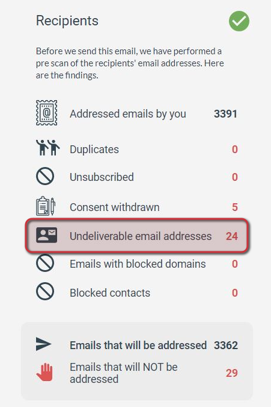
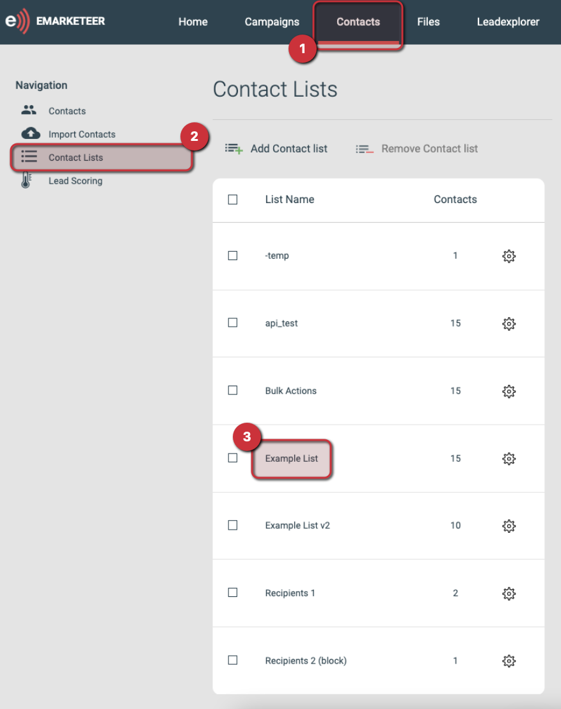
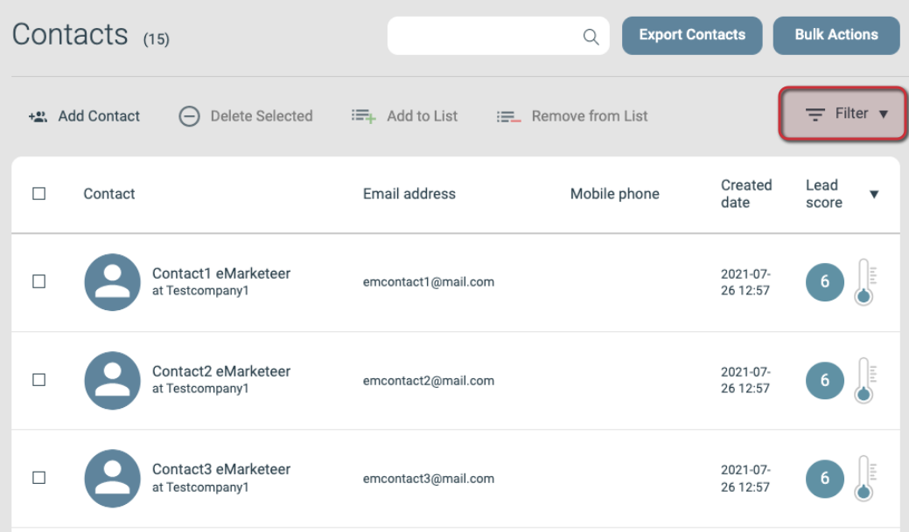

# Så hittar du ej levererbara e-postadresser från checklistan

När du skickar ett e-postmeddelande verifieras mottagare i checklistesteget, och vissa blockeras från utskicket. Den här guiden förklarar kategorin Undeliverable Email Address och visar hur du bygger en lista över de kontakterna för granskning.

## Vad en ej levererbar e-postadress är

En ej levererbar adress är en adress som inte kan ta emot e-post på grund av ett leveransproblem. eMarketeer blockerar utskick till dessa adresser för att skydda ditt avsändarrykte — ett mått som de flesta e-posttjänster använder för att skilja spam från legitim post.

En adress markeras som ej levererbar när ett tidigare utskick returnerade en permanent studs. Du ser det i [e-postrapporten](../reports/email-report-explained.md) och på kontaktkortet. För mer om studsar och avsändarrykte, se [den här artikeln](about-email-bounces.md).

Checklistan kör också en andra, live-kontroll vid utskickstillfället: den verifierar om varje mottagares e-posttjänst för tillfället kan ta emot e-post. Om en mottagares e-posttjänst är tillfälligt nere räknas den kontakten som ej levererbar för det aktuella utskicket, men markeras inte permanent på kontaktkortet. Kontakten kommer sannolikt att ta emot ditt nästa utskick, men du kan inte inkludera dem i listan den här guiden bygger.

## Bygg en lista över kontakter med ej levererbara adresser

Börja på checklistesidan där du ser antalet ej levererbara. Stegen nedan förutsätter att du redan har en kontaktlista för de avsedda mottagarna.

#### 1. Navigera till sidan Contacts

Öppna Contacts-sektionen för kontot.

#### 2. Öppna Contact Lists

Använd menyn till vänster för att öppna Contact Lists.

- Om du inte har en kontaktlista med mottagarna, välj Import istället, skapa listan och återvänd sedan till Contact Lists.
- Om du vill kontrollera alla ej levererbara kontakter på kontot snarare än bara mottagarna från ett specifikt utskick, hoppa till steg 4.

#### 3. Öppna kontaktlistan med mottagarna

#### 4. Öppna Filter-funktionen

Klicka på Filter-knappen till höger på Contacts-sidan.

#### 5. Använd det här filtret

Använd dessa parametrar för att visa endast kontakter med ej levererbara e-postadresser:

`[Delivery: E-mail > Equals > Undeliverable]`

#### 6. Tillämpa filtret

Listan som visas innehåller mottagarna med ej levererbara adresser som du såg på checklistesidan.

## Vad du kan göra med listan

- Öppna ett enskilt kontaktkort och kontrollera engagemangsloggen för det senast skickade e-postmeddelandet. Det specifika leveransfelet som markerade kontakten som ej levererbar visas där.
- Exportera ett kalkylblad med kontakterna.
  - För att begära att den ej levererbara statusen tas bort, exportera deras e-postadresser (kommaseparerade) och skicka filen till support@emarketeer.com.
  - Om du har en CRM-integration som SuperOffice kan du exportera kontakterna till en lista i det CRM:et.
- Använd [Bulk Actions-verktyget](../contacts-lists/bulk-actions-tool.md) för att hantera kontakterna. Till exempel skapar "Add to Contact List" en permanent lista som du kan återkomma till senare.

Om du fortfarande har frågor, kontakta supporten via kanalerna som listas på [den här sidan](https://app.emarketeer.com/corporate/gui/help/contact.php) när du är inloggad.
