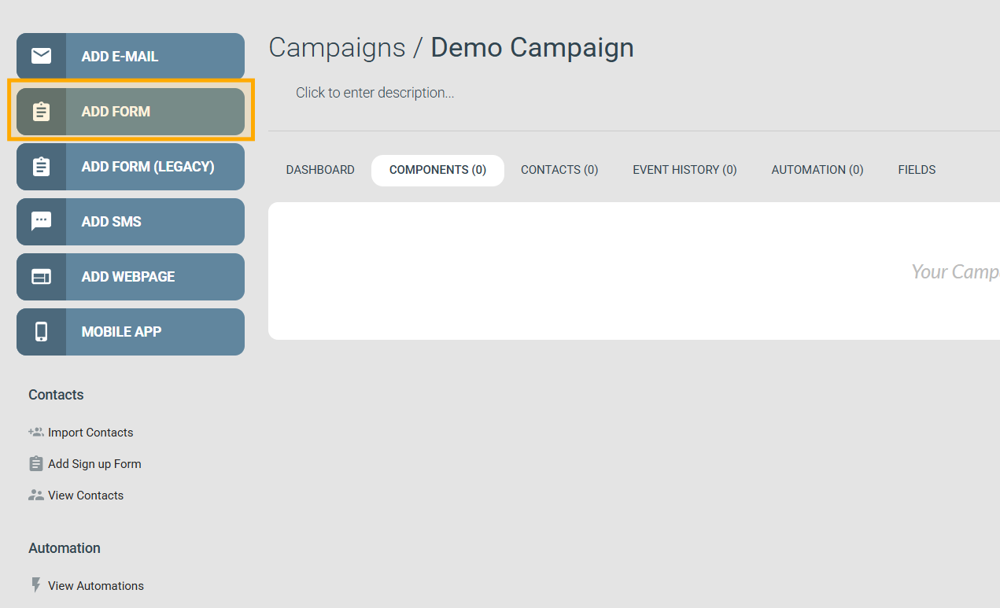

# Formulär


Det här avsnittet gäller den nuvarande **Form**-editorn. För den tidigare formuläreditorn, se [Formulär (Legacy)](legacy.md).


Ett formulär är en kampanjkomponent som du lägger till i en kampanj tillsammans med dina e-postutskick och annat innehåll. Öppna en kampanj och klicka på **Add Form** i den vänstra panelen för att lägga till ett.

När du lägger till ett formulär väljer du bland ett antal färdiga mallar eller börjar från grunden.

Formulär passar för en mängd olika användningsområden:

- Registreringsformulär
- Evenemangsanmälningar
- Enkäter och utvärderingar efter evenemang
- Poängsatta quiz
- NPS-enkäter

Formulär är utformade för att enkelt bäddas in på din webbplats — alla ändringar du gör i eMarketeer uppdaterar det inbäddade formuläret automatiskt. Formulär kan även hanteras direkt av eMarketeer, vilket ger dig en länk som du kan dela eller länka till från valfri plats. Se [Bädda in formulär på din webbplats](../../documentation/forms/publish-a-form.md) för installationsinstruktioner.

Formulärinlämningar registreras som kontaktaktivitet och bidrar till leadpoängsättning. En kontakt som fyller i en evenemangsanmälan eller slutför en enkät genererar engagemangssignaler som räknas in i deras leadpoäng.

### I det här avsnittet




publish-a-form.md



the-form-component.md





ui-overview.md



how-to-link-to-a-form.md



