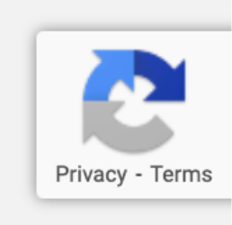

# reCAPTCHA för eMarketeer-formulär

reCAPTCHA skyddar dina formulär från botinskick med hjälp av Googles CAPTCHA-system.

Alla eMarketeer-formulär som publicerats efter den 25 april 2022 har reCAPTCHA-skydd. En grå och blå pilikon längst ned på sidor med formulär som driftas av eMarketeer visar att reCAPTCHA är aktivt.

reCAPTCHA-ikon

reCAPTCHA hindrar bottar från att skicka falska svar till dina formulär, vilket annars skulle fylla dina rapporter med oönskad aktivitet och skapa falska kontakter på ditt konto. Det fungerar både för formulär som driftas av eMarketeer och formulär som du bäddar in på din egen sajt. Följ stegen som visas när du publicerar formuläret.

## reCAPTCHA v3

Tidigare versioner av CAPTCHA bad besökare att identifiera objekt i bilder eller tyda svårläst text. reCAPTCHA v3 fungerar annorlunda: den analyserar hur besökarna interagerar med sidan och använder det för att klassificera varje besökare som person eller bot. Dina formulärbesökare avbryts inte när de skickar in.

För mer information, se [Googles dokumentation för reCAPTCHA](https://www.google.com/recaptcha/about/).

## Stänga av reCAPTCHA

Du kan stänga av reCAPTCHA för formulär på ditt konto från motsvarande inställning på kontots sida för Integration settings.
