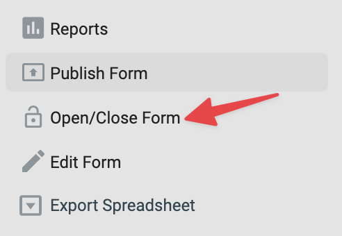

# Formulär: Stäng ett formulär

Sätt villkor för när ett formulär ska sluta ta emot svar.

Använd det här när ett formulär bara ska vara öppet under en begränsad tid eller upp till ett maximalt antal inskick.

## Öppna formulärets publiceringsinställningar

1.  I kampanjvyn, klicka på Publish på formuläret.

    

2.  I vänstermenyn, klicka på Open/Close form.

    

3.  Välj de inställningar du behöver för ditt formulär.

    

