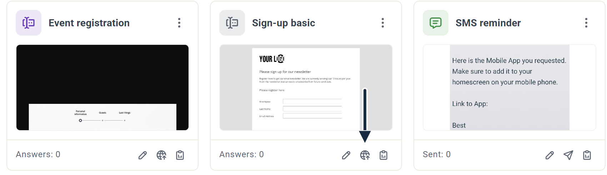
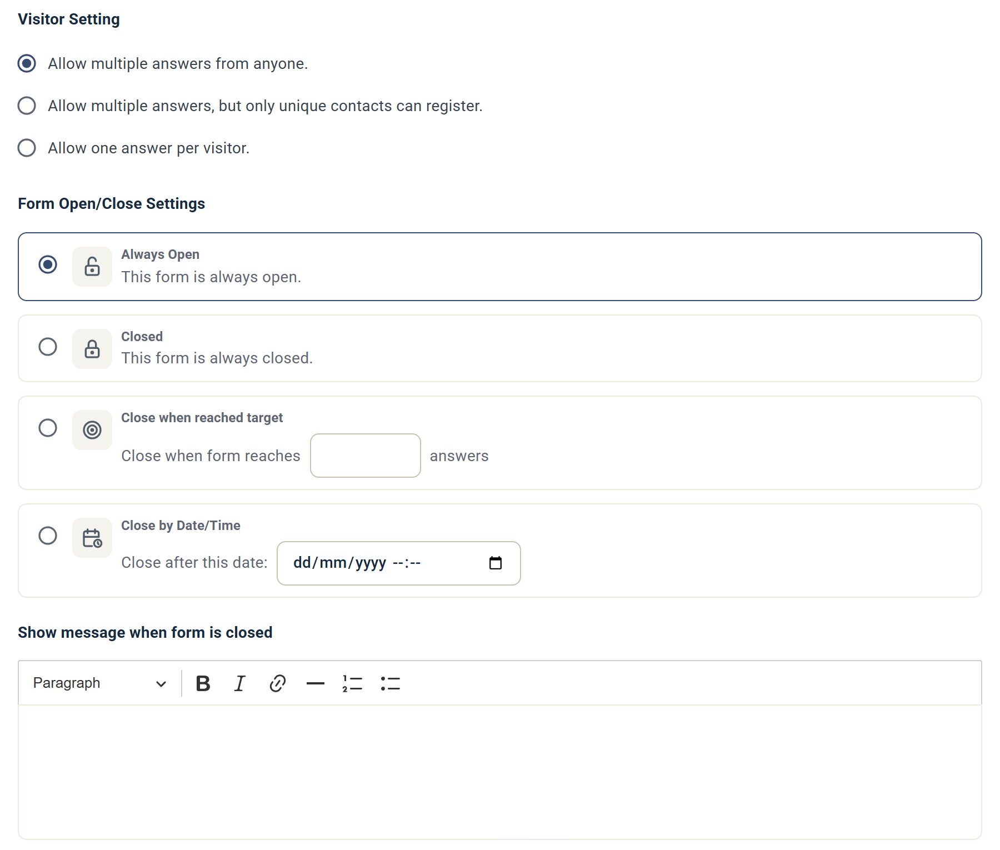

# Formulär: Stäng ett formulär


Den här artikeln gäller **Formulär (Legacy)**. För den nuvarande formuläreditorn, se [Formulär](README.md).


Sätt villkor för när ett formulär ska sluta ta emot svar.

Använd det här när ett formulär bara ska vara öppet under en begränsad tid eller upp till ett maximalt antal inskick.

## Öppna formulärets publiceringsinställningar

1.  I kampanjvyn, klicka på ikonen **Publish** på formulärets kort.

    

2.  Öppna menyn bredvid formulärets namn högst upp på sidan och klicka på **Open/Close Form**.

    

3.  Välj de inställningar du behöver för ditt formulär och klicka sedan på **Save Changes**.

    

