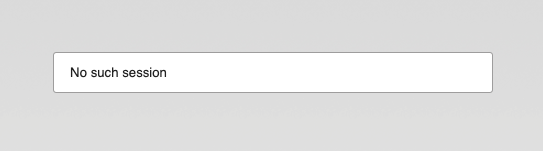
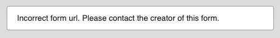

# Identifiera varför ett formulär är otillgängligt (Legacy)

Den här guiden hjälper dig att diagnostisera ovanligt beteende eller trasiga länkar när du försöker nå ett eMarketeer-formulär.

Innan du börjar, öppna ett privat fönster eller inkognitofönster och pröva formuläret där. Om formuläret laddas i privat läge är orsaken troligen gammal data i din webbläsare. Rensa den datan från webbläsarens inställningar så bör problemet vara borta.

Den här artikeln hänvisar till olika typer av eMarketeer-URL:er. För bakgrund, se [Understanding eMarketeer URLs](../account-admin/understanding-em-urls.md).

## The form cannot be displayed at this time

Felmeddelandet "The form cannot be displayed at this time"

Det här betyder vanligtvis att eMarketeer-kontot har nått sin kontaktgräns och inte kan ta emot nya registreringar förrän gränsen höjs eller antalet kontakter minskas.

För att höja kontaktgränsen, skicka en förfrågan till [customerservice@emarketeer.com](mailto:customerservice@emarketeer.com).

## Vit webbsida

En tom webbsida

Det här betyder vanligtvis att URL:en är felaktig, till exempel om några tecken har ändrats i en dynamisk del av URL:en. Gå tillbaka och bekräfta att länken är korrekt, helst [Direct URL](../account-admin/understanding-em-urls.md).

Det kan också hända när ett formulär har flyttats till en annan kampanj. Det inträffar bara med en eMarketeer [Internal URL](../account-admin/understanding-em-urls.md), eftersom interna URL:er är beroende av målkomponentens placering i förhållande till källan. Till exempel slutar ett mejl som länkar till ett formulär i samma kampanj att fungera om du flyttar formuläret till en annan kampanj. Flytta tillbaka komponenterna till deras ursprungliga layout, eller gör om länkningen.

## No such session

En webbsida som visar meddelandet "No such session"

Det här betyder vanligtvis att [Session URL](../account-admin/understanding-em-urls.md) har gått ut. Session-URL:er lever i 24 timmar och tillåter endast ett svar innan de upphör att gälla. Det kan också hända när ett svar har raderats från Form Components Report, eftersom det raderar den session som URL:en pekar mot.

Använd formulärets Direct URL istället.

## Answer already registered

Svaret har redan registrerats

Du ser det här meddelandet när ett formulär är inställt på att tillåta ett svar per person och någon redan har svarat via Session- eller [Personalised URL](../account-admin/understanding-em-urls.md) du försöker använda, eller när den ursprungliga respondenten besöker formuläret igen via en Direct URL. Det kan överraska personer som vidarebefordrat eller mottagit ett vidarebefordrat mejl med en Personalised URL, eftersom bara en person kan svara.

Om du ser det här av misstag, bekräfta att du använt rätt länk och att formulärets besökarinställningar tillåter mer än ett svar.

## Formulärkomponenten har raderats

Direct URL-meddelande för en raderad formulärkomponent

Session URL-meddelande för en raderad formulärkomponent

De här meddelandena betyder vanligtvis att formulärkomponenten har raderats i eMarketeer. I några fall betyder meddelandet "Incorrect Form URL" att någon ändrat URL:en av misstag. Om formuläret fortfarande finns i eMarketeer, bekräfta att URL:en som används för att nå det är korrekt.

## Formulärkomponenten är stängd

Standardmeddelandet för ett stängt formulär

Du ser det här när formulärets Open/Close-inställning är satt till stängd, antingen manuellt eller via ett villkor. Det kan dyka upp oväntat om formuläret är en kopia av en annan formulärkomponent som var stängd eller hade ett stängningsvillkor inställt vid duplicering.

Ändra formulärets Open/Close-inställning till Open så att det tar emot nya svar.

## Anonymous not allowed

Meddelande för ett saknat formulär

Det här meddelandet visas när formulärkomponenten inte finns eller inte kan hittas på den URL som använts.

Hämta rätt URL från formuläret.
