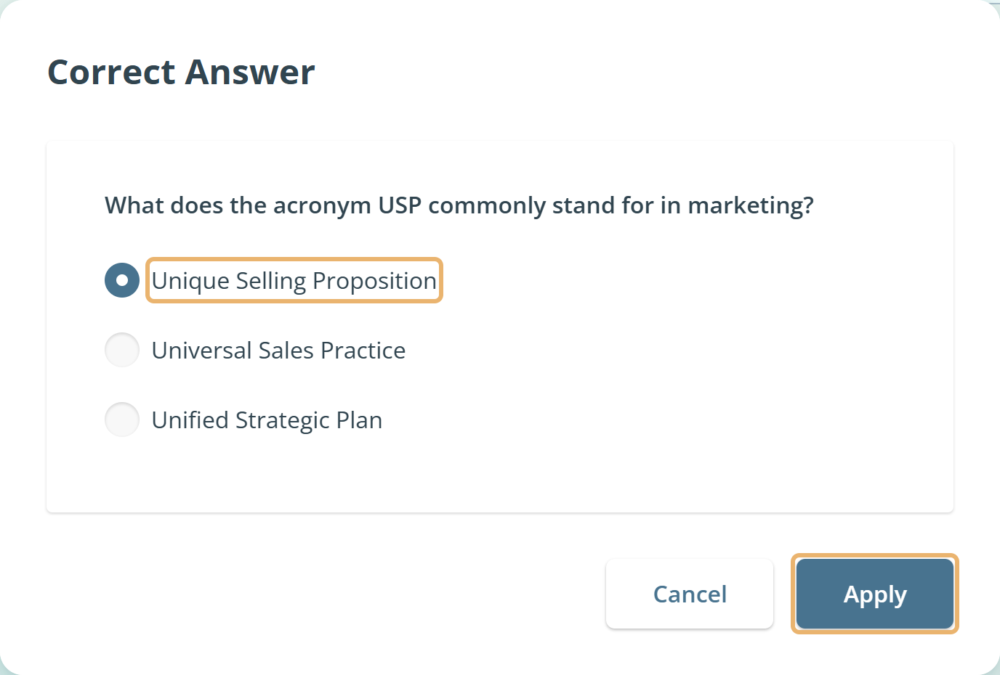
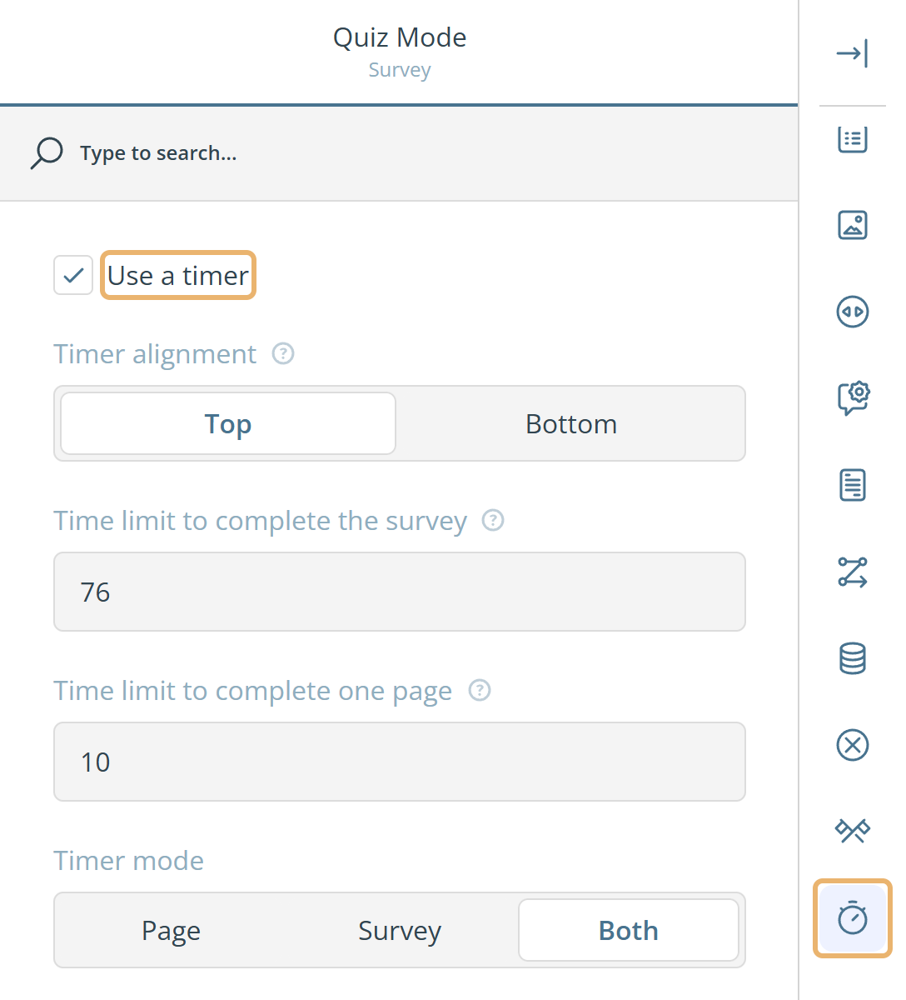
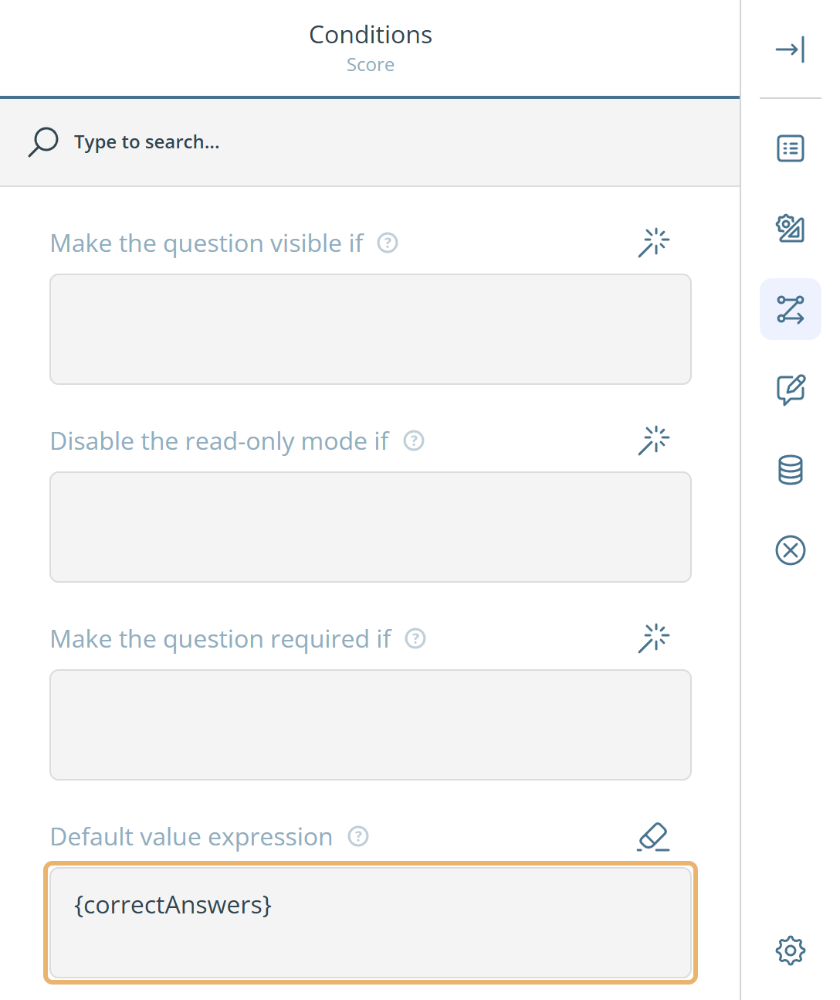

# Så här skapar du ett quiz

Den här guiden visar hur du bygger ett quiz med eMarketeers formulärredigerare, från rätt svar till att visa varje deltagare sitt resultat.

Ett quiz är ett formulär där vissa frågor har ett rätt svar. eMarketeer räknar de rätta svaren, så att du kan visa deltagarna deras resultat, anpassa meddelandet efter hur det gick och spara resultatet med svaren.

## Börja från mallen Scored Quiz

Det snabbaste sättet att bygga ett quiz är att börja från mallen **Scored Quiz**. När du lägger till ett formulär i en kampanj klickar du på **Templates** i dialogen **Choose a starting point** och väljer **Scored Quiz**. Grunderna för att lägga till ett formulär finns i [Skapa ditt första formulär](../getting-started/basics-creating-form-new.md).

Mallen innehåller redan allt som den här guiden beskriver:

* En startsida som frågar efter deltagarens namn.
* Quizfrågor med rätt svar angivna, en fråga per sida.
* En sista sida som visar deltagarens resultat och ber om kontaktuppgifter. Namnet från startsidan fylls i som förnamn.
* Ett dolt **Score**-fält som sparar resultatet med svaren.

Ändra frågorna och texterna så att de passar ditt quiz, eller bygg ett eget quiz från början med stegen nedan.

## Välj frågetyper

Du kan använda alla frågetyper i ett quiz. Flervalsfrågor som **Radio Button Group**, **Checkboxes** och **Dropdown** är vanligast. Mallen Scored Quiz använder även en **Image Picker** och en rangordningsfråga, där rätt svar är rätt ordning.

## Ange rätt svar

Ange ett rätt svar på varje fråga som ska räknas in i resultatet.

1. Klicka på frågan på fliken **Designer** och klicka sedan på **Settings**.
2. Klicka på kategorin **Data** i högra kolumnen i inställningspanelen.
3. Klicka på **Set Correct Answer**.
4. Välj rätt svar och klicka på **Apply**.

När ett rätt svar är angivet heter knappen **Change Correct Answer**. Klicka på den för att välja ett annat svar, eller klicka på **Clear** för att ta bort det rätta svaret.

## Lägg till en startsida

På en startsida kan du ge instruktioner eller fråga efter deltagarens namn innan quizet börjar. Den räknas inte som en del av quizet, och timern startar först när deltagaren lämnar den.

1. Lägg till dina instruktioner och eventuella frågor, till exempel ett namnfält, på formulärets första sida.
2. Klicka på **Survey settings** ovanför designytan, bredvid spara-knappen.
3. Klicka på kategorin **Navigation** och välj **First page is a start page**.
4. Ändra eventuellt texten på startknappen i **"Start Survey" button text**, till exempel till "Starta quizet".

## Ange en tidsgräns

Du kan ge deltagarna en begränsad tid för hela quizet, för varje sida eller för båda. Öppna **Survey settings** och klicka på kategorin **Quiz Mode**.

* **Use a timer** — slår på timern. Tidsgränserna gäller bara när det här är valt.
* **Time limit to complete the survey** — tiden, i sekunder, för hela quizet. När tiden är slut avslutas quizet och deltagaren kommer till tacksidan.
* **Time limit to complete one page** — tiden, i sekunder, för varje sida. När tiden är slut går deltagaren vidare till nästa sida. Med en tidsgräns per sida kan deltagarna inte gå tillbaka till en tidigare sida.
* **Timer alignment** — visa timern högst upp eller längst ned i formuläret.
* **Timer mode** — visa tiden som är kvar på den aktuella sidan, för hela quizet eller båda.

## Visa resultatet på tacksidan

Du kan visa varje deltagare hur många frågor den svarade rätt på. Två variabler innehåller resultatet:

* `{correctAnswers}` — antalet rätta svar.
* `{questionCount}` — antalet frågor som har ett rätt svar.

Så här visar du resultatet:

1. Öppna **Survey settings** och klicka på kategorin **"Thank You" Page**.
2. Skriv ditt meddelande med variablerna i **"Thank You" page markup**, till exempel: `Du fick {correctAnswers} av {questionCount} rätt.`

Skriv variablerna själv, inklusive klammerparenteserna. Knappen för kopplingsfält i redigeraren listar bara kampanj- och kontaktfält.

## Visa olika meddelanden beroende på resultatet

Med **Dynamic "Thank You" page markup** kan tacksidan visa olika meddelanden beroende på resultatet. Du kan till exempel gratulera deltagare som fick alla rätt och uppmuntra dem som inte gjorde det.

1. Öppna **Survey settings** och klicka på kategorin **"Thank You" Page**.
2. Klicka på plusikonen bredvid **Dynamic "Thank You" page markup** för att lägga till en rad. Klicka sedan på **Show Details** på raden.
3. Ange villkoret för meddelandet i **expression**. Till exempel:
   * `{correctAnswers} == {questionCount}` — alla svar är rätt.
   * `{correctAnswers} == 0` — inget svar är rätt.
4. Ange meddelandet som ska visas när villkoret är uppfyllt i **HTML markup**.
5. Upprepa för varje meddelande du behöver.

Om inget av villkoren är uppfyllt ser deltagaren den vanliga **"Thank You" page markup**. Mallen Scored Quiz innehåller en tom rad i den här listan. Fyll i den eller ta bort den.

Om du vill bygga ett villkor utan att skriva det klickar du på trollstavsikonen bredvid **expression** och använder den visuella redigeraren. Mer om villkor finns i [Förgreningslogik i formulär](form-branching-logic.md) och [Uttryckssyntax i formulär](form-expression-syntax.md).

## Visa resultatet innan deltagaren skickar in

I stället för på tacksidan kan du visa resultatet på quizets sista sida. Deltagaren ser då sitt resultat innan formuläret skickas in, och du kan be om kontaktuppgifter på samma sida. Mallen Scored Quiz fungerar så.

Lägg till ett **HTML**-block för varje meddelande på den sista sidan och gör varje block synligt bara för ett visst resultat:

1. Lägg till ett **HTML**-block med ditt meddelande, till exempel `Du fick {correctAnswers} av {questionCount} rätt.`
2. Klicka på **Settings** på blocket och öppna kategorin **Conditions**.
3. Ange villkoret för meddelandet i **Make the question visible if**, till exempel `{correctAnswers} >= 7`.
4. Lägg till ett block till för det andra resultatet, till exempel med villkoret `{correctAnswers} < 7`.

## Spara resultatet med svaren

Om du vill behålla varje deltagares resultat lägger du till ett dolt fält som får sitt värde från `{correctAnswers}`. Resultatet sparas då med resten av deltagarens svar.

1. Lägg till en **Single-Line Input**-fråga på den sista sidan och ge den ett tydligt namn, till exempel "Score".
2. Klicka på **Settings** på frågan. Avmarkera **Visible** i kategorin **General** så att deltagarna inte ser fältet.
3. Ange `{correctAnswers}` i **Default value expression** i kategorin **Conditions**.
4. Ställ in **Clear hidden question values** på **Never** i kategorin **Data**, så att det dolda värdet behålls när formuläret skickas in.

