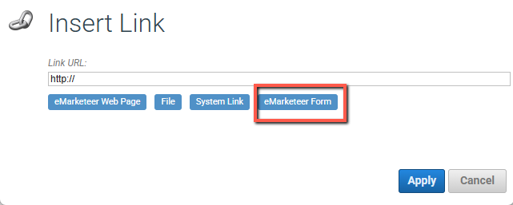

# Så här länkar du till ett formulär

Den här guiden visar hur du länkar till ett formulär från ett e-postmeddelande eller en webbsideskomponent i eMarketeer.

Du kan lägga till länkar i text, bilder eller länkelement som knappar. Stegen nedan använder en knapp som exempel.

## Lägg till länken

Öppna knappens inställningar och klicka på bläddra-knappen bredvid URL-fältet.

Klicka på "link to eMarketeer form."

## Välj länkalternativen

Det sista steget ger dig några alternativ. Välj det som passar ditt användningsfall bäst.

**Choose campaign:** länka till ett formulär utanför den kampanj du arbetar i. Lämna detta som det är för att använda ett formulär från den aktuella kampanjen.

**Choose form:** formuläret som knappen länkar till.

**Choose identification:** skapa antingen en anonym länk eller en personlig länk. En anonym länk är densamma för varje kontakt som tar emot e-postmeddelandet. En personlig länk är unik för varje mottagare.

Identifieringsvalet spelar roll eftersom en personlig länk identifierar respondenten när formuläret öppnas, vilket gör att formuläret kan förifylla kontaktdata du redan har. Vissa funktioner — som "Allow only one answer per visitor" i formulärets publiceringsinställningar — fungerar bäst med en personlig länk.

Klicka på "Select -> Apply -> Save."

## Varför använda den här metoden

Att länka via den här dialogen skapar en länk som är relativ till kampanjen. Om du kopierar kampanjen länkar den nya kopian fortfarande till sitt eget interna formulär — du behöver inte uppdatera URL:en manuellt.
