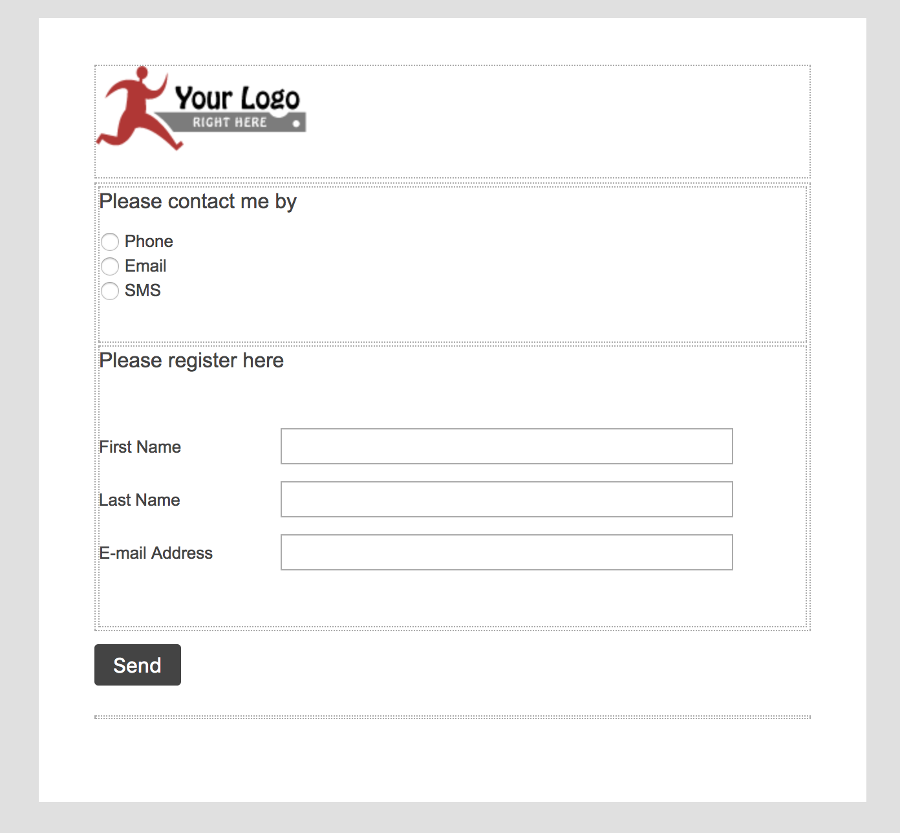
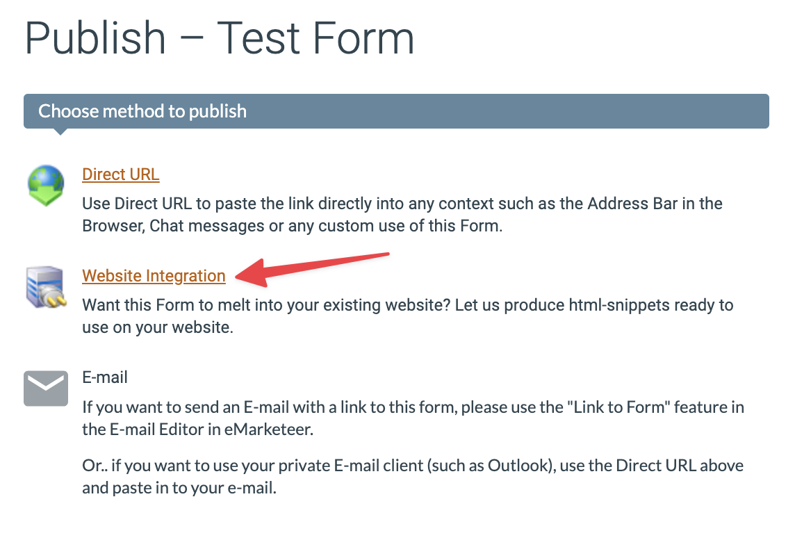
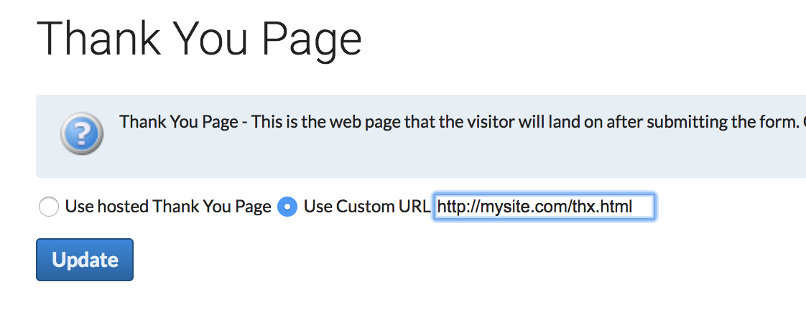

# Posta data till ett formulär


Den här artikeln gäller **Formulär (Legacy)**. För den nuvarande formuläreditorn, se [Formulär](./).


Den här guiden visar hur du postar svar till ett eMarketeer-formulär från din egen webbplats eller från ett annat system.

Den hostade versionen av ett formulär täcker många fall, men ibland behöver du bädda in formuläret på din webbplats eller trigga automationer från ett annat system. Ett formulär är ett flexibelt mål för att posta data utanför eMarketeer.

## Innan du börjar

Du måste alltid skapa formuläret i eMarketeer först. Formuläret definierar vilka frågor du vill ha svar på. När det väl finns kan du posta svar till det på flera sätt:

* Hämta den direkta URL:en och låt besökare svara på det hostade formuläret (täcks inte här).
* Lägg in det hostade formuläret som iframe på din webbplats (täcks inte här).
* Lägg HTML-koden för formuläret på din webbplats.
* Använd ett skript för att posta data till formuläret programmatiskt.

Varje formulär har två viktiga egenskaper:

* En URL att posta datan till.
* Inmatningsfält med ett namn och ett värde.

Om du POST:ar (eller GET:ar) svaren till den URL:en med rätt name/value-par sparas dina svar i eMarketeer.

## 1. Skapa formuläret

Skapa ett formulär i eMarketeer med en kontaktregistrering och eventuella andra frågor du behöver.

## 2. Hämta HTML-koden för formuläret

Klicka på "publish" på formuläret.

Klicka sedan på "Website integration."

Klicka på "GET CODE" under `<FORM>`-sektionen för att öppna formulärkoden. Om reCAPTCHA är aktivt på ditt konto behöver du lägga till en domän i domänfältet innan du kan komma åt koden.

Formulärkoden visas.

Du kan klistra in den här koden direkt på din webbplats. Den postar svaren till eMarketeer och visar sedan tacksidan.

Du kan styla om och ändra ordningen på koden hur mycket du vill — så länge du behåller action-URL:en och inmatningsnamnen intakta. Det finns också ett dolt inmatningsfält som heter "m" med ett värde som identifierar vilket formulär som ska postas till. Behåll det.

## cURL och andra metoder för att posta

När du har URL:en och inmatningsfälten fungerar varje metod som postar till den URL:en. I stället för att använda en webbläsare kan du använda cURL eller ett liknande verktyg för att posta programmatiskt. Behåll inmatningsnamnen intakta. GET är också giltigt — skicka parametrarna i query-strängen.

## Egen tacksida

Om du bäddar in formuläret på din webbplats kanske du vill skicka besökare till din egen tacksida i stället för den eMarketeer-hostade. För att ändra omdirigeringen redigerar du formuläret i eMarketeer och klickar på "Thank you page." Välj "Use custom URL" och ange URL:en att omdirigera till.

