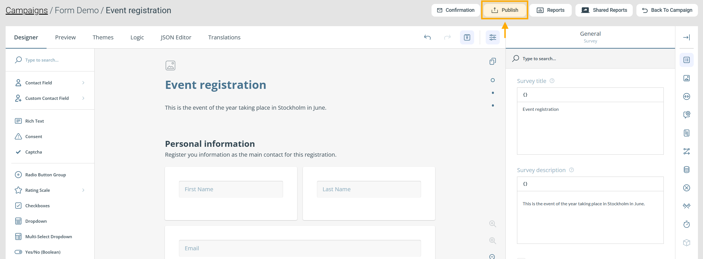
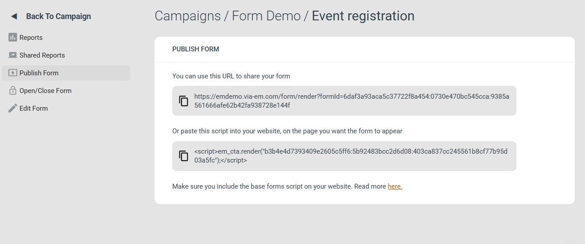
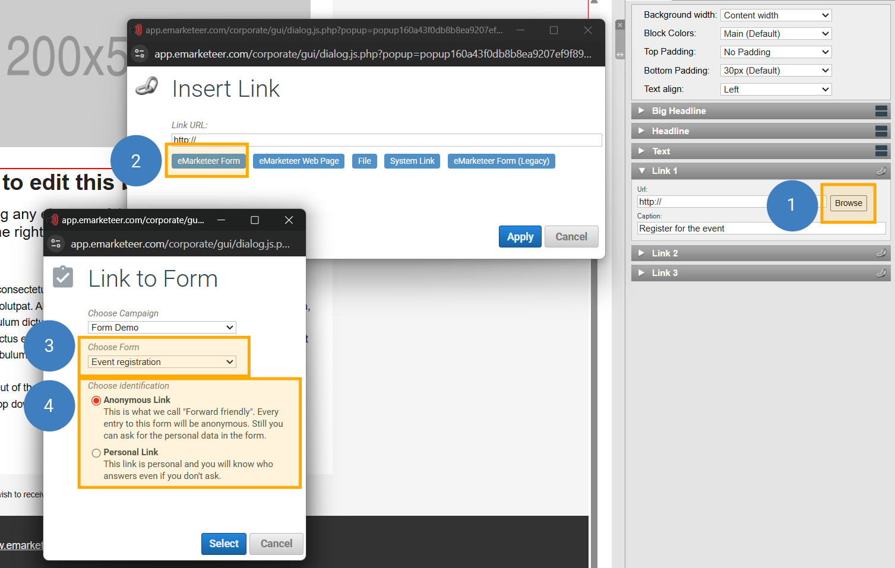

# Så publicerar du ett formulär

eMarketeer erbjuder tre sätt att dela ett formulär med respondenter: en värd-URL, en inbäddning på webbplats och en länk från ett e-postmeddelande.

## Öppna Publish-panelen

Navigera till kampanjens komponentvy och klicka på **Publish** under formuläret. Du kan även öppna formuläreditorn och klicka på **Publish** i verktygsfältet.

## Publish-alternativ

### Värd-URL

En delningsbar länk till formuläret. Formuläret visas som det ser ut i förhandsgranskningsläget (Preview). Dela länken direkt — via sociala medier, i ett chattmeddelande eller som en länk på din webbplats.

### Bädda in på din webbplats

Placerar formuläret på en webbsida med ett skriptavsnitt. Se [Bädda in formulär på din webbplats](../../documentation/forms/publish-a-form.md) för en fullständig guide.

## Länka till ett formulär från ett e-postmeddelande

Vill du länka till ett formulär från ett eMarketeer-e-postmeddelande använder du Insert Link-metoden i stället för Publish-panelen. Det skapar en kampanjrelativ länk, vilket innebär att länken fortfarande pekar på rätt formulär om du kopierar kampanjen.

1. Öppna Insert Link-menyn — till exempel genom att klicka på **Browse**-knappen på ett Link-block.
2. Klicka på **eMarketeer Form**.
3. Välj formuläret i rullgardinsmenyn **Choose form**. Om formuläret tillhör en annan kampanj väljer du den kampanjen i **Choose campaign** först.
4. Välj identifieringsmetod:
   - **Anonymous link** — samma URL för varje mottagare. Respondenten identifieras inte när formuläret öppnas.
   - **Personal link** — en unik URL per mottagare. Identifierar kontakten när de öppnar formuläret, vilket möjliggör förifyllda fält och personaliserat innehåll.

