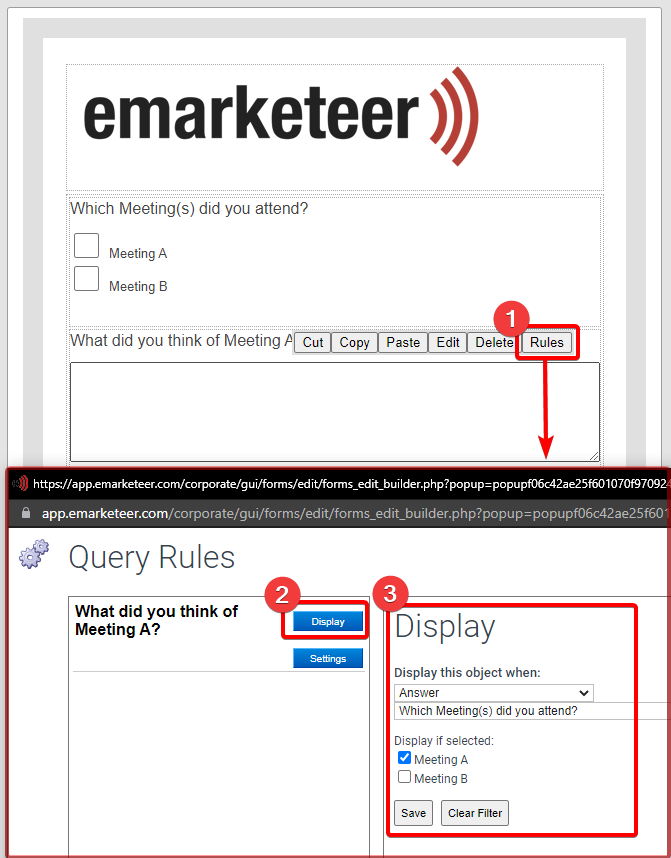

# Skapa förgrenade frågevägar och använd visningsregler för frågor i formulär


Den här artikeln gäller **Formulär (Legacy)**. För den nuvarande formuläreditorn, se [Formulär](README.md).


Förgrena frågor i formulär eller dölj dem tills de är relevanta genom att använda regler på formulärfrågor.

Det finns två huvudsakliga tillvägagångssätt:

1. Förgrena till olika sidor med frågor baserat på ett svar, genom att hoppa till en specifik sida.
2. Visa eller dölj frågor på samma sida baserat på ett svar, genom att använda visningsalternativ.

## Skip to Page

Skip to Page är enklare när varje gren har många frågor.

Regeln ändrar vilken sida besökaren landar på när hen klickar på Next Page. I det här hypotetiska scenariot frågar ett formulär om två möten. Varje besökare deltog i ett, och frågorna skiljer sig beroende på vilket.

För att sätta upp detta använder du en radioknappsfråga där varje svar har en Skip to Page-regel. Frågor om Meeting A finns på sida 2, frågor om Meeting B på sida 3.

Det valda svaret flyttar besökaren till den matchande sidan. För att hindra en besökare som skickats till sida 2 från att fortsätta in i Meeting B-frågorna på sida 3, dubbelklickar du på Next Page-knappen på sida 2 och sätter den att hoppa fram till sida 4.

## Visningsregler för frågor

Visningsregler passar små förgreningar, eller formulär på en sida. De visar eller döljer en fråga baserat på besökarens tidigare svar.

I det här hypotetiska scenariot frågar ett formulär om två möten, och en besökare kan ha deltagit i ett eller båda. Frågor för varje möte ska bara visas för besökare som deltog i det mötet, och alla frågor ska visas om båda besöktes.

Använd en checkbox-fråga där besökaren väljer Meeting A, Meeting B eller båda. Lägg till de mötesspecifika frågorna efter den, öppna sedan reglerna för var och en och konfigurera dess visningsinställningar. I det här exemplet är Meeting A-frågan inställd att visas endast när det alternativet är valt i den föregående checkbox-frågan.

Visningsregler konfigureras per fråga och stöder flera svar — eller kombinationer av svar — i den föregående frågan. Checkbox-svar är inte ömsesidigt uteslutande, så med fler än två alternativ kan du visa en fråga endast för specifika kombinationer.

En fråga kan inte både vara obligatorisk och dold. Om en fråga har aktiva visningsregler ignoreras inställningen för obligatorisk.
