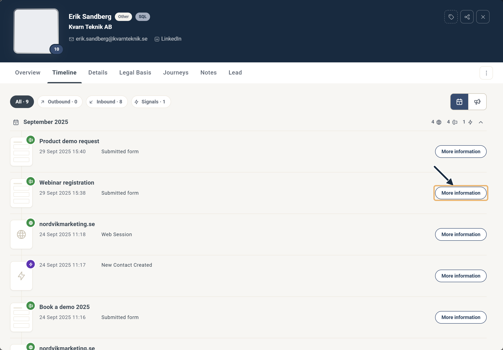

# Hur tar jag bort ett formulärsvar?


Den här artikeln gäller **Formulär (Legacy)**. För den nuvarande formuläreditorn, se [Formulär](README.md).


Ta bort testsvar, felaktiga svar eller hela uppsättningen svar från en formulärrapport.

Det finns tre sätt att ta bort oönskade formulärsvar, beroende på var du startar.

## Ta bort från Spreadsheet-rapporten

Öppna formulärrapporten och gå till fliken Spreadsheet. Varje rad innehåller kontaktdata och svaren från en kontakt. Markera en eller flera rader — Delete answers-knappen aktiveras, med det valda antalet visat inom parentes.

Spreadsheet-rapport med två rader markerade.

## Ta bort från kontaktkortet

Hitta kontakten på det sätt du föredrar — sökrutan för kontakter, ett filter eller genom att gå in i en komponentrapport. Öppna kontaktkortet och gå till fliken Timeline. Hitta formulärinlämningen du vill ta bort, klicka på More information och klicka sedan på Delete answers.

Hitta formulärinlämningen i tidslinjen och klicka på More information.

Delete answers tar bort kontakten från rapporten.

## Ta bort från fliken Campaign Contacts

Använd det här alternativet när du vill ta bort en kontakt från flera komponentrapporter samtidigt. Gå till fliken Contacts i kampanjen, bläddra eller sök efter kontakten, kryssa i rutan bredvid en eller flera kontakter och klicka på Remove from Campaign.

Att ta bort en kontakt från kampanjens kontakter tar bort kontakten från alla kampanjrapporter.
