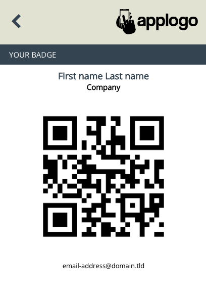

# Så här scannar du närvaro på event med en mobiltelefon

Använd en mobiltelefon för att registrera närvaro på plats på fysiska event genom att scanna deltagarnas QR-koder.

Närvaron registreras genom att skicka in en e-postadress via ett eMarketeer-formulär. I stället för att skriva in varje besökares e-post använder du en telefon med en QR-kod-tangentbordsapp för att scanna deras kod från event-appen.

Exemplet nedan använder dessa eventkomponenter.

* **Invitation email.** Skicka din inbjudan till den publik du vill ha på ditt event.
* **Registration form.** Där publiken anmäler sig till eventet. Be om mobilnummer.
* **App delivery and mobile app.** Skapa en app för ditt event för att hålla all eventinformation i deltagarnas fickor. Aktivera QR-koden. "App Delivery" är ett SMS med en länk till appen; skicka det till alla som anmält sig.
* **Scan form.** Formuläret som används för att registrera deltagare. Det är byggt för att ta emot en e-postadress och återgå till registreringssidan efter inskickning. Skapa det genom att lägga till ett "New Form" och välja mallen "Event Barcode Scan".

### Registrera närvaro

På eventdagen anländer dina besökare med sin mobila event-app som visar en streckkod som ska scannas.

#### Förberedelser

Innan du kan scanna QR-koder behöver du en tangentbordsapp på din telefon.

[Du hittar appen här](https://www.socketmobile.com/readers-accessories/product-families/socketcam/get-started)

_Notera: den här appen är inte en eMarketeer-produkt. Andra "QR code keyboard"-appar finns tillgängliga. Till exempel_ [_den här appen_](https://play.google.com/store/apps/details?id=com.nikosoft.nikokeyboard) _för Android och_ [_den här appen_](https://apps.apple.com/us/app/scankey-qr-ocr-nfc-keyboard/id1356206918) _för iPhone._

När du installerar appen läggs ett nytt tangentbord till på din telefon. Det fungerar som ett vanligt tangentbord men kan också scanna streckkoder.

#### Scanna närvaro

Hämta webb-URL:en för formuläret "Event Barcode Scan" i din eMarketeer-kampanj och öppna den på din telefon.

För att scanna en bricka:

1. Tryck på textfältet i formuläret så att tangentbordet öppnas. Växla till det nya tangentbordet med QR-scan.
2. Tryck på ikonen för streckkodsscanning (uppe till höger). Kameran öppnas — scanna streckkoden.
3. Formuläret skickas in automatiskt och visar kontaktuppgifterna för den scannade personen.
4. Efter några sekunder återgår skärmen till att scanna en annan person. Upprepa från steg 1.

Varje scannad bricka blir en formulärinskickning från en känd kontakt i eMarketeer. Du vet exakt vilka som deltog och kan följa upp utifrån vem som var registrerad.

När deltagarna är scannade kan du också:

* Skicka utvärderingar endast till dem som faktiskt deltog.
* Skapa Journeys baserat på att ha blivit scannad — till exempel ett SMS-välkomnande med tips.
* Nå ut under eventet via SMS med relevant information, som "Glöm inte din goodie bag."

### Alternativ scanninguppsättning (avancerat)

Du kan generera formulärspecifika QR-koder för att registrera deltagare som kan scannas med vilken smartphone-kameraapp som helst. Detta kräver mer planering och konfiguration. Se [den här artikeln](advanced-event-qr-code.md) för installationsguiden.
