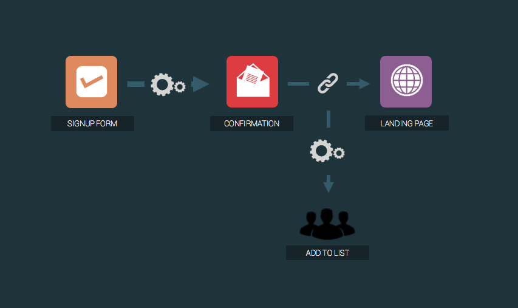

# Prenumeration med double opt-in

Double opt-in är en registreringsprocess där kontakten bekräftar sin prenumeration i två steg, vilket verifierar att adressen tillhör personen som skickade in formuläret.

För att bygga detta i eMarketeer, börja med att bestämma var verifierade kontakter ska lagras. Vanliga val är att lägga till dem i en kampanj, lägga till dem i en kontaktlista eller markera en kryssruta på kontaktkortet.

## Så fungerar processen

Double opt-in består av tre komponenter:

- Registreringsformuläret, placerat på din webbplats.
- Bekräftelse-e-postmeddelandet, som skickas efter att formuläret har skickats in. Det innehåller en länk som "Klicka för att verifiera din e-postadress."
- Landningssidan, som bekräftar klicket med ett meddelande som "Tack. Du prenumererar nu på vårt nyhetsbrev."

## Skapa double opt-in

1. Skapa komponenterna:
   - Registreringsformuläret som ska publiceras på din webbplats.
   - Bekräftelse-e-postmeddelandet som tackar kontakten och länkar till bekräftelsesidan.
   - Bekräftelsesidan som bekräftar att registreringen är klar.
2. Skapa automationerna:
   - Send Email — skickar bekräftelse-e-postmeddelandet när registreringsformuläret skickas in.
   - Add to contact list — utlöses när någon länk i bekräftelse-e-postmeddelandet klickas. Du kan byta ut den mot Add to campaign, Update contact card eller en annan åtgärd som passar din inställning.

När formuläret skickas in går bekräftelse-e-postmeddelandet ut. När kontakten klickar på länken landar de på bekräftelsesidan och automationen lägger till dem i din kontaktlista.
