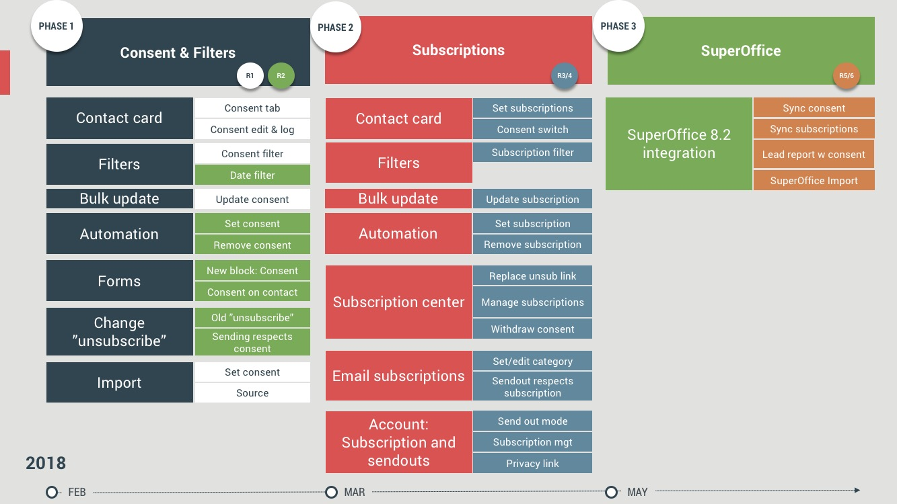

# [Video] GDPR och vad det innebär för eMarketeer-användare

Den här videon går igenom eMarketeers GDPR-färdplan och de nya funktionerna du kan förvänta dig innan GDPR träder i full kraft den 25 maj.

General Data Protection Regulation (GDPR) ger äganderätten och kontrollen över personuppgifter tillbaka till EU-medborgare. EU-invånare har rätten att bli glömda, rätten till åtkomst till sina uppgifter och rätten att de lagras säkert, bland andra skydd. Personuppgiftsbiträden (du) och personuppgiftsansvariga (eMarketeer) behöver justera processer för att efterleva.

### Videopresentationens upplägg

0:46 GDPR-översikt och nyckelbegrepp
6:13 Samtyckeshantering och koncept
7:44 Funktionsöversikt
17:10 eMarketeers GDPR-färdplan
19:51 Releaser och rekommendationer för dig

### Nya funktioner som hjälper dig att nå GDPR-efterlevnad

- Samtyckeshantering: varje kontakt behöver ett ändamål (varför du lagrar uppgifterna), en rättslig grund (rätten som tillåter dig att lagra dem) och en källa (varifrån uppgifterna kommer). Allt detta hanteras i eMarketeer.
- Prenumerationskategorier: kontakter kan välja vilken information de vill ta emot.
- Nya automationer: till exempel möjlighet att uppdatera samtycke och prenumerationskategorier.

### [GDPR-färdplanen](is-there-an-emarketeer-gdpr-roadmap.md)

GDPR-funktioner levereras i tre faser, två releaser per fas. Bilden nedan sammanfattar vad varje release täcker.

För mer, besök [eMarketeer GDPR Center](emarketeer-gdpr-overview.md) eller ladda ner [GDPR-guiden](https://www.emarketeer.com/portfolio/gdpr-guide-businesses-prepare/) för en snabbreferens.

För andra frågor om GDPR, mejla support@emarketeer.com.
