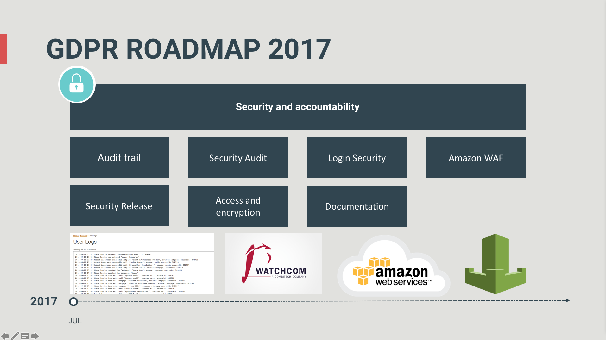
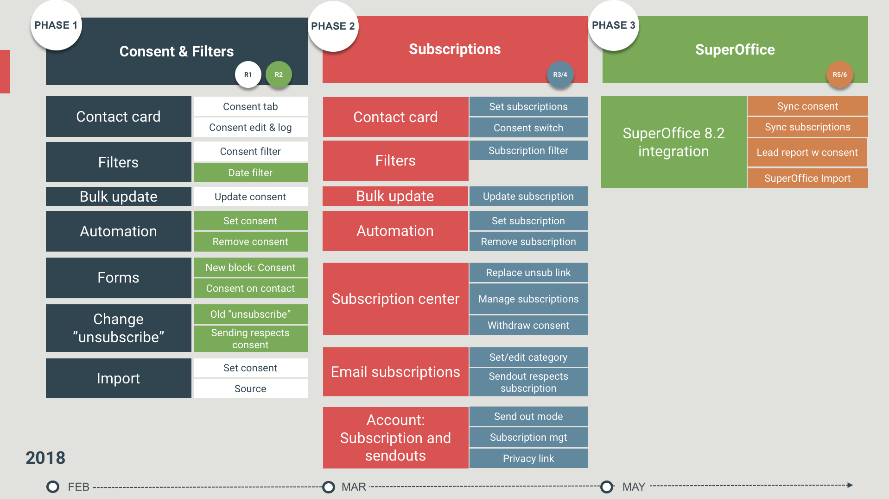

# eMarketeers GDPR-färdplan

Innan den 25 maj kommer eMarketeer att leverera de funktioner du behöver för att hantera samtycke och hålla det synkroniserat med SuperOffice om du har den integrationen.

> TODO: verify — this article references a 2018 deadline and may be out of date.

## Huvudfunktioner på färdplanen

- Samtyckeshantering — funktioner för att sätta och spåra samtycke på alla kontakter. Detta täcker massuppdateringar till befintliga kontakter och alla scenarier för nya kontakter, oavsett om du importerar dem eller om de registrerar sig via webbformulär.
- Prenumerationshantering — ett sätt för mottagare att finjustera den kommunikation de tar emot eller avregistrera sig helt (återkalla marknadsföringssamtycke).
- SuperOffice-integration — integrationen för SuperOffice 8.2 och senare uppdateras för att hålla samtycken och prenumerationer synkroniserade.

## Tidsram

Under 2017 slutförde vi den första delen av GDPR-projektet. Detta säkerställde att vår plattform, som personuppgiftsbiträde, uppfyllde viktiga krav kring säkerhet, granskningsloggar och mer. Bilden nedan illustrerar arbetet som utfördes 2017.

## GDPR-färdplan 2018

Funktionerna rullas ut i den ordning som listas ovan, med början med samtyckeshantering. Detta ger dig mer tid att migrera. Prenumerationer följer, därefter SuperOffice-anpassningarna.

Färdplanen illustreras nedan.

