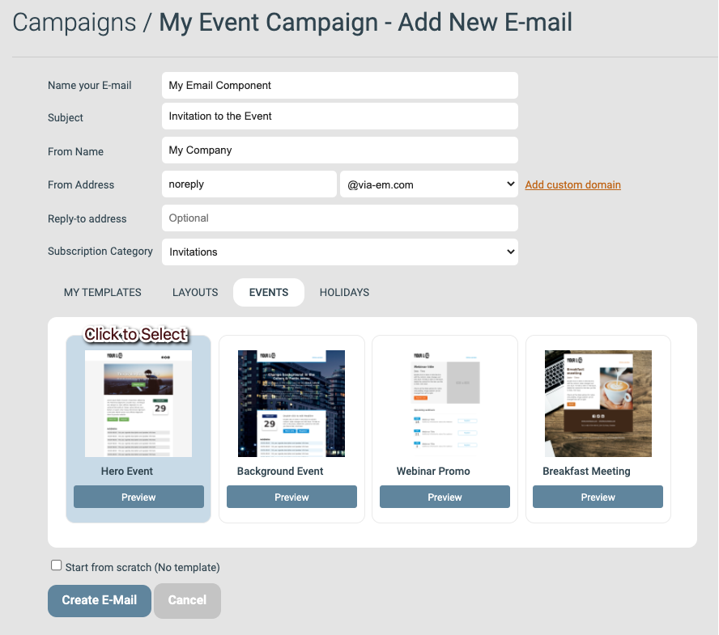

# Skapa din första e-post

Den här guiden tar dig genom hur du skapar en e-post i eMarketeer, från grundinställningar till redigering av innehållsblock och de sista detaljerna.

Exemplet bygger ett inbjudningsmejl till ett event, men processen är densamma för alla typer av e-post. När du är klar har du en e-post som är redo att skickas.




### Lägg till e-posten från kampanjsidan

Klicka på **Add Email** på kampanjsidan.

* Om du behöver skapa kampanjen först, se [Så här skapar du en ny kampanj](create-new-campaign.md).

Knappen Add Email




### Fyll i inställningar, välj en mall och skapa e-posten

E-postinställningar

**Inställningar**

* **Name your email:** Ge e-posten ett unikt namn så att du hittar den senare. Beskriv e-postens syfte i kampanjens sammanhang — till exempel "Inbjudan" för ett inbjudningsmejl. Bara du ser det här namnet; det visas inte för dina kontakter.
* **Subject:** Ämnesraden som mottagarna ser i sin e-postklient.
* **From Name:** Avsändarnamnet som visas i mottagarnas e-postklient.
* **From Address:** Den här består av två delar som tillsammans bildar avsändaradressen.
  1. Delen före `@` kan vara nästan vad som helst. Om du är osäker fungerar `noreply` i de flesta fall, men en riktig inkorg som kan ta emot svar är att föredra.
  2. Delen efter `@` är din e-postdomän. Du måste lägga till din egen domän innan du kan skicka. Se [den här artikeln](../../documentation/custom-domain/custom-email-domain.md) för hur.
* **Reply-to Address (optional):** En adress som tar emot eventuella svar, användbart om From Address inte kan ta emot e-post. Används sällan; ofta tryggt att hoppa över.
* **Subscription Category (optional):** Om ditt konto använder prenumerationslistor kan du kategorisera den här e-posten här. Används sällan; ofta tryggt att hoppa över.

**Mall**

Välj en mall från någon av flikarna som utgångspunkt för designen. Den här guiden använder **Hero Event** från fliken **Events**. Egna mallar som sparats på ditt konto visas under **My Templates**.

**Skapa e-postkomponent**

När inställningar och mall är klara klickar du på **Create Email** för att skapa komponenten.




### E-postredigeraren

När du klickat på **Create Email** öppnas redigeraren med den nya e-posten. Menyn till vänster låter dig lägga till innehållsblock, nå verktyg och uppdatera inställningarna från steg 2. Resten av sidan visar e-postens innehåll, importerat från mallen du valde.

Innehållet består av innehållsblock som du redigerar var för sig i följande steg.

Vy över e-postredigeraren




### Redigera ett innehållsblock

Varje innehållsblock består av flera delar som du kan uppdatera. Klicka på blockets redigeringsknapp för att öppna dess inställningar.

Redigera ett innehållsblock

En inställningsmeny öppnas till höger med två flikar: **Content** och **Styles**. Content är där du ändrar blockets inställningar och innehåll. Styles är där du ändrar färger och typsnitt.

På fliken Content styr första sektionen hur blocket visas — låt standardvärdena vara tills vidare. Andra sektionen är det som syns i blocket: bilder, rubriker, textstycken och knappar.




### Ändra ett blocks rubrik

För att ändra en rubrik eller ett textstycke klickar du på titellisten för den delen och redigerar texten i textrutan. Om du lämnar textrutan tom döljs den delen av blocket.

I bilden nedan använder vi varken textstycket eller två av länkknapparna, så de visas inte i e-posten.

Klicka på **Save** efter varje ändring för att spara ditt arbete.

Uppdatera textinnehåll i ett block




### Ladda upp en bild

För att ladda upp en egen bild öppnar du innehållsblocket för redigering, går till Image-sektionen i högermenyn och klickar på **Choose Image**.

Knappen Choose Image

Så här laddar du upp och använder en bild:

1. Klicka på **Upload File**.
2. Klicka på **Choose files** och välj bilden på din dator.
3. Ladda upp filen till ditt eMarketeer-konto.
4. Klicka på filen i webbläsarfönstret för att välja den.
5. Klicka på **Use Selected** för att lägga till den i innehållsblocket.

Steg för att ladda upp och använda en ny bildfil

Om bilden inte matchar rekommenderade mått för blocket visas ett alternativ att skala om den automatiskt. Klicka på länken i meddelandet för att godkänna.

Alternativet Auto Scale




### Lägg till en knapp med en länk

Använd knappar för att länka till en webbsida, en fil eller en annan eMarketeer-komponent. För en webblänk skriver du in URL:en i Link-inställningarna (inklusive `http://` eller `https://`-protokollet) och skriver en knappetikett. Så här länkar du till en annan eMarketeer-komponent:

1. Öppna innehållsinställningarna för "Link 1" och klicka på **Browse**.
2. Klicka på **eMarketeer Form**.
3. Välj kampanjen som innehåller ditt formulär i första rullgardinsmenyn, och därefter formuläret i andra rullgardinsmenyn.
4. Klicka på **Select**, sedan **Apply** och slutligen **Save** för att lägga till länken och spara blocket.

Uppdatera knapplänk i ett innehållsblock




### Lägg till ett nytt innehållsblock

För att lägga till ett nytt innehållsblock klickar du på **Add Content Block** i vänstermenyn. I Add Content-menyn till höger klickar du på **Add Block** intill den typ du vill ha.

Om knappen är grå klickar du först på ett befintligt block för att tala om för redigeraren var det nya ska placeras.

Lägg till ett innehållsblock och välj sedan det specifika blocket du vill ha




### Flytta ett innehållsblock

För att flytta ett block klickar du och håller in flyttikonen till vänster på blockets kontextlist och drar det till den nya positionen.

Flytta ett block genom att dra det på plats




### Ta bort ett innehållsblock

För att ta bort ett block från mallen klickar du på borttagningsknappen på blockets kontextlist.

Knappen för att ta bort ett innehållsblock




### Använd ett block med kalenderlänk

Vissa innehållsblock har stöd för kalenderlänk, vilket är användbart för event. När en mottagare klickar på länken genererar eMarketeer en kalenderfil som lägger till eventet i mottagarens kalender med de inställningar du valt.

Du konfigurerar kalenderhändelsen i blockets innehållsmeny — datum, tid, titel, plats och så vidare.

Håll fältet **Description** i ren text och begränsa det till två eller tre korta stycken.

Uppdatera Add to Calendar-blocket




### Lägg till en preheader och slutför e-posten

Email Settings-blocket högst upp i de flesta e-postmeddelanden är valfritt. De flesta av dess inställningar är för speciella användningsfall som rör delade länkar till e-postinnehållet, men **Preheader** är värd att använda.

Preheadern är den korta sammanfattning som mottagarens e-postklient visar bredvid ämnesraden. Använd den för att sammanfatta vad e-posten innehåller.

När din preheader är sparad klickar du på **Done Editing** för att lämna redigeraren.

Skriv en preheader och lämna redigeraren




### Vad du gör härnäst

E-posten är redo att skickas. Se [Så här skickar du en e-post](basics-send-email.md).
