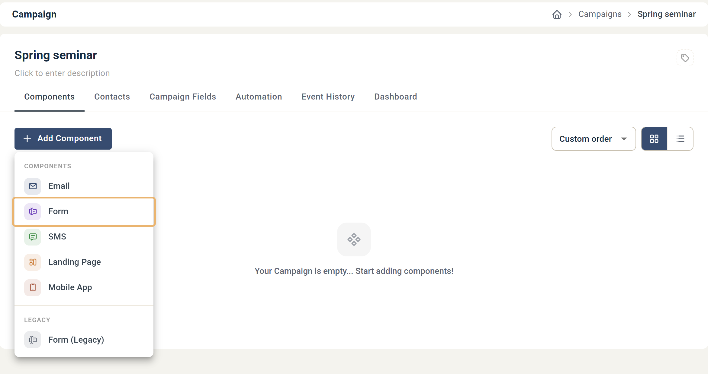
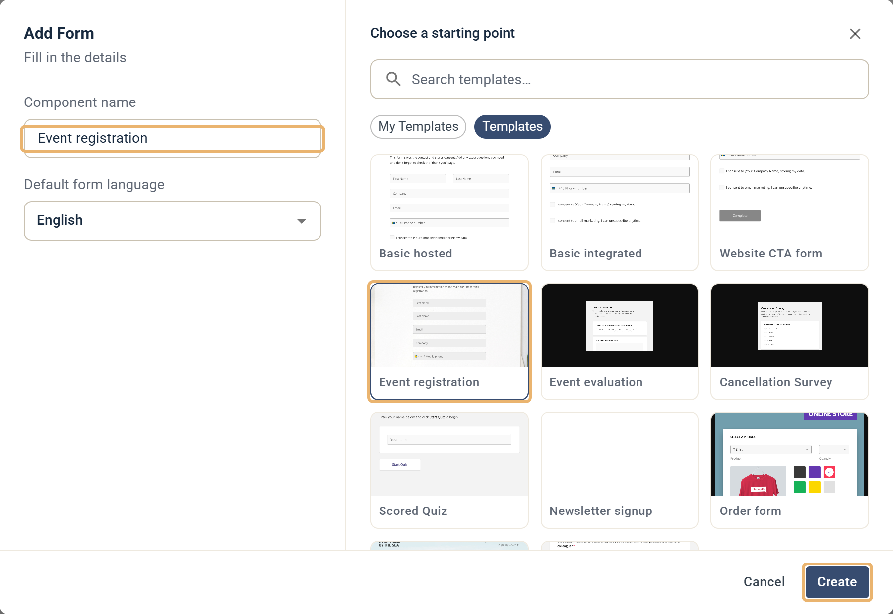
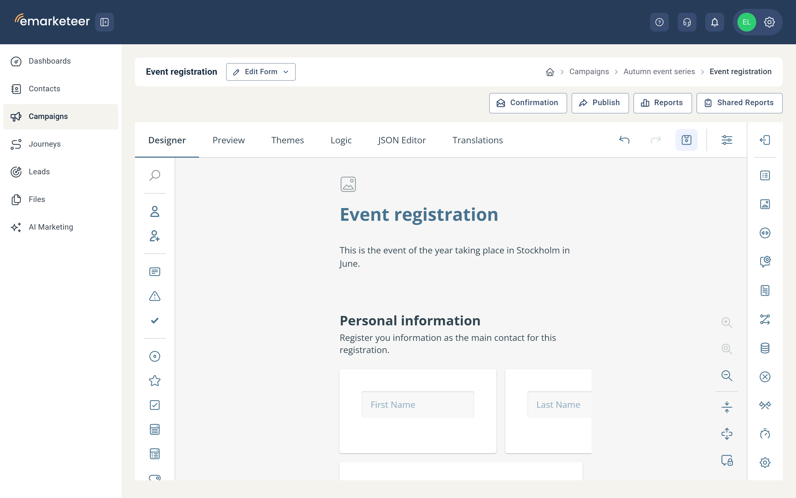
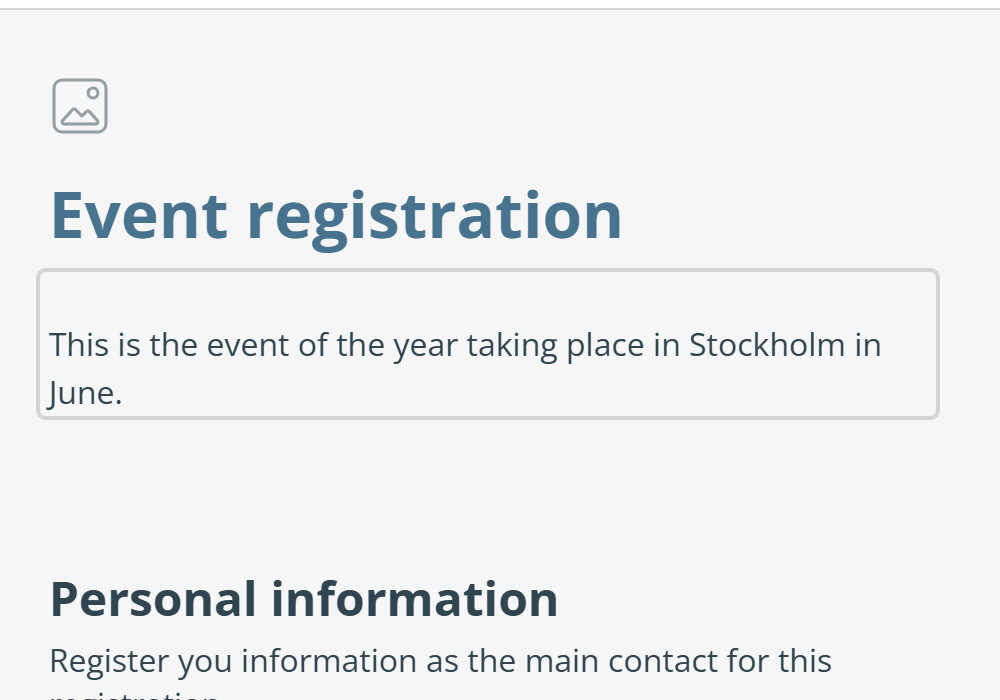
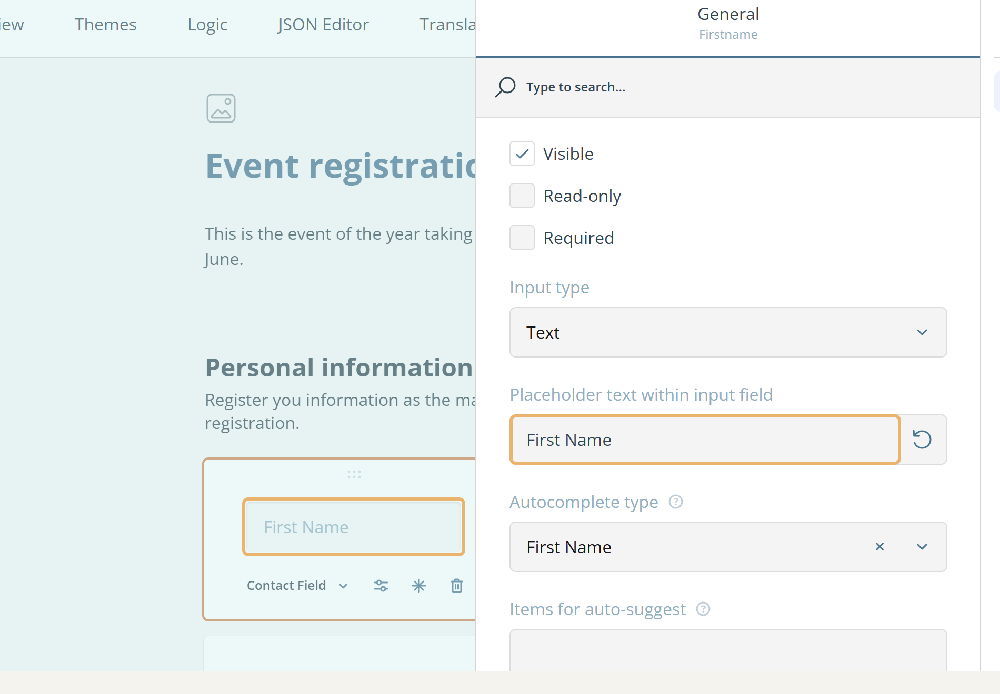
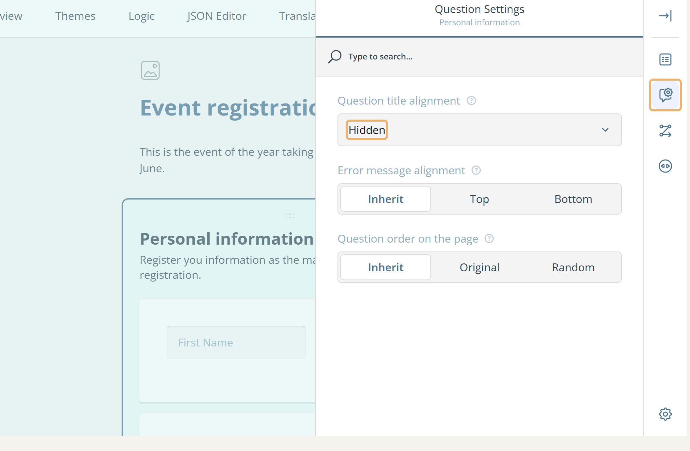
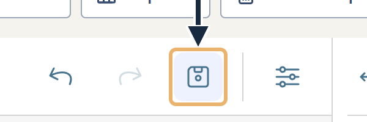
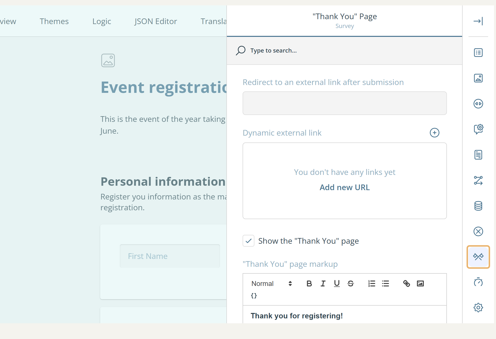
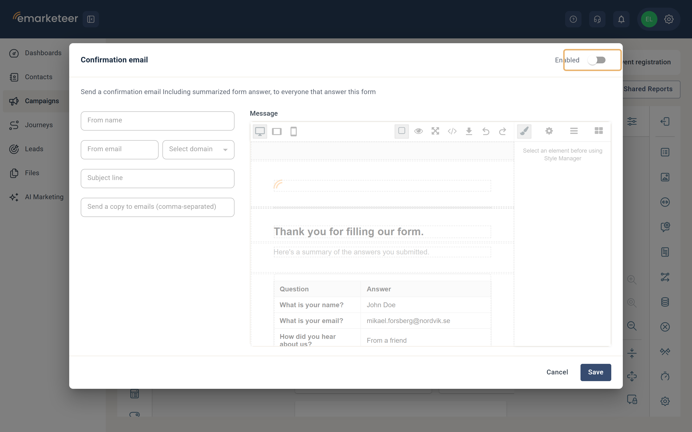
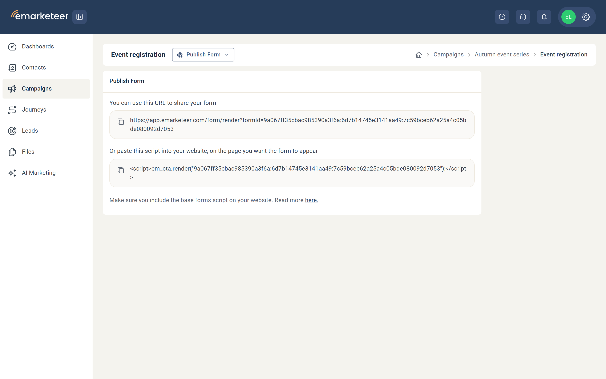

# Skapa ditt första formulär


För att skapa ett formulär behöver du en kampanj först. Om du inte har någon redo, se [Så här skapar du en ny kampanj](create-new-campaign.md).


Den här guiden tar dig igenom att skapa ett formulär i eMarketeer — för en eventregistrering, nyhetsbrevsprenumeration eller annat ändamål.

När du är klar har du ett fungerande formulär med en tacksida och ett valfritt bekräftelsemeddelande.



### Lägg till formuläret från kampanjsidan

Klicka på **Add Component** i kampanjen där du vill skapa formuläret och välj sedan **Form**.




### Fyll i inställningar, välj mall, skapa formuläret

**Inställningar**

* **Component name:** Ge formuläret ett unikt namn så att du hittar det senare. Beskriv syftet i kampanjen — till exempel "Registrering" för ett registreringsformulär. Bara du ser det här namnet; det visas inte för besökare.

**Mall**

Välj en mall från någon av flikarna som utgångspunkt för designen. Den här guiden använder **Event Registration** från fliken **Templates**. Egna mallar sparade på ditt konto visas under **My Templates**.

**Skapa formulärkomponent**

När inställningar och mall är valda klickar du på **Create** för att skapa komponenten.



### Formuläreditorn

När du klickar på **Create** öppnas editorn med fliken Designer aktiv. Menyn på vänster sida (Toolbox) låter dig lägga till formulärfält genom att dra dem till designytan — det centrala området där du strukturerar formulärlayouten och lägger till sidor. Mallen **Event Registration** öppnas med tre sidor: **Personal information**, **Guests** och **Last things**.

En fullständig referens för alla flikar och alternativ finns i [Formuläreditor: UI-översikt](../../documentation/forms/ui-overview.md).



### Ändra titel och beskrivning

Många mallar öppnas med en Survey title och Survey description längst upp. Klicka på någon av texterna i designytan för att redigera den, eller justera dem under General Survey settings.




### Justera formulärfälten

Kontaktfält är de viktigaste fälten i ett formulär som samlar in identifierade svar. De sparar besökarens kontaktinformation och matchar den mot din eMarketeer-kontaktdatabas — uppdaterar ett befintligt kontaktkort eller skapar ett nytt om inget finns.


Använd **Contact Field** i stället för **Single-Line Input**-fält för att spara inlämnade data som kontaktdata. Det säkerställer att en kontakt kan kopplas till formulärinlämningen.


Justera fälten på sidan **Personal information**. Mallen Event Registration innehåller First Name, Last Name, Email, Company och Mobile som standard. Lägg till fler kontaktfält från Toolbox eller knappen **Add question** längst ned på varje sida.

Gör ett fält obligatoriskt genom att markera kryssrutan **Required** i fältets verktygsfält. Ta bort ett fält genom att hovra över det och klicka på papperskorgsikonen i samma verktygsfält. Du kan också radera hela sidor — om du använder mallen Event Registration kanske du vill ta bort sidan **Guests**.

Många eMarketeer-formulärmallar använder platshållartexter i stället för frågenycklar — titlarna är dolda som standard via fältinställningarna, så etiketten visas inuti fältet i stället för ovanför det.

Om synliga titlar föredras kan det aktiveras i formulärfältets **Layout**-egenskaper, under rullgardinsmenyn **Question title alignment** för enskilda frågor — eller i bulk genom att uppdatera sidans **Question Settings**.

Spara dina ändringar genom att klicka på diskettikonen ovanför designytan.




### De vanligaste formulärfälten

Det här steget går igenom de grundläggande frågetyperna för att komma igång.

* **Radio Button Group:** En fråga med flera fördefinierade svar där besökaren väljer _ett_.
* **Checkboxes:** En fråga med flera fördefinierade svar där besökaren kan välja _flera_.
* **Long Text:** En fråga där besökaren kan skriva ett valfritt textsvar. Använd det här för längre svar.
* **Consent:** En kryssruta med text du väljer. Att markera den uppdaterar samtyckesinställningen på besökarens kontaktkort — användbart när du behöver uttryckligt samtycke för att lagra kontaktinformation.

Du hittar de här frågetyperna i Toolbox i menyn till vänster. En fullständig lista över tillgängliga frågetyper finns i [Formuläreditor: UI-översikt](../../documentation/forms/ui-overview.md#question-types).



### Ställ in tacksidan

När en besökare skickar in formuläret visas tacksidan för att bekräfta att svaret sparades. Standardtacksidan innehåller ett enda textblock som du kan redigera för att passa ditt formulär.

Öppna tacksidans inställningar genom att klicka på **Survey Settings** (bredvid Spara-knappen) ovanför designytan och sedan klicka på **Thank You Page** (korsade flaggor-ikonen) i Property Grid på höger sida.

Ändra texten på tacksidan genom att redigera fältet **Thank You page markup**. Vill du omdirigera besökare till en extern URL efter inlämning använder du alternativet **Redirect to an external link after submission**.


Tacksidan visas ändå kort innan omdirigeringen sker, om inte **Show the "Thank You" page** är avbockat.




### Konfigurera ett bekräftelsemeddelande (valfritt)

Med bekräftelsemeddelandets inställningar kan du skicka en kopia av varje inlämning till en angiven e-postadress och skicka en kopia av svaren tillbaka till den som skickade in formuläret.

1. Klicka på knappen **Confirmation** och aktivera sedan funktionen med reglaget i det övre högra hörnet.
2. Fyll i avsändarinformationen (obligatoriskt):
   * **From name:** Avsändarnamnet som visas i mottagarens e-postklient.
   * **From email:** Avsändaradressen — välj ett prefix och välj en domän i rullgardinsmenyn.
   * **Subject line:** Ämnesraden som visas i mottagarens e-postklient.
3. Vill du skicka en kopia till dig själv eller en kollega efter varje inlämning fyller du i **Send a copy to emails**. Separera flera adresser med kommatecken.
4. Redigera e-postbrödtexten vid behov:
   * Dubbelklicka för att redigera ett block. Dra och släpp för att flytta block.
   * Klicka på **Open blocks** i det övre högra hörnet för att lägga till fler innehållsblock.
   * Blocket **Form Answers** visar de svar som respondenten skickade in.



### Publicera ditt formulär

När formuläret är klart klickar du på **Publish** i editorns övre menyrad.

* **Hosted URL:** En delningsbar länk till formuläret. Formuläret visas som det ser ut i fliken Preview. Dela det direkt via sociala medier, i ett chattmeddelande eller som en länk på din webbplats.
* **Bädda in på din webbplats:** Placerar formuläret på en webbsida med ett skriptavsnitt. Se [Bädda in formulär på din webbplats](../../documentation/forms/publish-a-form.md) för en fullständig guide.
* **E-post:** Länka till formuläret från ett e-postmeddelande. Se [Så publicerar du ett formulär](../forms/how-to-publish-a-form.md#länka-till-ett-formulär-från-ett-e-postmeddelande) för mer information.


