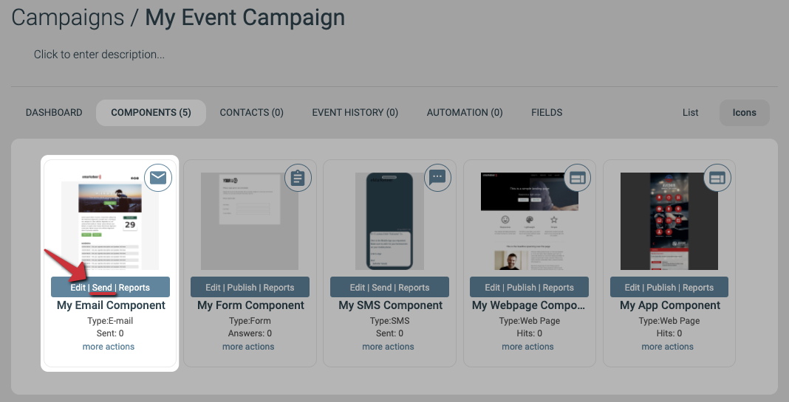
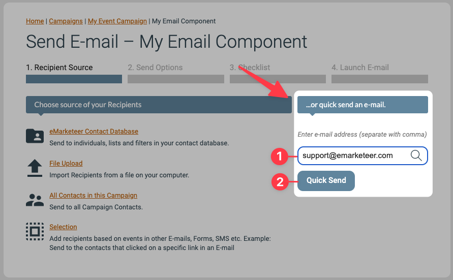
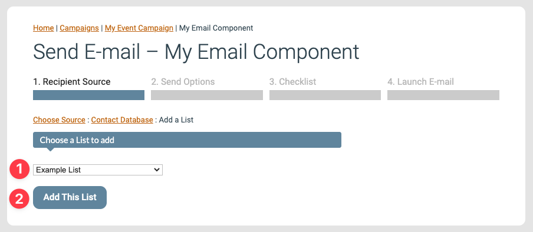
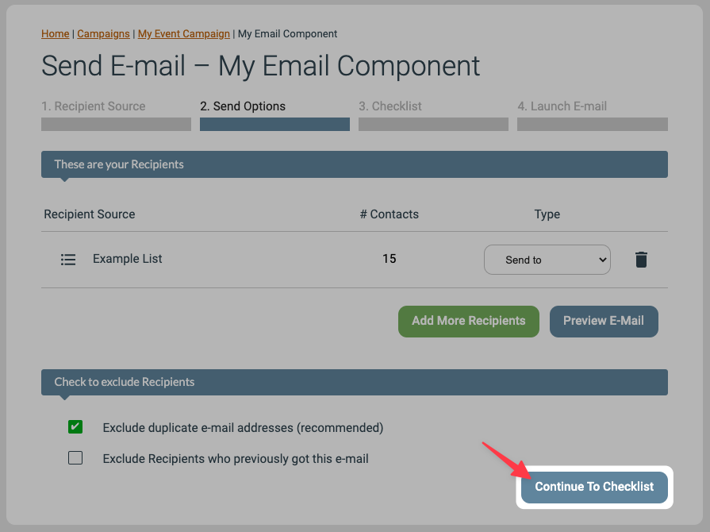
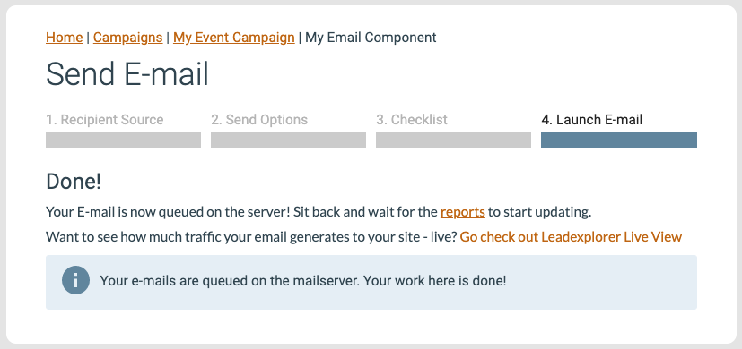

# Så här skickar du en e-post

Den här artikeln går igenom den enklaste vägen för att skicka en e-post i eMarketeer — från en färdig e-postkomponent till en lista med kontakter.

Vi hoppar över de mer avancerade funktionerna här och fokuserar på ett rakt utskick.


Innan du börjar behöver du en färdig e-postkomponent. Se [Skapa din första e-post](basics-creating-email.md) om du inte har en än.




### Starta utskicket

Gå till kampanjen som innehåller e-posten och klicka på **Send**.




### Välj Send Now

Den här guiden går igenom hur du skickar direkt. Du har också möjlighet att schemalägga e-posten till en senare tidpunkt.




### Skicka ett testmejl eller skicka till dina kontakter

**Alternativ A — Skicka ett testmejl till dig själv (valfritt)**

För att förhandsgranska e-posten i din egen e-postklient skickar du ett snabbt test till dig själv. Skriv in din e-postadress i adressfältet och klicka på **Quick Send**.

**Alternativ B — Skicka e-posten till din kontaktlista**

Det här steget har tre sidor.

Om du inte har en kontaktlista än, se:

* [Så här skapar du en ny kontaktlista](new-contact-list.md)
* [Importera kontakter från Excel eller ett kalkylark](../contacts-lists/import-contacts-from-excel.md)

Välj först **eMarketeer Contact Database**.

Välj sedan **Contact List**.

Välj till sist din kontaktlista i rullgardinsmenyn och klicka på **Add This List**. Exemplet nedan använder en lista som heter "Example List" med 15 kontakter.




### Fortsätt till checklistan

Nästa sida, **2. Send Options**, visar den valda mottagarlistan och erbjuder alternativ för mer komplexa utskick. För ett enkelt utskick kan du hoppa över detaljerna här.

Klicka på **Continue To Checklist** för att fortsätta.




### Granska checklistan och starta utskicket

Checklistan visar om några kontakter från din lista kommer att exkluderas från utskicket. eMarketeer blockerar automatiskt kontakter som har avregistrerat sig eller av andra skäl inte ska få e-posten. Du behöver oftast inte oroa dig för siffrorna här — de hanteras åt dig.

Om du vill se detaljerna, se [Förstå e-postchecklistan](../reports/checklist-explained.md).

Klicka på **Launch Email** för att adressera och skicka e-posten till kontakterna i listan.




### Utskicket är klart

Efter starten lämnas e-posten över till e-postservrarna, som vanligtvis hinner adressera och skicka inom några minuter.




### Vad du gör härnäst

Du kan följa utskicket och se detaljerad statistik i e-postrapporten. Se [E-postrapporten förklarad](../reports/email-report-explained.md).
