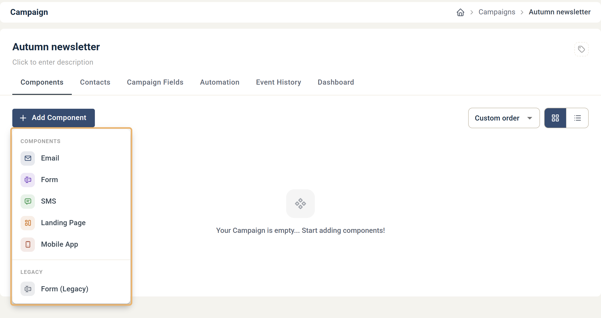

# Så här skapar du en ny kampanj

Skapa en kampanj som behållare för de e-postmeddelanden, formulär och webbsidor du vill skicka och publicera.

En kampanj samlar relaterade komponenter, så att skapa en är oftast första steget för ett nytt arbete i eMarketeer.

Skapa en kampanj

### 1. Öppna Campaigns i vänstermenyn

Om du vill att den nya kampanjen ska ligga i en befintlig mapp, navigera till den mappen först.

### 2. Klicka på \[New Campaign] uppe till vänster

### 3. Ge kampanjen ett unikt namn

Namnet identifierar kampanjen inom eMarketeer och visas aldrig för dina kontakter. Du kan också lägga till en valfri beskrivning och taggar. Båda är bara interna.

### 4. Klicka på \[Create] i dialogrutan

Detta skapar kampanjen och öppnar dess tomma komponentsida.

***

## Vad du gör härnäst

Klicka på \[Add Component] för att lägga till din första komponent i kampanjen. Det kan vara en e-postinbjudan, ett anmälningsformulär eller en landningssida.

Menyn Add Component

Följande artiklar går igenom varje komponenttyp från början till slut:

* [Skapa din första e-post](basics-creating-email.md)
* [Skapa ditt första formulär](basics-creating-form-new.md)
* [Skapa din första SMS](basics-creating-sms.md)
* [Skapa din första landningssida](../developer-advanced/creating-first-webpage.md)
