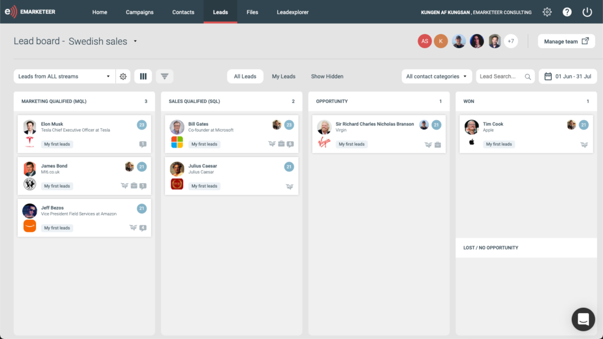

# Kom igång med leads

eMarketeer Leads låter marknadsföring kvalificera kontakter utifrån engagemang och persona och sedan leverera dem till säljteam i realtid.

Lead Board ger sälj ett intuitivt sätt att kvalificera och föra leads framåt. Den här guiden täcker tre områden:

1. Sätta upp säljteam och leverera kvalificerade leads till dem.
2. Arbeta med leads som säljanvändare.
3. Använda eMarketeer Leads inuti ditt CRM.

## Generera och leverera leads till ett säljteam

För att kvalificera och leverera leads krävs tre delar:

- **Säljteam**
  Leads kan bara levereras till säljteam. Du kan ha ett team eller flera.
  [Skapa ett säljteam](https://support.emarketeer.com/knowledgebase/sales-teams/)
- **Lead Streams**
  En Lead Stream är en uppsättning kvalificeringsregler (ett filter). Varje kontakt som matchar filtret kvalificeras som ett lead och levereras till det valda säljteamet eller -teamen.
  [Skapa Lead Streams](https://support.emarketeer.com/knowledgebase/lead-streams/)
- **Säljanvändare**
  En säljanvändare har tillgång till Lead Board för att hantera leads och tillhör alltid ett team som tar emot leads.
  [Skapa säljanvändare](https://support.emarketeer.com/knowledgebase/sales-users/)

## Arbeta med Lead Board

När leads kommer in öppnar säljanvändarna Lead Board för att granska berikade leads och föra dem nedåt i tratten.

[Öppna guiden för Lead Board](https://support.emarketeer.com/knowledgebase/the-lead-board/)

## Lead Board och SuperOffice

eMarketeer Lead Board fungerar fullt ut inuti SuperOffice. Lär dig hur Lead Board och SuperOffice fungerar tillsammans.

[Lead Board och SuperOffice](https://support.emarketeer.com/knowledgebase/lead-board-and-superoffice/)
