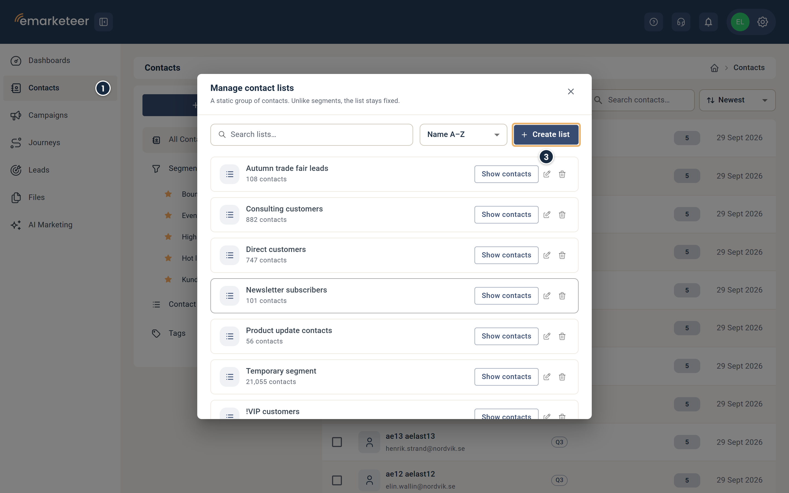

# Så här skapar du en ny kontaktlista

En kontaktlista är en statisk segmentering av kontakter. Du bestämmer vilka kontakter som ingår i den och använder listan som målgrupp när du skickar en kampanj.

Stegen för att skapa en ny kontaktlista.

## Steg-för-steg

1. Öppna sidan Contacts genom att klicka på Contacts i sidofältet till vänster.
2. Klicka på Contact lists i navigeringen på sidan Contacts. Då öppnas panelen Manage contact lists.
3. Klicka på Create list ovanför listan med befintliga kontaktlistor.
4. Ange ett namn och klicka på Create för att skapa listan.


Kontaktlistor kan också läggas till från verktyget [Bulk Actions](../contacts-lists/bulk-actions-tool.md) — markera de kontakter du vill ha och lägg till dem i en ny eller befintlig lista.


## Vad du gör härnäst

För att importera kontakter från Excel till den nya listan, se [Importera kontakter från Excel](../contacts-lists/import-contacts-from-excel.md).
