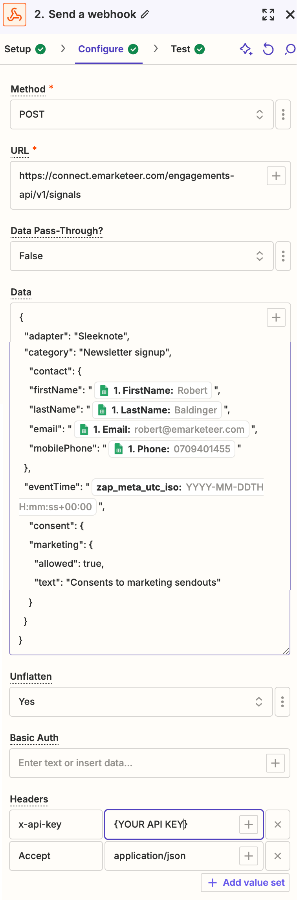

# Skicka en Webhook från Zapier till eMarketeer

Skapa en Zap som skickar kontaktdata till eMarketeer som en anpassad Signal.

Det här är användbart när du vill fånga formulärsvar, CRM-uppdateringar eller annan engagemangsdata från valfri källa. Signalen skapar eller uppdaterar kontakten i eMarketeer och registrerar engagemanget.

### Steg 1: Skapa en ny Zap

1. Logga in på Zapier och klicka på "Create Zap".
2. Namnge din Zap så att den är lätt att hitta igen.

### Steg 2: Konfigurera triggern

1. Välj en trigger-app som innehåller kontaktdatan du vill skicka. I det här exemplet ett Sleeknote-formulär.
2. Välj den specifika händelse som triggar din Zap, till exempel "New Form Submission".
3. Anslut ditt konto och testa triggern för att bekräfta att datan fångas upp.

### Steg 3: Lägg till Webhook-åtgärden

1. Klicka på "+ Add Action" och välj "Webhooks by Zapier" som åtgärds-app.
2. Välj "Custom Request" som åtgärdshändelse så att du kan skicka ett anpassat API-anrop till eMarketeer.

### Steg 4: Konfigurera Webhook

I dialogrutan för Webhook-konfiguration, ange:

- **Method:** POST
- **URL:** Signals API-endpoint — `https://connect.emarketeer.com/engagements-api/v1/signals`
- **Headers:**
  - Content-Type: `application/json`
  - Authorization: `Bearer YOUR_API_KEY` (ersätt `YOUR_API_KEY` med din faktiska API-nyckel)
- **Payload Type:** JSON

I avsnittet **Data** anger du datan du vill skicka i JSON. Exempelmall:

`{   "adapter": "Sleeknote",   "category": "Newsletter signup",   "contact": {   "firstName": "{{trigger_data_first_name}}",   "lastName": "{{trigger_data_last_name}}",   "email": "{{trigger_data_email}}",   "mobilePhone": "{{trigger_data_phone}}"   },   "eventTime": "{{zap_meta_utc_iso}}",   "consent": {   "marketing": {   "allowed": true,   "text": "Consents to marketing sendouts"   }   }   }   `

Ersätt platshållarvärdena (t.ex. `{{trigger_data_first_name}}`) med motsvarande fält från din trigger-data.

### Steg 5: Testa Webhook-åtgärden

1. Klicka på "Test & Review" för att skicka en testnyttolast till eMarketeer.
2. Kontrollera i eMarketeer att kontakten skapades eller uppdaterades och att den anpassade Signalen registrerades.

### Steg 6: Aktivera din Zap

1. När testet har gått igenom, klicka på "Turn on Zap" för att aktivera den.
2. Din Zap skickar nu kontaktdata till eMarketeer varje gång triggern utlöses.

### Ytterligare information

- **Adapter:** namnet på Signal-källan, till exempel verktyget du använder (Sleeknote, CRM och så vidare).
- **Category:** typen av data eller åtgärd, till exempel "Newsletter signup" eller "Sale closed".
- **Event Time:** använd `{{zap_meta_utc_iso}}` för att fånga den exakta tidpunkten då händelsen inträffade.

### Rekommenderade användningsfall

Använd den här konfigurationen för att skicka engagemangsdata som formulärsvar, kontaktuppdateringar eller CRM-aktivitet. För formulärsvar är Signals API som visas ovan den rekommenderade metoden.

För mer information om Signals API, se [eMarketeers API-dokumentation](https://api-doc.emarketeer.com/?urls.primaryName=Engagement#/Signals/post_signals).
