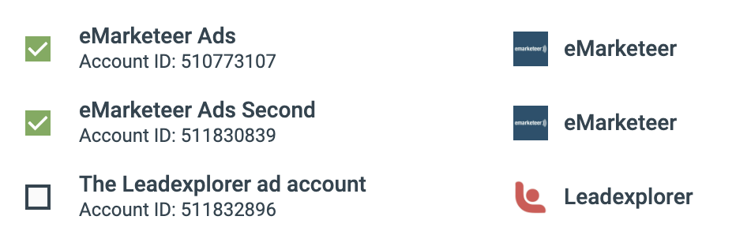

# LinkedIn Lead Gen Forms

Skicka inskickningar från LinkedIn Lead Gen Forms direkt till eMarketeer så att du kan agera på dem utan att exportera CSV-filer.

När du annonserar på LinkedIn kan du lägga till en uppmaning i dina annonser för att samla in registreringar, leads och anmälningar. [Läs mer om Lead Gen Forms på LinkedIn](https://business.linkedin.com/marketing-solutions/native-advertising/lead-gen-ads).

Som standard låter LinkedIn dig ladda ner inskickade leads som en CSV som du måste hantera manuellt. Med eMarketeers LinkedIn-koppling flödar inskickningarna automatiskt in i eMarketeer så att du kan:

- Skapa och uppdatera kontakter.
- Sätta lead score.
- Trigga Journeys.
- Skicka leads till säljteamet.

### Kom igång med LinkedIn Lead Gen Forms

#### Anslut eMarketeer till LinkedIn

Som administratör i eMarketeer, klicka på "Settings", sedan "Plugins and integrations" och därefter "LinkedIn". Klicka på "Connect to LinkedIn" för att starta anslutningen.

_Obs: du ansluter med din personliga LinkedIn-profil, vilket ger eMarketeer åtkomst till de Ad Accounts som profilen har åtkomst till. Anslut med en profil som har åtkomst till de Ad Accounts du vill ta emot inskickningar från._

När anslutningen är klar ser du listan över tillgängliga Ad Accounts.

Markera de Ad Accounts du vill ta emot leads från. Alla inskickningar via Lead Gen Forms på ett markerat konto skickas till eMarketeer.

#### Vad skickas till eMarketeer när en Lead Gen Form skickas in

När du skapar en Lead Gen Form på LinkedIn väljer du upp till 12 profildatafält att inkludera med leadet. Du kan också lägga till anpassade frågor som kryssrutor, droplists och textfält.

All inskickad data skickas till eMarketeer och syns i tidslinjehändelsen.

#### Nya kontakter skapade från LinkedIn

När eMarketeer tar emot ett lead från LinkedIn matchas kontakten på e-postadress. Om e-postadressen redan finns uppdateras kontakten med den nya informationen. Annars skapas en ny kontakt.

_Obs: se till att ditt konto inte ligger på sin kontaktgräns. Om det gör det kan inga nya kontakter skapas._

Följande fält från LinkedIn (när de skickas in) används för att skapa eller uppdatera kontakter:

- Email
- FirstName
- LastName
- Phone
- City
- ZipCode
- Country
- State
- Title
- Company

All annan inskickad information visas i tidslinjehändelsen på kontaktkortet.

#### Så testar du en Lead Gen Form

LinkedIn-formulär kan bara användas i en betald, publicerad annons — men du kan testa innan du publicerar. Skapa formuläret och annonsen i LinkedIn och klicka sedan på "Preview" på annonsen. I förhandsgranskningen kan du skicka in ett testlead, och det skickas till eMarketeer. På så sätt kan du förbereda och testa scores, Journeys och leadkvalificering innan lansering. [Läs mer om att testa leads på LinkedIn](https://www.linkedin.com/help/lms/answer/a420737).

#### Bearbeta inkommande leads

När leads finns i eMarketeer kan du komma åt dem via Contact Filter som ett engagemang.

Använd filtret för att hämta alla kontakter som:

- Skickat in valfri LinkedIn Lead Gen Form.
- Skickat in en specifik Lead Gen Form.
- Besvarat formuläret på ett specifikt sätt.

Eftersom det här engagemanget ingår i Contact Filter kan du använda samma urval i:

- Lead score för kontakter.
- Journeys, som startpunkt eller som if/else-villkor.
- Kvalificering av leads för Lead Board.
