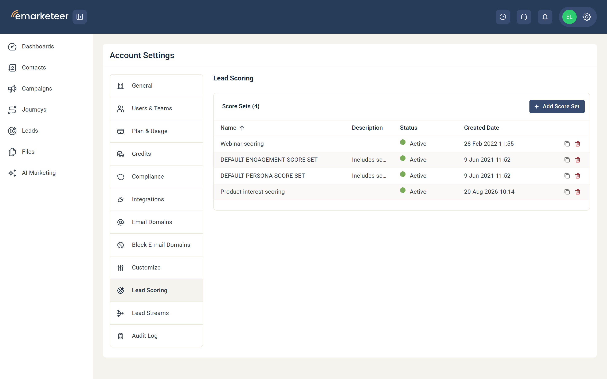
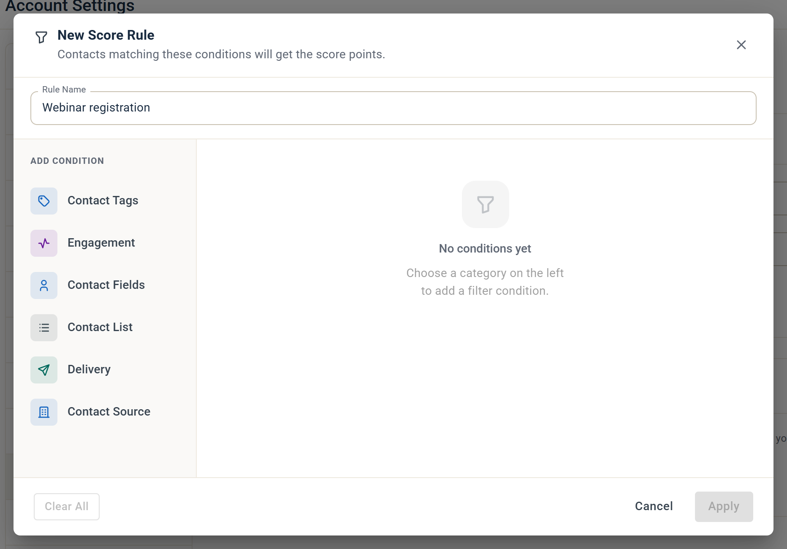
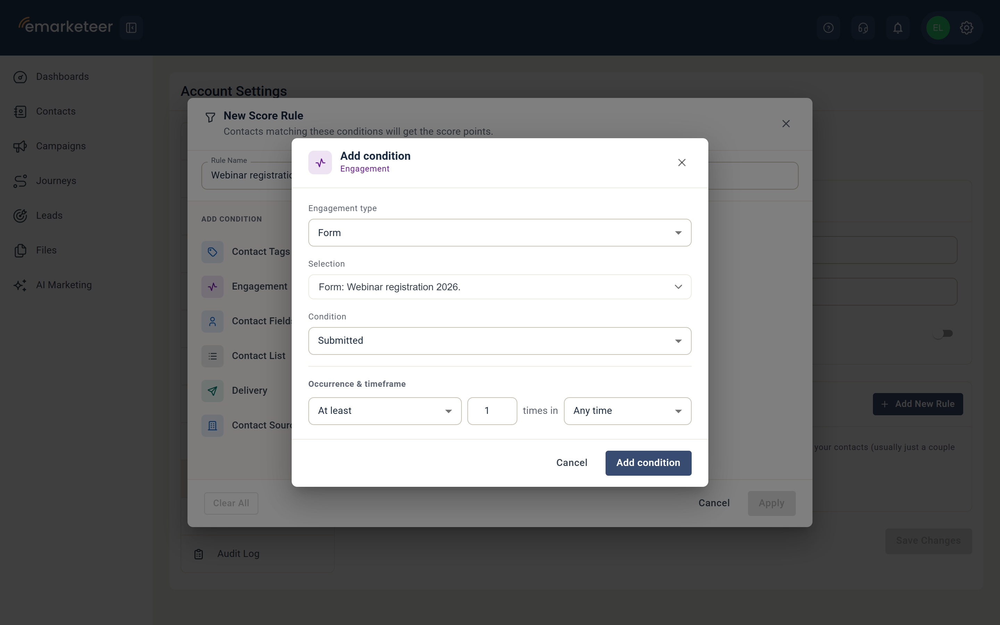
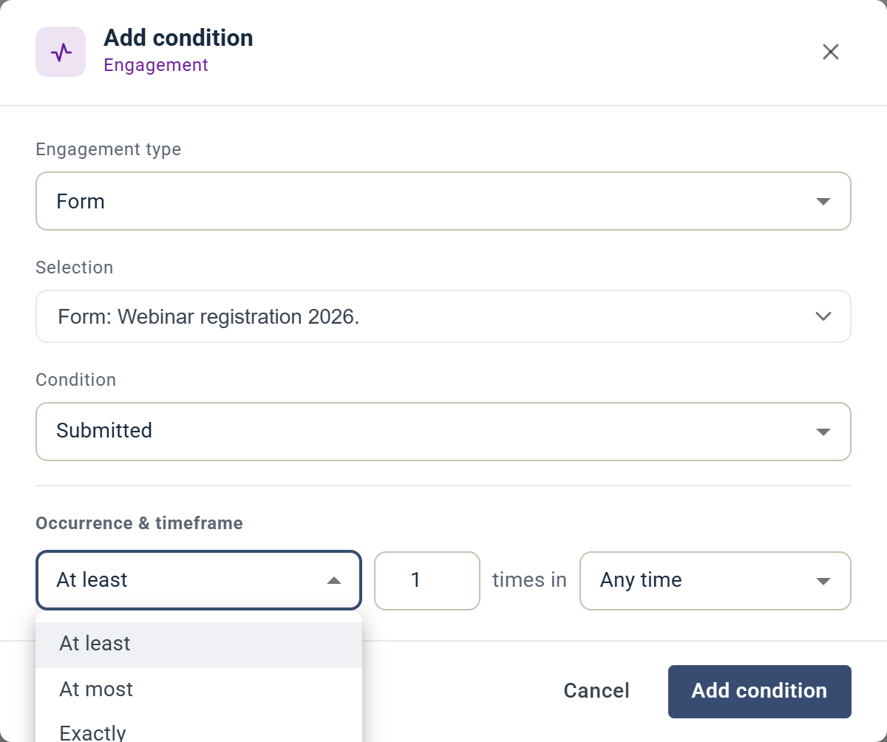
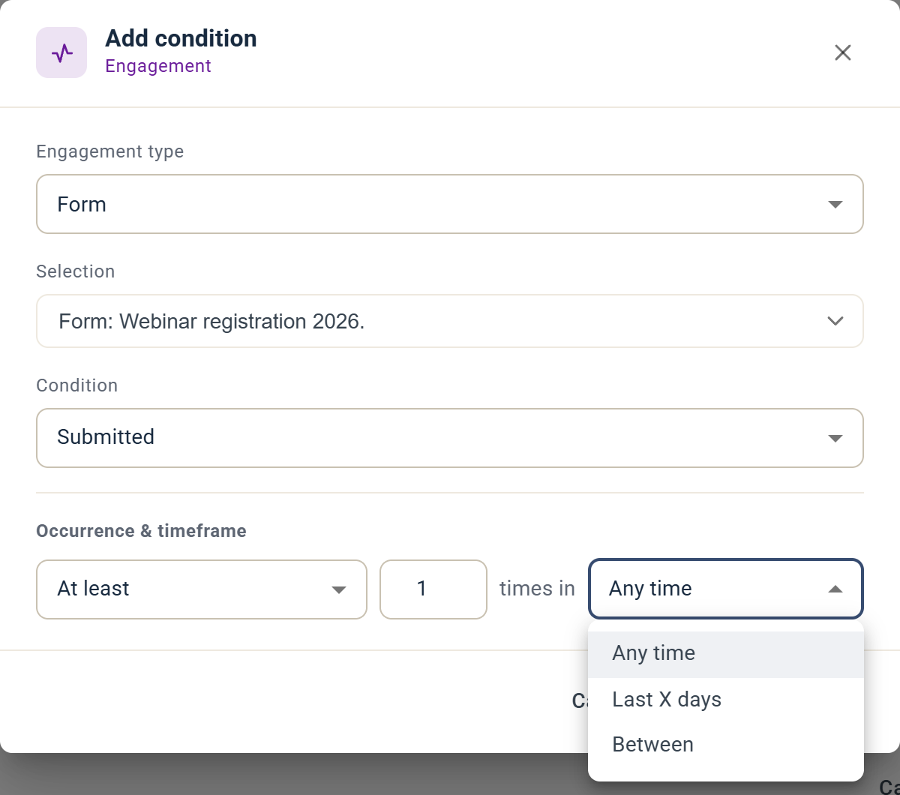
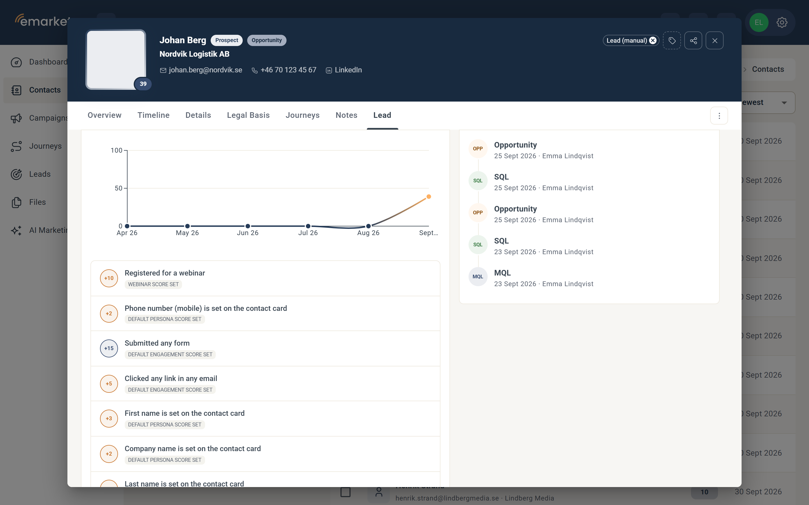
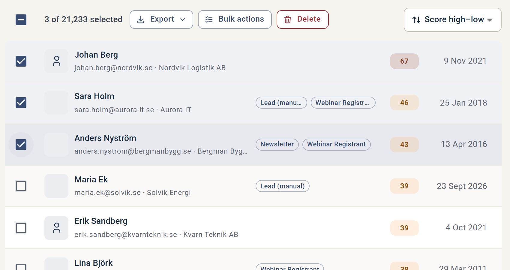

# Så fungerar lead scoring i eMarketeer och steg-för-steg-guide

Lead scoring visar hur säljklara dina kontakter är genom att tilldela poäng baserat på persona-matchning och engagemang.

I den här artikeln lär du dig hur du skapar score-regler steg för steg, var du ser varje kontakts lead score och hur du filtrerar kontakter efter deras score.

## Introduktion: vad är lead scoring?

Med lead scoring ser du hur säljklara dina kontakter är och identifierar marketing qualified leads (MQL). Du tilldelar poäng baserat på hur väl en kontakt matchar din köpar-persona och hur engagerad personen är i din marknadsföring. Du bestämmer vilka kriterier som spelar roll och skapar score-regler kring dem. Ju högre score, desto mer säljklar är kontakten, och desto tryggare kan du lämna över till sälj.

Med lead scoring kan du:

* Skapa regler baserade på marknadsföringsengagemang, fält på kontaktkortet och kontaktlistor.
* Se varje kontakts lead score på alla kontaktlistor och på kontaktkortet.
* Filtrera kontakter efter score – till exempel alla kontakter över 50.
* Exportera kontakter som en fil och lämna dem till sälj.

## Viktiga begrepp

* **Lead score:** antalet poäng en kontakt har.
* **Score-regler:** kriterierna en kontakt måste uppfylla för att få eller förlora poäng.
* **Score-uppsättning:** en behållare för en eller flera score-regler. Använd score-uppsättningar för att gruppera regler – till exempel en uppsättning för engagemangsregler och en för köpar-persona-kriterier. Om du säljer flera produkter kan du ha en score-uppsättning per produkt.
* **Explicit scoring:** regler baserade på persona-attribut, som demografi eller företagsprofil.
* **Implicit scoring:** regler baserade på beteende, som klick.

## Så använder du lead scoring i eMarketeer

Innan du går in i eMarketeer, bestäm din lead scoring-modell. eMarketeer levereras med några standardregler för score som ger dig en startpunkt, men ingen modell passar alla verksamheter. Anpassa reglerna efter din säljprocess och bygg modellen tillsammans med ditt säljteam.

[Guide: så bygger du en lead scoring-modell och vanliga misstag att undvika](how-to-set-up-your-lead-scoring-model-and-lead-scoring-mistakes.md)

### Du kan score:a på följande i eMarketeer

Marknadsföringsengagemang:

* Vilket engagemang som helst
* E-post – öppnade eller klickade på en länk
* Formulär – besökte, skickade in eller svarade på ett specifikt sätt
* Landningssida – besökte eller klickade på en länk
* SMS – klickade
* Web Tracker – besök. För att score:a webbesök, [installera Web Tracker-skriptet på din webbplats](../../documentation/web-tracker/installing-the-web-tracker-script-on-your-website.md).

Information på kontaktkortet:

* Vilket fält som helst på kontaktkortet. Du kan score:a på om fältet har ett värde eller matchar ett specifikt värde – till exempel jobbtitel är ifylld eller jobbtitel är lika med VD.

Kontaktlistor:

* Om kontakten finns i en specifik kontaktlista.

## Så skapar du score-regler i eMarketeer

### Konfigurera poängregler steg för steg



### Öppna lead scoring

Klicka på inställningsikonen uppe till höger, välj "Account Settings" och sedan "Lead Scoring" i vänstermenyn. Den här vyn visar alla dina score-uppsättningar och deras aktiva status.




### Lägg till en score-uppsättning

För att lägga till egna regler, klicka på "Add Score Set." Namnge score-uppsättningen efter den typ av regler den innehåller – till exempel en uppsättning per produkt eller en uppsättning för engagemangsregler. Du kan också lägga till en valfri beskrivning.




### Lägg till en regel

Klicka på "Add New Rule" och ge regeln ett tydligt namn i fältet Rule Name.




### Bygg regelkriterierna

Regler byggs på samma sätt som filter i eMarketeer. Under "Add condition" väljer du en kategori – till exempel engagemang, fält på kontaktkortet eller medlemskap i kontaktlista.

För en webbinarieregistrering, välj Engagement och ställ in Engagement type på Form.

Under Selection väljer du det specifika formuläret och ställer in Condition på Submitted.

Tänk sedan på förekomst – hur många gånger kontakten måste utföra handlingen för att få poängen: minst, högst eller exakt ett visst antal gånger. Tänk sedan på tidsram – till exempel endast de senaste 30 dagarna. Klicka på "Add condition."

 

För att begränsa en regel ytterligare, lägg till ett villkor till. Till exempel: kontakten anmälde sig till webbinariet OCH besökte en landningssida tre gånger. Välj en kategori igen och upprepa stegen för det andra villkoret. Villkoren kombineras med AND. Klicka på AND-markeringen för att ändra den till OR.




### Tillämpa regeln

Klicka på "Apply."



### Ange poängvärdet

Ange bredvid regeln hur många poäng den är värd. Välj "Remove" istället för "Add" för att dra bort poäng. Använd negativa poäng för beteenden som sannolikt inte leder till en försäljning – till exempel "student" som jobbtitel, ett besök på din karriärsida eller ett land du inte kan leverera till.




### Aktivera score-uppsättningen

När score-uppsättningen har alla regler du vill ha, slå på Active och klicka på "Save Changes." Score:n beräknas för varje kontakt. Efter att du lagt till eller redigerat en regel kan det dröja en stund innan poängen uppdateras – vanligtvis några minuter, beroende på databasens storlek.




### Se varje kontakts lead score och poängfördelning

Kontakter score:as när de uppfyller någon av dina regler. Du ser score:n på varje kontaktlista och på kontaktkortet. På kontaktkortet visar fliken "Lead" hur kontakten tjänat sina poäng. Grafen "Lead score over time" visar score:n över tid. Under grafen listar en uppdelning varje uppfylld regel med dess poäng och score-uppsättning.

### Filtrera ut dina MQL:er och lämna dem till sälj

För att hitta kontakter som nått en specifik score – säg 80 eller högre – använd filter. Gå till Contacts, klicka på "Filter" och välj "Score" under Add condition. Ställ in villkoret på "Greater Than" och ange din tröskel, till exempel 80. Du kan sedan lista kontakter över eller under din säljtröskel.

När du markerar kontakter visas knapparna "Export" och "Bulk actions" högst upp i listan. Använd Bulk actions för att uppdatera urvalet – till exempel lägga till kontakterna i en lista. Använd "Export" för att ladda ner kontakterna som en fil ("Export as file") eller skicka dem till ett urval eller projekt i SuperOffice ("Export to CRM"). För SuperOffice-export måste kontakterna redan vara kända i SuperOffice.

