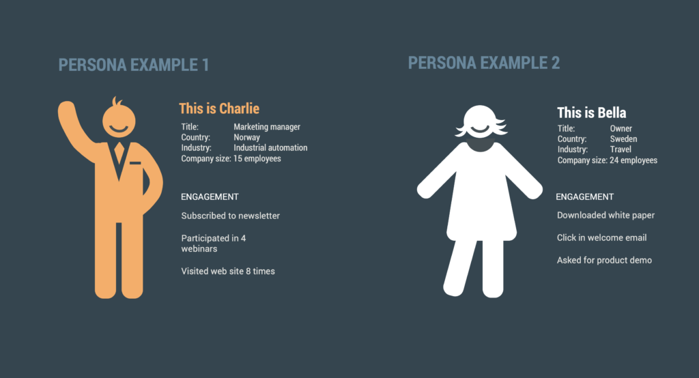
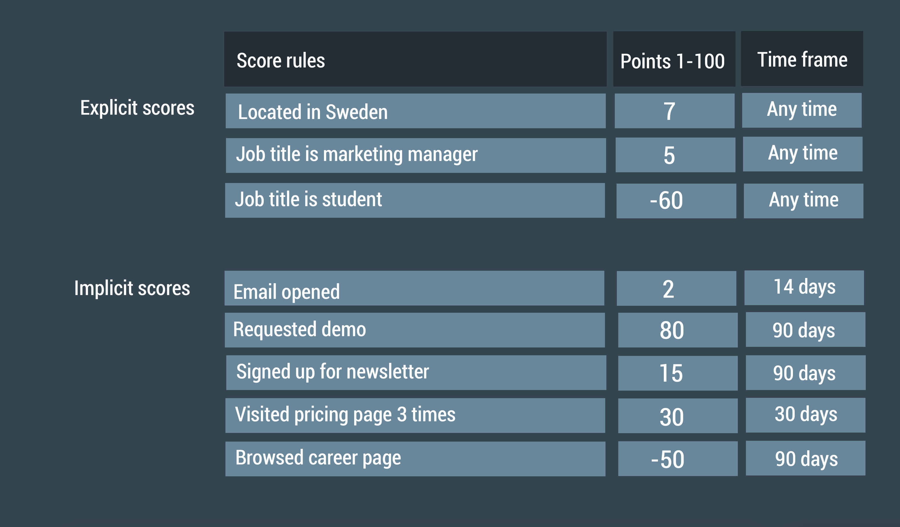

# Så bygger du din lead scoring-modell och vanliga misstag

Den här artikeln visar hur du bygger en lead scoring-modell som passar din verksamhet och listar misstag att undvika.

För att komma igång med lead scoring, bestäm vad du ska score:a dina kontakter på. eMarketeer levereras med [standardregler för score](https://support.emarketeer.com/knowledgebase/default-score-rules-in-emarketeer/) som ger dig en startpunkt, men lead scoring fungerar bäst när det är anpassat efter din verksamhet och säljprocess. Bygg modellen tillsammans med ditt säljteam – deras insikter spelar roll här.

Om du redan vet vad du vill score:a på, använd [guiden för att skapa score-regler i eMarketeer](https://support.emarketeer.com/knowledgebase/how-lead-scoring-works-in-emarketeer/).

## Några anteckningar om lead scoring

### Vad är lead scoring?

Lead scoring identifierar marketing qualified leads (MQL) och visar hur redo en kontakt är att köpa. Du tilldelar poäng baserat på en kontakts intresse för dig och hur väl personen matchar din köpar-persona. När score:n når en definierad tröskel är kontakten en MQL och marknad kan lämna över till sälj. Ju högre score, desto mer säljklar är kontakten.

### Varför använda lead scoring?

- **Samordning mellan sälj och marknad.** Lead scoring är en gemensam aktivitet. När modellen speglar insikter från båda teamen faller färre kontakter mellan stolarna och båda teamen är överens om vad som kvalificerar ett lead.
- **Fokus på de mest relevanta kontakterna.** Lead scoring identifierar MQL så att säljteamet kan lägga tid på de kontakter som mest sannolikt köper.
- **Hitta rätt tajming för sälj.** En kontakt som precis besökt din webbplats eller gillat ett inlägg på sociala medier är inte redo att bli kontaktad av sälj. En scoring-modell anpassad efter köparens resa hjälper sälj att höra av sig vid rätt tillfälle.

## 3 steg för att bygga din lead scoring-modell

En lead scoring-modell definierar vad du ska score:a på, hur många poäng som kvalificerar en kontakt som en MQL och hur många poäng varje regel är värd.

### 1. Vad ska du score:a på? Dina kunder har svaret

Bestäm först vilka regler du ska score:a på – de handlingar och attribut som spelar roll för att kvalificera en kontakt. Det finns två typer av regler:

- **Explicit scoring** är baserad på hur väl kontakten matchar din köpar-persona – demografi och företagsprofil.
- **Implicit scoring** är baserad på marknadsföringsengagemang och beteende.

Explicit scoring är baserad på profil, implicit på beteende. Båda spelar roll.

För att bestämma vad du ska score:a på, titta på dina kunder. Börja med demografi och företagsprofil – land, jobbtitel, bransch, företagsstorlek och så vidare. Analysera sedan beteende. Kartlägg det marknadsföringsinnehåll de konsumerade och hur de engagerade sig med det innan de blev kunder. Vilka mejl klickade de på? Vilka webbsidor besökte de? Vad laddade de ner? Deltog de i webbinarier eller event? Tänk också på aktiviteter och kampanjer du har planerat.

Titta på säljkonverteringar för varje datapunkt också. Vissa är närmare en försäljning än andra – en begäran om produktdemo konverterar oftast bättre än en nyhetsbrevsanmälan.

Sammanfattningsvis, titta på:

- Kundernas företagsprofil och demografi
- Tidigare marknadsföringsengagemang
- Säljkonverteringar för handlingarna och attributen

Använd data för att bygga dina köpar-personas. Dina personas kan se ut så här:

Datapunkterna i dina personas blir grunden för dina score-regler. Ju mer en framtida kontakt matchar dina personas, desto fler poäng får personen. Det här steget kräver analys, men ju bättre du förstår dina kunder, desto bättre score:ar du framtida kontakter.

### 2. När är en kontakt marketing qualified (MQL)?

Många lead scoring-modeller använder ett intervall på 1–100, vilket är det intervall standarduppsättningarna i eMarketeer utgår från. Ett intervall på 1–10 fungerar också, men 1–100 ger dig mer precision. Välj ett intervall och bestäm din säljtröskel – den score där en kontakt är en MQL och redo för sälj. Till exempel 80 eller mer.

Marknad och sälj bör vara överens om denna tröskel. För att göra det enklare att läsa av en kontakts "hetta", sätt trösklar över hela intervallet:

### 3. Sätt poäng för varje regel

Bestäm nu hur många poäng varje regel är värd. Några saker att tänka på:

- **Sätt olika poäng för olika regler.** Regler närmare en försäljning bör vara värda mer. Använd säljkonverteringsdatan du samlat in tidigare som vägledning.
- **Kombinera flera regler till en.** En e-postöppning ensam är kanske inte värd mycket. Kombinerad med ett klick och flera landningssidesbesök visar den verkligt intresse. Kombinera kriterier så att kontakten måste uppfylla alla för att få poängen.
- **Var inte rädd för negativa score.** Lead scoring kan också synliggöra kontakter som inte passar. Använd negativa regler för beteenden som sannolikt inte leder till en försäljning – till exempel "student" som jobbtitel eller ett land du inte kan leverera till. När en kontakt uppfyller en negativ regel dras poäng av.
- **Tänk på tidsram och förekomst för engagemangsregler.** Ett klick från tre månader sedan är mindre meningsfullt än ett från igår. Sätt en tidsram så att poäng bara gäller inom ett aktuellt fönster. Du kan också bestämma hur många gånger en kontakt måste utföra en handling innan personen får poängen – till exempel tre landningssidesbesök istället för ett.
- **Du kan score:a bara för att ha information om kontakten.** Ju mer du vet om en kontakt, desto mer kvalificerad kan personen vara. En kontakt med ett telefonnummer på kortet kan vara närmare en försäljning än en med bara en e-postadress. Du kan tilldela poäng för att ett fält finns ifyllt.

Lista dina regler, hur många poäng var och en är värd och när de går ut. Listan kan se ut så här:

### 4. Sätt din lead score i verket

Det är nu dags att sätta dina regler i verket. [Följ den här guiden för att skapa score-regler i eMarketeer.](https://support.emarketeer.com/knowledgebase/how-lead-scoring-works-in-emarketeer/)

## Vanliga misstag med lead scoring

- **Att lämna modellen orörd.** En lead scoring-modell behöver ständig finjustering medan du lär dig mer om dina kunder. Bevaka om dina MQL konverterar till kunder. Om konverteringen sjunker behöver modellen troligen uppdateras. Stäm av med sälj regelbundet och acceptera att modellen aldrig är klar.
- **Att glömma negativa score.** Lead scoring hittar de kontakter som mest sannolikt köper – och filtrerar bort de som inte gör det. Lägg till regler för oönskat beteende, som "student" som jobbtitel, fel företagsstorlek eller besök på dina jobbannonser.
- **Att tilldela samma poäng till varje regel.** Vissa engagemang är närmare en försäljning än andra. En begäran om produktdemo slår en nyhetsbrevsanmälan. Spegla det i poängen.
- **Att inte tänka på tidsram.** Ett besök på din prissida igår är meningsfullt. Samma besök för ett år sedan, utan aktivitet sedan dess, är det inte. Utan en tidsram speglar score:n inte längre aktuellt intresse. Behandla tidsramen som ett utgångsdatum på poängen.

Lycka till med att bygga din modell. [Du kan också använda den här guiden för hjälp att implementera den i eMarketeer.](https://support.emarketeer.com/knowledgebase/how-lead-scoring-works-in-emarketeer/)
