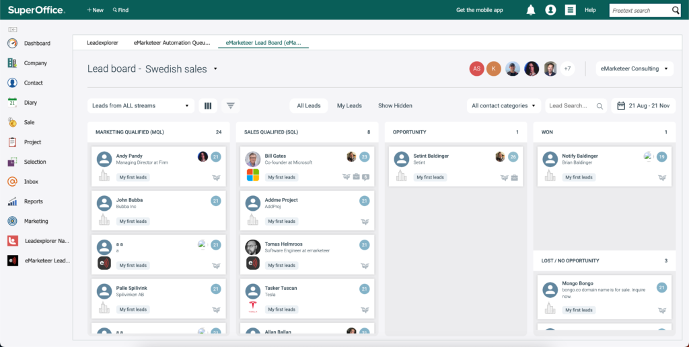
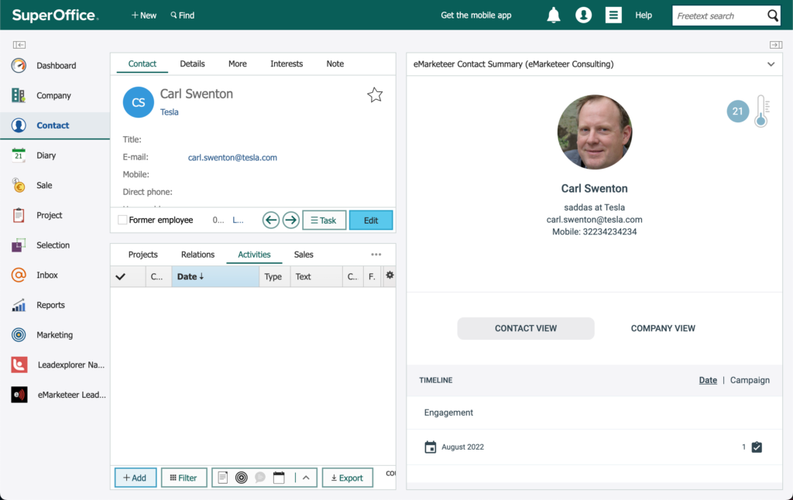

# Lead Board och SuperOffice

eMarketeer Lead Board kan användas helt och hållet via SuperOffice, så sälj kan hantera leads från SuperOffice samtidigt som de använder eMarketeer-webbpanelerna för insikter om kontakter och företag.

Nya leads matchas automatiskt mot kontakter i SuperOffice och tilldelas automatiskt till ansvarig sales user.

## Paneler

När du integrerar med SuperOffice Online får du fyra huvudpaneler:

- Lead Board – huvudwebbpanelen där leads levereras och hanteras.
- Company Summary – sidopanel på företagsvyn som visar en sammanfattning av företaget från eMarketeer.
- Contact Summary – sidopanel på kontaktvyn som visar data om kontakten från eMarketeer.
- Automation Queue – visar alla automatiseringar som väntar på att motsvarande kontakt ska matchas eller skapas i SuperOffice.

## Integration

När integrationen initieras i eMarketeer sätts de nya panelerna upp av integrationsskriptet.

## Logga in på webbpanelerna (automatiskt)

När du visar en sidopanel eller Lead Board behöver du en eMarketeer-användare. När en SuperOffice-användare laddar en eMarketeer-webbpanel körs en kontroll för att se om SuperOffice-användarnamnet (e-postadressen) matchar en eMarketeer-användare. Om e-posten matchar loggas användaren in i eMarketeer och panelen automatiskt.

Om SuperOffice-användarens e-post inte hittas i eMarketeer ser personen ett alternativ att begära åtkomst. Det skickar ett mejl till administratörerna på ditt eMarketeer-konto.

## Lead Board

Du hittar Lead Board på huvudwebbpanelen under SuperOffice-logotypen. Det finns också en genväg i navigeringen.

## SuperOffice-matchning och auto-tilldelning

När en kontakt i eMarketeer blir en MQL och når Lead Board kontrolleras kontakten automatiskt mot SuperOffice för att se om kontakten redan finns där. Sökningen använder kontaktens e-postadress.

Om en matchning hittas väljer eMarketeer den första kontakten i resultatet och sparar ContactID till eMarketeer. En matchning visas av SuperOffice-ikonen (uggla) på lead-kortet.

En lyckad matchning släpper också igenom eventuella väntande automatiseringar för kontakten.

eMarketeer tilldelar sedan det nya leadet till rätt sales user i eMarketeer. Tilldelningen sker bara om ansvarig SuperOffice-användare också är medlem i sales-teamet i eMarketeer.

## Webbpanelen för contact summary

På kontaktvyn i SuperOffice kan du visa eMarketeer-panelen Contact Summary. Den visar berikad data från eMarketeer för kontakten. Matchning görs på e-postadress, och data visas endast om kontakten finns i eMarketeer.

## Webbpanelen för company summary

På företagsvyn i SuperOffice kan du använda eMarketeer Company Summary, som visar berikad data och en översikt över alla kända kontakter och deras interaktioner i eMarketeer. Företaget identifieras av domänen från dess webbadress.

> TODO: verify — original text ends mid-sentence ("identified on domain from their web").

## Automation Queue

Automation Queue visar alla eMarketeer-kontakter med automatiseringar som väntar på att föras in i SuperOffice. De är väntande eftersom inget ContactID är definierat på eMarketeer-kontakten (External ID). Kontakten måste först skapas i SuperOffice med knappen "Share to CRM".
