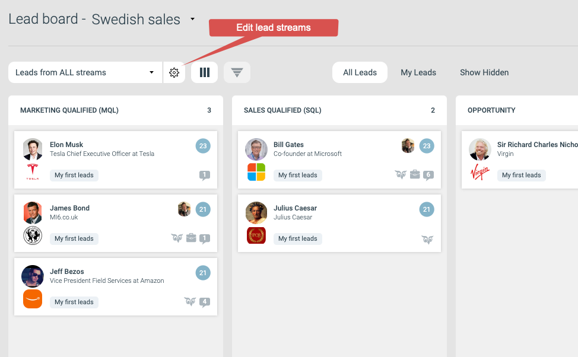
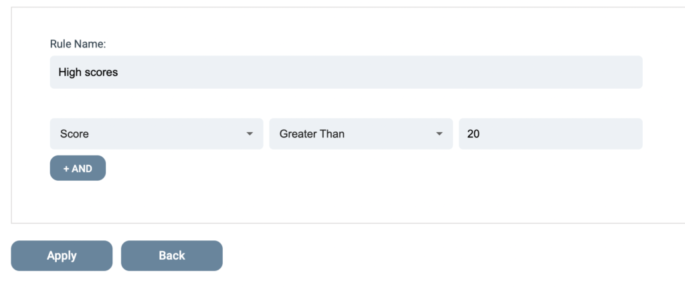

# Lead Streams

En lead stream är en uppsättning regler som genererar Marketing Qualified Leads (MQL) för sälj att bearbeta.

När en kontakt matchar reglerna för en lead stream blir kontakten ett lead och levereras till ett valt sales-team. Väl uppsatt levererar en lead stream leads kontinuerligt.

## Skapa en lead stream

Öppna Lead Board genom att klicka på Leads i toppmenyn.

För att skapa en ny lead stream, klicka på kugghjulet i rutan för lead streams.

Det öppnar sidan för lead streams, där du kan skapa eller hantera lead streams.

Klicka på Add lead stream för att skapa en ny.

En lead stream behöver tre saker:

- Ett namn och en valfri beskrivning
- En uppsättning filterregler
- Ett eller flera sales-team som leads ska levereras till

### Lägg till en ny regel

Klicka på Add new rule för att lägga till det första kriteriet för att bli ett lead.

I det här scenariot vill vi hitta kontakter med hög lead score.

Klicka på Apply för att lägga till regeln. Lägg till fler regler för att vidga eller smalna av vilka kontakter som kvalificeras som leads.

### Välj ett sales-team

Bocka i ett eller flera sales-team som ska ha åtkomst till denna lead stream.

### Aktivera den nya lead stream:en

Du har följande alternativ för en ny lead stream:

- Enabled / Disabled – en ny lead stream startar inaktiv. Slå på reglaget till Active för att sätta den i drift. Från den stunden genererar nya matchningar mot dina regler leads.
- Clear leads – du kan rensa lead stream:en på alla leads när som helst. Det tar bort leads från Lead Board som matchar denna stream. Stream:en måste vara inaktiv för att alternativet ska vara tillgängligt.
- Fetch history – en lead stream genererar bara leads från nya matchningar. Om du till exempel vill göra leads av kontakter som svarar på ett formulär, genererar stream:en endast leads från formulärinskickningar som kommer in medan stream:en är aktiv. För att göra leads av tidigare matchningar, klicka på "Fetch ALL leads from history" för att generera de historiska leads:en en gång. Stream:en måste vara aktiv för att alternativet ska vara tillgängligt.

## Kontrollera resultatet

Gå tillbaka till Lead Board för att se de nya leads:en.

