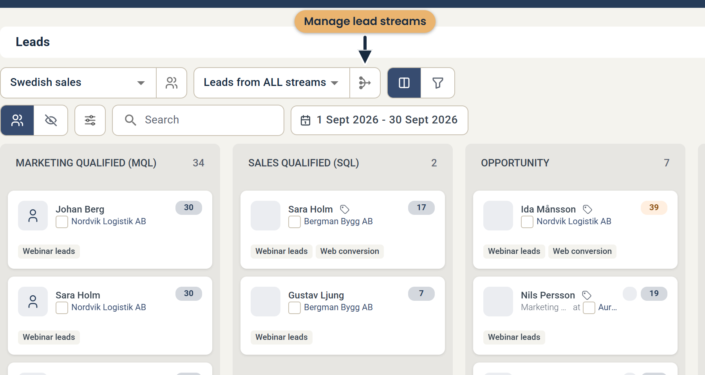
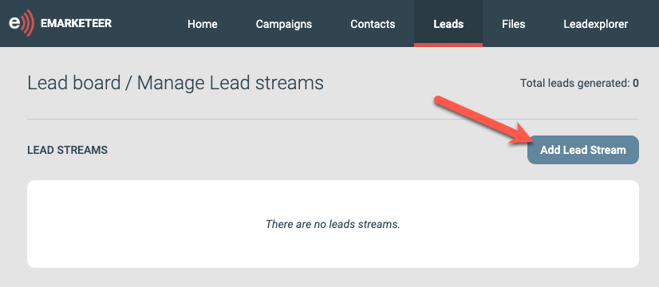
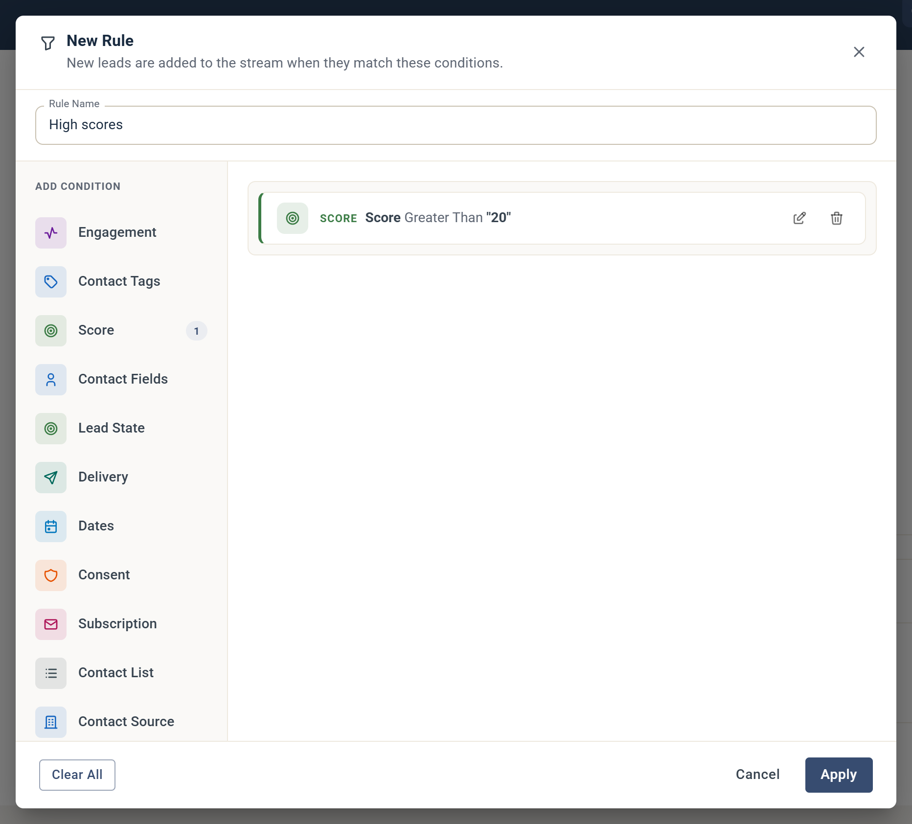
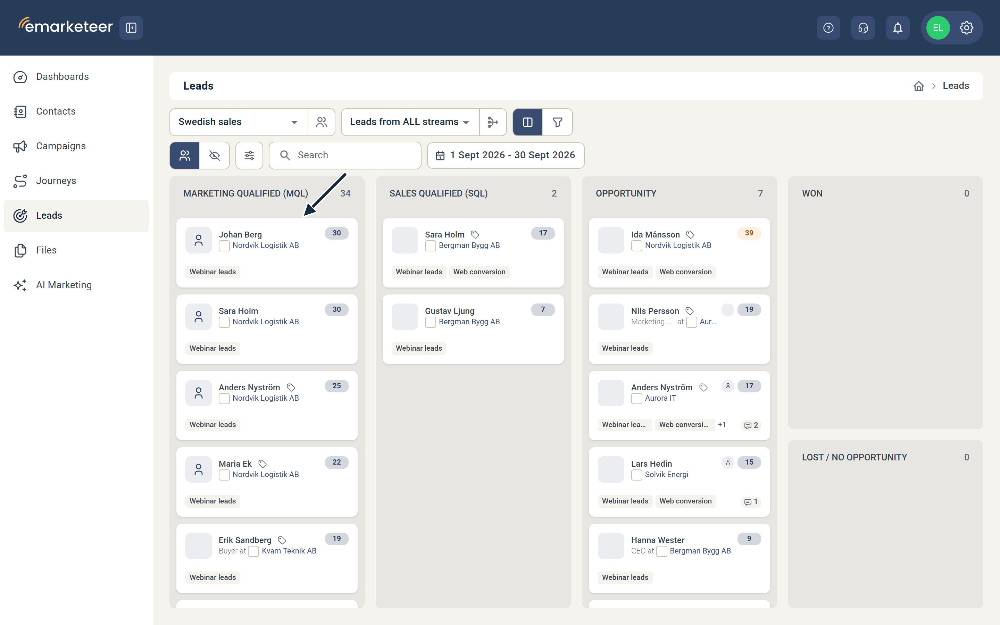

# Leadströmmar

En leadström är en uppsättning regler som genererar Marketing Qualified Leads (MQL) för sälj att bearbeta.

När en kontakt matchar reglerna för en leadström blir kontakten ett lead och levereras till ett valt sales-team. Väl uppsatt levererar en leadström leads kontinuerligt.

## Skapa en leadström

Öppna Lead Board genom att klicka på Leads i vänstermenyn.

För att skapa en ny leadström, klicka på ikonen Manage lead streams bredvid rullgardinsmenyn för leadströmmar.

Det öppnar Lead Streams i Account Settings, där du kan skapa eller hantera leadströmmar.

Klicka på Add Lead Stream för att skapa en ny.

En leadström behöver tre saker:

* Ett namn och en valfri beskrivning
* En uppsättning filterregler
* Ett eller flera sales-team som leads ska levereras till

### Lägg till en ny regel

Klicka på Add New Rule, namnge regeln och välj en villkorskategori — till exempel Score — för att lägga till det första kriteriet för att bli ett lead.

I det här scenariot vill vi hitta kontakter med hög lead score.

Klicka på Apply för att lägga till regeln. Lägg till fler regler för att vidga eller smalna av vilka kontakter som kvalificeras som leads.

### Välj ett sales-team

Under Distribution to Sales Team bockar du i ett eller flera sales-team som ska ha åtkomst till denna leadström.

### Aktivera den nya leadströmmen

Du har följande alternativ för en ny leadström:

* Enabled / Disabled – en ny leadström startar inaktiv. Slå på reglaget till Active och klicka på Save Changes för att sätta den i drift. Från den stunden genererar nya matchningar mot dina regler leads.
* Clear leads – du kan rensa leadströmmen på alla leads när som helst. Det tar bort leads från Lead Board som matchar denna leadström. Leadströmmen måste vara inaktiv för att alternativet ska vara tillgängligt.
* Fetch history – en leadström genererar bara leads från nya matchningar. Om du till exempel vill göra leads av kontakter som svarar på ett formulär, genererar leadströmmen endast leads från formulärinskickningar som kommer in medan leadströmmen är aktiv. För att göra leads av tidigare matchningar, klicka på "Fetch ALL leads from history" för att generera de historiska leads:en en gång. Leadströmmen måste vara aktiv för att alternativet ska vara tillgängligt.

## Kontrollera resultatet

Gå tillbaka till Lead Board för att se de nya leads:en.

