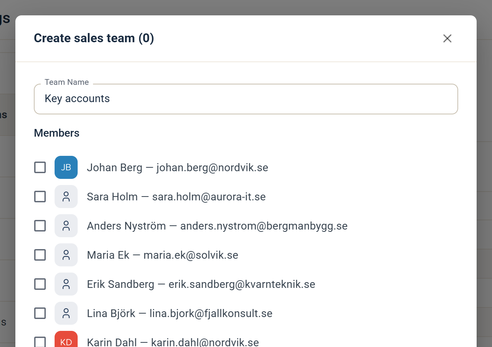

# Sales-team

Leads i eMarketeer levereras till ett sales-team. Sales users i samma team delar inkommande kvalificerade leads.

Om din marknadsföringsaktivitet sträcker sig över flera marknader, varumärken eller produktkategorier, skapa flera sales-team så att varje team bara får de leads som är relevanta för det.

## Skapa ett sales-team

Att skapa ett sales-team kräver administratörsrättigheter.

1. Klicka på kugghjulsikonen uppe till höger, välj Account Settings och öppna sedan Users & Teams.
2. Öppna fliken Sales Teams.
3.  Klicka på Create new team. Då öppnas dialogrutan Create sales team.

    

4. Ge teamet ett namn i fältet Team Name. Om du redan har sales users, bocka i de som ska vara medlemmar.
5. Klicka på Save changes.
