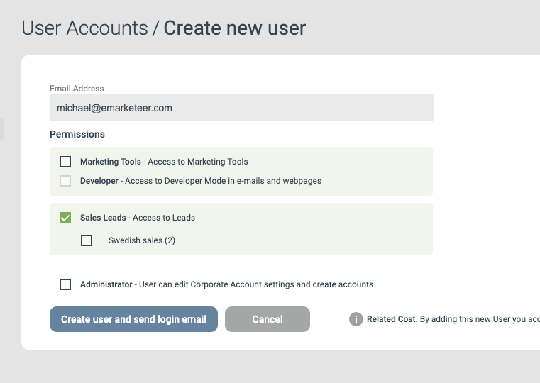

# Sales users

En användare i eMarketeer kan ha åtkomst till både marknadsförings- och säljfunktioner. Med säljåtkomst kan användaren arbeta i ett sales-team på Lead Board.

Att hantera användare kräver administratörsrättigheter.

Öppna Settings och välj User Accounts för att se aktuella användare och deras rättigheter.

## Skapa en ny sales user

1. Klicka på Create User.
2. Ange e-postadressen för den nya användaren.
3. Aktivera Sales leads med kryssrutan, och bocka sedan i ett eller flera sales-team som användaren ska tillhöra. En användare kan tillhöra ett eller flera sales-team.

   

4. Klicka på Create user and send login email.

Användaren meddelas via e-post att sätta ett lösenord och fylla i profilen.
