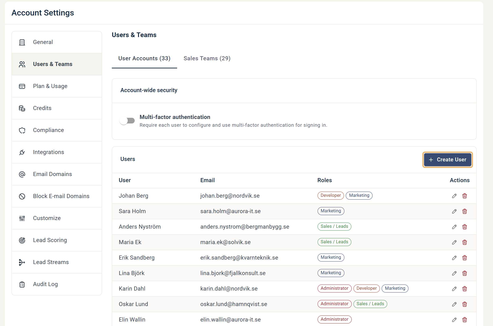
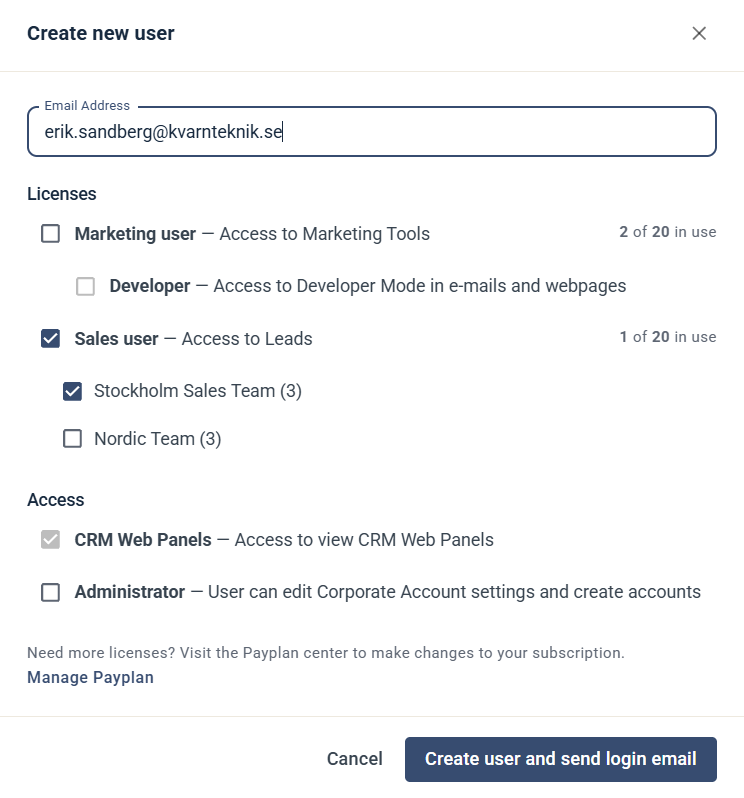

# Sales users

En användare i eMarketeer kan ha åtkomst till både marknadsförings- och säljfunktioner. Med säljåtkomst kan användaren arbeta i ett sales-team på Lead Board.

Att hantera användare kräver administratörsrättigheter.

Klicka på kugghjulsikonen uppe till höger, välj Account Settings och öppna Users & Teams för att se aktuella användare och deras rättigheter.

## Skapa en ny sales user

1. Klicka på Create User. Då öppnas dialogrutan Create new user.
2. Ange e-postadressen för den nya användaren.
3.  Under Licenses, markera Sales user — Access to Leads och bocka sedan i ett eller flera sales-team som användaren ska tillhöra. En användare kan tillhöra ett eller flera sales-team. En säljanvändare får också åtkomst till CRM-webbpaneler som standard, så **CRM Web Panels** under **Access** markeras automatiskt.

    

4. Klicka på Create user and send login email.

Användaren meddelas via e-post att sätta ett lösenord och fylla i profilen.
