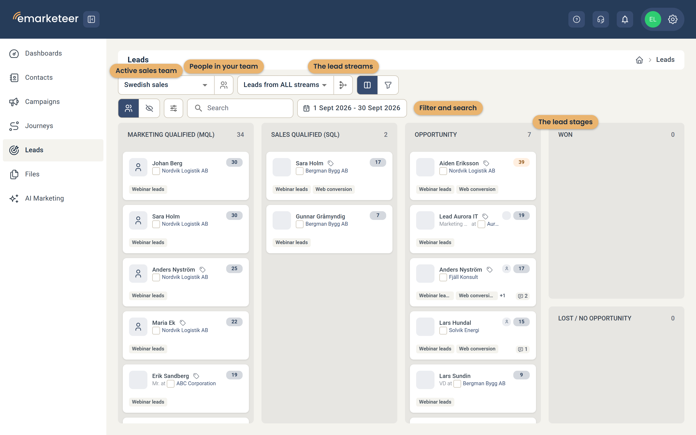
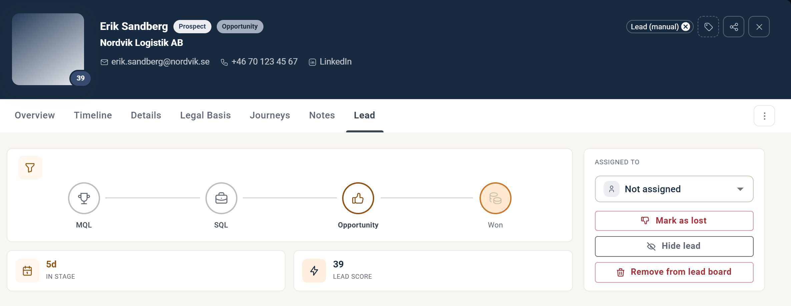

# Lead Board

Lead Board är där kontakter som marknad kvalificerat som leads levereras till ditt sales-team.

Syftet med boarden är att låta sälj utvärdera leads och flytta dem nedåt i tratten mot en försäljning.

### Processen

Ett färskt lead landar i MQL-stadiet. Ditt jobb är att validera MQL och flytta dem nedåt i tratten. Om ett lead är intressant, flytta det till nästa stadium. Om det diskvalificeras vid någon punkt, flytta det till "Lost / No opportunity" – det ger också viktig feedback till ditt marknadsteam.

### Funktionerna

Flera funktioner hjälper dig att arbeta med säljprocessen.

#### Filtrering

För att begränsa leads på din board, använd dessa filter:

* **Leadströmmar.** Som standard visar boarden alla leads oavsett källa. Öppna listan över leadströmmar ("Leads from ALL streams") och välj en leadström för att bara visa leads från den.
* **Datumintervall.** Visa endast leads som genererats inom ett specifikt datumintervall. Om du inte hittar det du söker, utöka datumintervallet.
* **Show hidden.** Ovanför stadierna växlar du mellan alla leads och dolda leads. Använd Filters för att begränsa boarden efter ansvarig.
* **Kontaktkategori och taggar.** Öppna Filters och välj en kontaktkategori (alla kategorier, eller bara prospekt, kunder eller övriga) eller en tagg.
* **Sök.** Sök på e-post, namn eller företag för att hitta ett specifikt lead.

### Kontaktkortet

Klicka på ett lead på boarden för att öppna kontaktkortet. Den sista fliken är fliken Lead, som visar allt som är relevant för att hantera leadet.

Härifrån kan du:

* Se vilka leadströmmar kontakten matchat och beskrivningen.
* Ändra leadets kategori till prospekt, kund eller övrig.
* Ändra lead-stadium.
* Tilldela leadet till dig själv eller någon annan.
* Dölja leadet från boarden.

Du har också direktlänkar till kontaktens e-post, telefonnummer och LinkedIn-profil.

De andra flikarna på kontaktkortet låter dig:

* Granska hela engagemangstimelinen.
* Redigera kontaktinformationen.
* Skriva anteckningar.

Det finns också en länk till företagskortet.

### Företagskortet

Från kontaktkortet, öppna fliken Overview och klicka på View company för att se en sammanfattning av företaget. Företaget identifieras av domänen i leadets e-postadress.

