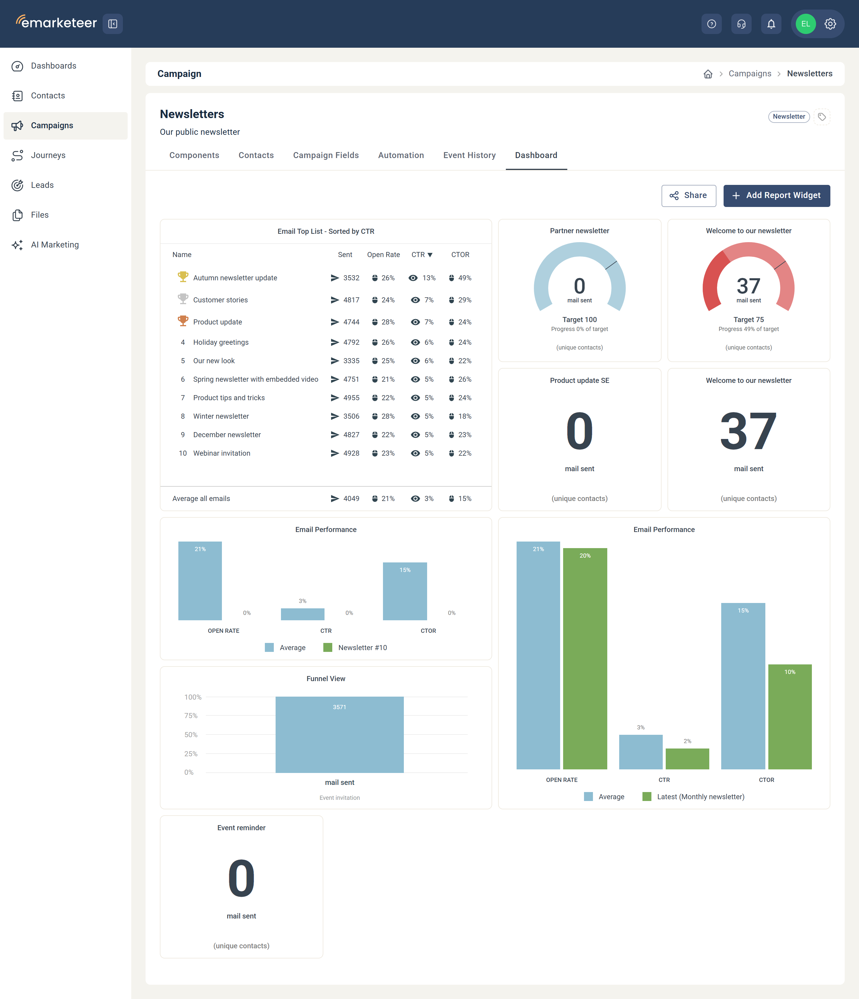
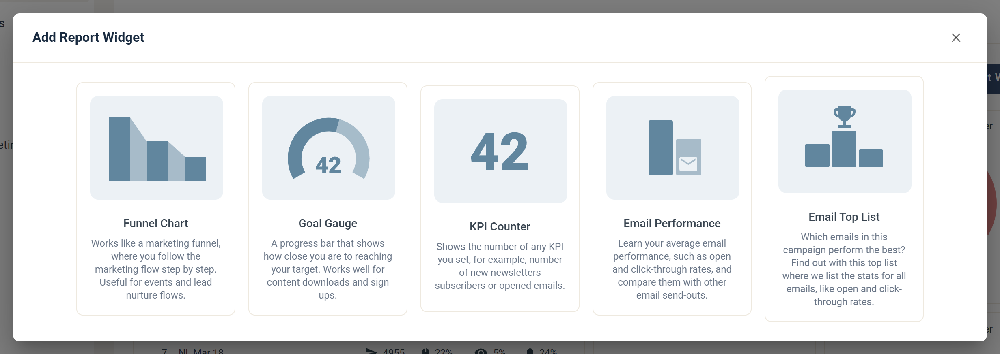
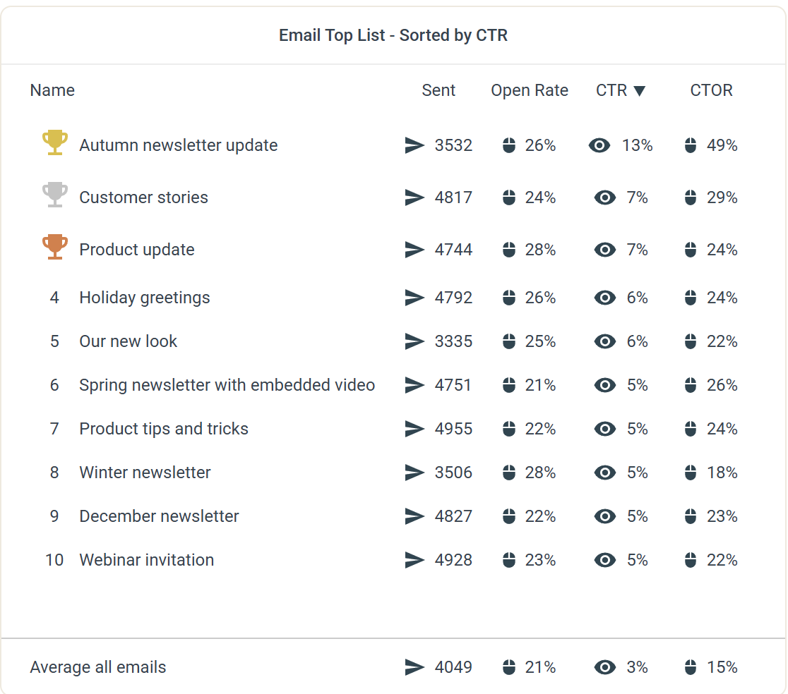
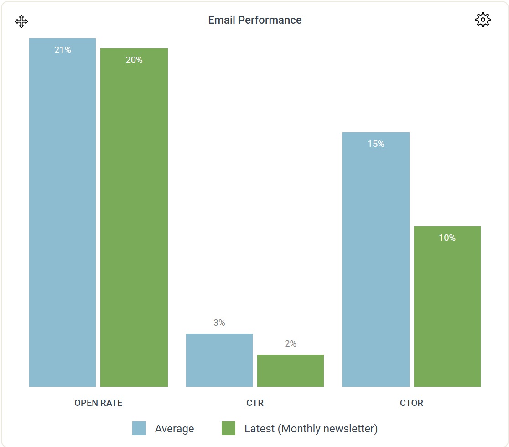
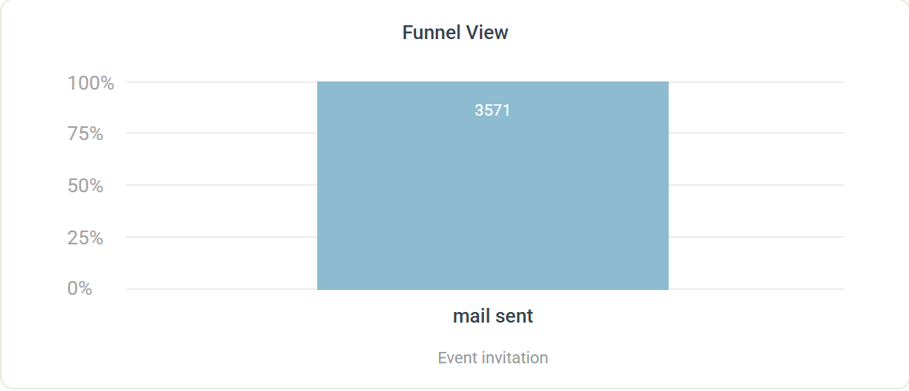
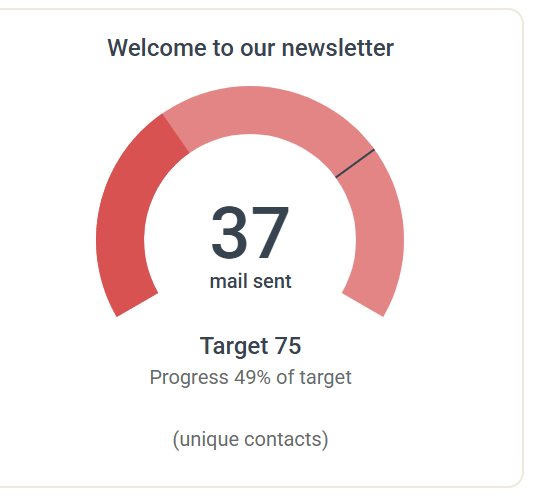

# Så använder du eMarketeers kampanjrapporter

Kampanjpanelen låter dig bygga realtidsrapporter för vilken kampanj som helst med hjälp av dra-och-släpp-widgetar.

I den här artikeln lär du dig hur kampanjens rapportpanel fungerar och vad varje rapporteringswidget gör.

## Kampanjens dashboard

Kampanjens dashboard bygger rapporter från en uppsättning widgetar som du väljer. Rapporter uppdateras i realtid, och du arrangerar dem med dra-och-släpp.

### Så bygger du en kampanjrapport

Gå till kampanjen du vill rapportera om. Klicka på fliken "Dashboard" och sedan "Add Report Widget". Välj de widgetar du vill spåra kampanjen med. Arrangera om dem genom att dra.

## Rapporteringswidgetar

De tillgängliga widgetarna är email top list, email performance, funnel chart, KPI counter och goal gauge.

### Email top list

Ta reda på vilka av dina kampanjer som presterar bäst.

Widgeten email top list rangordnar dina kampanjer efter open rate, click-through rate eller click-to-open rate. Den ger dig en överblick över hur varje kampanj presterade och vilken typ dina kontakter föredrar.

Så lägger du till widgeten:

1. Välj tidsperiod — all time eller this year.
2. Välj hur du vill sortera — open rate, click-through rate eller click-to-open rate. Listan genereras automatiskt med de tio bästa kampanjerna.

### Email performance report

Lämplig för din e-postmarknadsföring.

Se din genomsnittliga kampanjprestanda — open rate, click-through rate, click-to-open rate och avregistreringar. Du kan också jämföra genomsnitt med en annan kampanj. När du har lagt till widgeten väljer du kampanjen att jämföra mot och rapporten genereras automatiskt.

### Funnel chart

Fungerar bra för lead nurture-kampanjer och event.

Spåra ditt marknadsföringsflöde steg för steg. Funnel chart visualiserar varje steg du bygger — till exempel eventinbjudan, eventanmälan och deltagarformulär. Varje steg är en stapel med konverteringsfrekvensen till nästa, och diagrammet visar den totala konverteringen från första steget till det sista.

Så ställer du in det:

1. Klicka på "Add Report Widget".
2. Välj "funnel chart".
3. Välj komponenten som är det första steget i flödet. Beroende på komponenten väljer du mellan några åtgärder — för e-post: addressed, delivered, opened, clicked. För formulär: submissions.
4. Lägg till resten av stegen i den ordning de sker i ditt flöde.

Klicka på en stapel för att se vilka kontakter som slutförde eller inte slutförde det steget. Klicka på komponentnamnet under en stapel för att öppna rapporten för den komponenten.

Viktigt: för att en kontakt ska räknas i ett steg måste de också räknas i föregående steg.

Du kan ändra storlek på funnel chart. Öppna det, hitta rullgardinsmenyn "size" och välj ett mindre värde för att göra plats för ett annat diagram bredvid — till exempel en goal gauge.

### Goal gauge

Fungerar bra för nedladdningar eller registreringar.

Sätt ett mål och se framstegen mot det. Goal gauge fungerar som en förloppsindikator och visar procenten till målet.

1. Klicka på "Add Report Widget".
2. Välj "goal gauge".
3. Välj komponenten att spåra — till exempel formulärinskick.
4. Sätt målet.

### KPI counter

En snabb räknare för formulärinskick, e-postklick eller vad du nu vill spåra. Som goal gauge, men utan ett mål.

1. Klicka på "Add Report Widget".
2. Välj "KPI counter".
3. Välj komponenten att spåra — till exempel formulärinskick.
4. KPI:n beräknas omedelbart.
