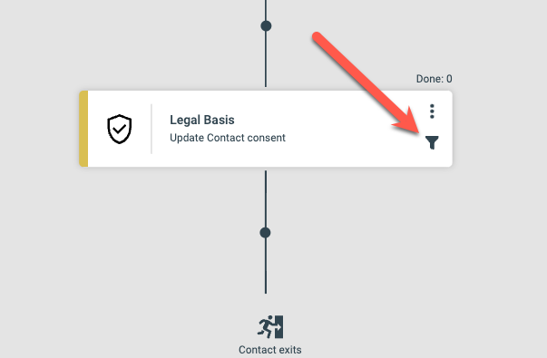
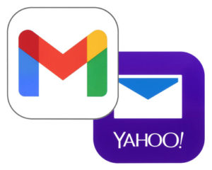
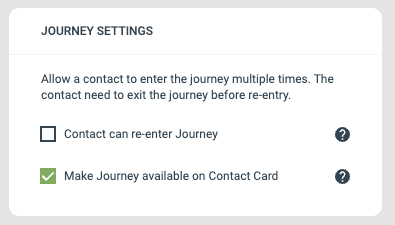

# eMarketeer Support – What can we help you with today?

[

##### Getting Started

A collection of useful  
articles and guides for  
new eMarketeer users

](https://support.emarketeer.com/kb/getting-started/)

[

##### Knowledge Base

Articles and Guides about  
eMarketeer Features

](https://support.emarketeer.com/knowledgehome/)

[

##### Documentation

Technical Documentation  
about Features and Services

](https://support.emarketeer.com/documentation/)

[

##### Legal

Legal stuff

](/documentation/legal/)

# Feature spotlight

* * *

### Journey Conditions

Now you can set conditions for a step to trigger. If the condition does not match the Journey will continue to the next step. This is handy if you don’t want to branch out the Journey with an IF/ELSE statement.

### Email delivery updates

**Do you send emails to Gmail or Yahoo?**

Gmail and Yahoo have since the start of February enforced new requirements to deliver emails to their recipients.

eMarketeer fully supports these requirements, but you may need to make changes in your DNS if you haven’t done so already for them to take effect.

[Read more here](https://support.emarketeer.com/documentation/custom-email-domain/)

### Manual trigger of Journeys

Enable a Journey to be available on the contact card or in the SuperOffice side panel. This way a user can trigger a Journey manually on a specific contact. Use this feature for meeting follow-ups, send requested material or start a full process, available also for sales users in your CRM.

### Leads from LinkedIn and Facebook/Instagram

Connect your eMarketeer account to LinkedIn and Facebook Ad Center and automatically receive submitted Lead Forms directly in to eMarketeer. Push them into lead nurturing Journeys and qualify them as leads.

Watch our latest webinar on this topic [on Youtube.](https://youtu.be/Gm9e18Z1tzQ?feature=shared)

### Change log

Latest release 2026-04-14  
[Read release notes here](https://support.emarketeer.com/change-log/)

##### Latest Articles

-   [Email feedback loop](https://support.emarketeer.com/knowledgebase/feedback-loop/)
-   [Email bounce handling](https://support.emarketeer.com/knowledgebase/bounce-handling/)
-   [Email complaint handling](https://support.emarketeer.com/knowledgebase/complaint-handling/)
-   [SPF setup](https://support.emarketeer.com/knowledgebase/spf-setup/)
-   [DMARC setup](https://support.emarketeer.com/knowledgebase/dmarc-setup/)
-   [DKIM is missing or incorrectly configured](https://support.emarketeer.com/knowledgebase/dkim-setup/)
-   [Email Health Dashboard](https://support.emarketeer.com/knowledgebase/email_health_dashboard/)
-   [Why eMarketeer Doesn’t Support SRI for Embed Scripts](https://support.emarketeer.com/knowledgebase/why-emarketeer-doesnt-support-sri-for-embed-scripts/)
-   [How to link to a form](https://support.emarketeer.com/knowledgebase/how-to-link-to-a-form/)
-   [Form specific QR-code generation for Scanning Event Attendance (Advanced)](https://support.emarketeer.com/knowledgebase/advanced-event-qr-code/)
